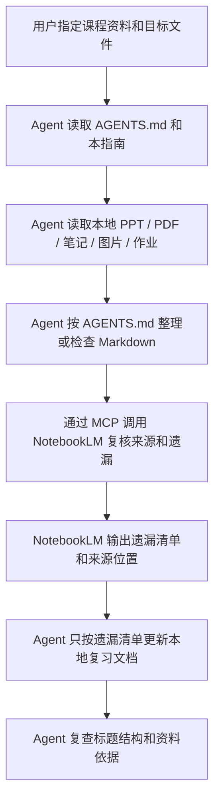

# AI 课程复习整理指南

本指南用于配合 Agent、NotebookLM 和 MCP 整理课程复习资料。目标是把 PPT、PDF、课堂笔记、图片、作业题整理成可读、可查、可追溯、可继续问答的 Markdown 复习文档。

核心原则：

1. 内容严格参照 PPT 和指定课程资料，不凭空扩展。
2. Agent 负责读取本地资料、调用 MCP、维护 Markdown 文件。
3. NotebookLM 通过 MCP 负责多源资料复核、来源溯源、FAQ、Mind Map 和遗漏检查。
4. 复习文档格式以 `AGENTS.md` 为最高优先级；本指南只提供执行流程和统一提示词。

---

## 1. MCP 联动工作流



执行约束：

- 修改具体课程整理文件前，必须明确目标文件和修改范围。
- 如果用户只要求检查，Agent 只输出结构问题和建议，不修改文件。
- 如果用户要求更新，Agent 只能更新指定文件，不改动其他课程文件。
- NotebookLM 的结果只能作为“来源复核和遗漏清单”，不能替代 `AGENTS.md` 的文档格式规则。
- NotebookLM 找到的遗漏内容交给 Agent 更新时，Agent 只能按清单补充，不主动扩展课程外知识。

---

## 2. 复习文档固定格式

复习文档必须按 PPT 章节组织。文档开头是 `# 目录`，随后是 `# 要点速背`，中间是各章标题，末尾是 `# 作业题`。

固定结构：

```markdown
# 目录

[TOC]

# 要点速背

## 0.1 高频要点

## 0.2 高频公式 / 关键结论

## 0.3 易混淆点

# 第 1 章 章节标题

## 1.1 知识点

## 1.2 知识点

# 第 2 章 章节标题

## 2.1 知识点

# 作业题

## 题 1 题目标题

## 题 2 题目标题
```

硬性格式：

- `#` 一级标题只能用于：`目录`、`要点速背`、具体章节、`作业题`。
- `# 目录` 必须放在文档最开头；目录内容可以使用 `[TOC]` 实现。
- `# 要点速背` 必须紧跟 `# 目录` 之后；其中每一个速背要点必须单独作为一个 `##` 二级标题。
- 各章一级标题下，`##` 二级标题必须按该章实际知识点细分。
- `# 作业题` 必须放在文档最后；其中每一道题必须单独作为一个 `##` 二级标题。
- 所有 `##` 二级标题必须带编号：要点速背使用 `0.1`、`0.2`；第 N 章使用 `N.1`、`N.2`；作业题使用 `题 1`、`题 2`。
- 新增、删除或调整二级标题后，必须同步更新同一一级标题下的编号，保证连续且不重复。
- 复习文档不使用三级标题及更低级标题，即不得使用 `###`、`####` 等标题。
- 不使用 `# 速背`、`全课程总览`、`总复盘` 作为正文主结构。

内容要求：

- 严格参照 PPT、课件、老师笔记、作业题，不主动扩展课外知识。
- PPT 中没有的内容，除非用户明确要求补充，否则不要写入正文。
- 如果资料表述不完整，标注“PPT 中未明确提供”或“资料中未明确提供”。
- 每章都要汇总复习，但汇总方式必须服从该章实际知识点。
- 定义、公式、流程、优缺点、适用场景归入对应章节的具体知识点。
- 复习文档必须保持高可读性，不要把资料直接堆成大段文字。
- 长段内容必须拆成短列表、对比表、步骤列表、公式块或 Mermaid 图；同一要点下连续正文段落不宜超过 3 行。
- 每个知识点优先按“定义 / 条件 / 公式 / 流程 / 优缺点 / 考法 / 易错点”等短标签组织，标签只用加粗文本或列表项，不新增三级标题。
- 表格只用于对比、分类、优缺点、公式条件等适合横向比较的内容；不要为了形式化而制造空表。
- 关键图片要保留，并补充图片说明、图中重点和可能考法。

---

## 3. 统一提示词

以下提示词作为唯一入口使用。Agent 应根据任务类型自行决定是检查、整理、调用 NotebookLM 复核，还是更新本地文件。

```text
你是我的课程复习整理 Agent。请先读取当前工作区的 AGENTS.md，并严格以 AGENTS.md 作为最高优先级规则。

任务目标：
根据我指定的课程资料和目标文件，完成课程复习文档的检查、整理、NotebookLM 复核、遗漏补充或问答。能通过 MCP 调用 NotebookLM 时，请把 NotebookLM 作为来源复核和遗漏检查工具使用；本地 Markdown 文件仍由 Agent 按 AGENTS.md 维护。

资料范围：
我会指定课程文件夹、PPT、PDF、课堂笔记、图片、作业题、真题或已有 Markdown 复习文档。只能使用我指定的资料范围。

执行规则：
1. 修改任何具体课程文件前，先明确本次要修改的文件和范围。
2. 如果我只要求检查结构或复核遗漏，不要修改文件。
3. 如果我要求更新文件，只更新我指定的文件，不改动其他课程文件。
4. 严格参照 PPT、PDF、课堂笔记、图片、作业题或真题，不凭空扩展课程外知识。
5. 资料没有明确提供的内容，必须标注“PPT 中未明确提供”或“资料中未明确提供”。
6. 保留已有图片引用；必要时补充图片说明、图中重点和可能考法。
7. 复习文档必须保持高可读性，不要把资料直接堆成大段文字。
8. 长段内容必须拆成短列表、对比表、步骤列表、公式块或 Mermaid 图；同一要点下连续正文段落不宜超过 3 行。
9. 每个知识点优先按“定义 / 条件 / 公式 / 流程 / 优缺点 / 考法 / 易错点”等短标签组织，标签只用加粗文本或列表项，不新增三级标题。

文档格式：
1. 文档开头必须是 # 目录，目录内容可以使用 [TOC] 实现。
2. # 目录 后必须紧跟 # 要点速背。
3. # 要点速背 中每一个要点必须是一个 ## 二级标题。
4. 课程正文的一级标题必须是具体章节，例如 # 第 1 章 章节标题。
5. 各章一级标题下，## 二级标题必须按该章实际知识点细分。
6. 文档最后必须是 # 作业题，其中每一道题必须是一个 ## 二级标题。
7. 所有 ## 二级标题必须带编号：# 要点速背 下使用 0.1、0.2；# 第 N 章 下使用 N.1、N.2；# 作业题 下使用 题 1、题 2。
8. 新增、删除或调整二级标题后，必须同步更新同一一级标题下的编号，保证连续且不重复。
9. 不使用三级标题及更低级标题，不得使用 ###、#### 等标题。
10. 不使用 # 速背、全课程总览、总复盘作为正文主结构。

NotebookLM / MCP 复核规则：
1. 需要复核时，通过 MCP 将原始资料和整理版内容交给 NotebookLM 对照检查。
2. NotebookLM 复核输出必须按以下结构整理：
   PPT 章节 -> 知识点 -> 遗漏内容 -> 来源资料 -> 建议补充位置。
3. 将 NotebookLM 的遗漏清单更新到本地文档时，只能按遗漏清单补充，不主动扩展。
4. 如果 NotebookLM 结果和 AGENTS.md 格式冲突，以 AGENTS.md 为准。
5. 不使用 NotebookLM 的 Audio Overview / 音频摘要作为主要复习方式。

问答规则：
1. 后续回答课程问题时，优先基于整理后的本地复习文档。
2. 回答先给直接答案，再指出依据来自哪个章节、哪个知识点。
3. 如果整理内容中没有依据，明确说“整理内容中未提供”。
4. 如果我问考试题，给出适合卷面作答的标准表述。
```

---

## 4. 任务用法

新整理一门课时：

```text
请按统一提示词整理这门课。
资料范围是：某某课程文件夹中的 PPT/PDF/课堂笔记/作业题。
目标文件是：某某课程/某某课程.md。
需要时通过 MCP 调用 NotebookLM 复核遗漏。
```

检查已有课程文档时：

```text
请按统一提示词检查这个课程整理文件的结构。
目标文件是：某某课程/某某课程.md。
只指出问题和建议，暂时不要修改文件。
```

根据 NotebookLM 复核结果更新时：

```text
请按统一提示词处理下面的 NotebookLM 遗漏清单。
目标文件是：某某课程/某某课程.md。
只根据遗漏清单补充，不主动扩展其他内容。
```

基于整理内容问答时：

```text
请基于这门课整理后的复习文档回答我的问题。
先给直接答案，再指出依据来自哪个章节、哪个知识点。
如果整理内容中没有依据，请明确说“整理内容中未提供”。
```

---

## 5. 是否需要特殊 skills

通常不需要特殊 skill。当前规则可以由 `AGENTS.md`、本指南和 MCP 工具完成：

- `AGENTS.md` 负责固定格式和内容边界。
- `AI复习指南.md` 负责统一提示词和执行流程。
- MCP 负责把 Agent、NotebookLM 和本地文件流程接起来。

只有在以下情况才建议做一个专门 skill：

- 你希望把这套课程整理流程复用到很多工作区，而不是只在当前目录使用。
- 你希望 Agent 每次自动执行固定步骤，例如读取资料、生成整理版、调用 NotebookLM、解析遗漏清单、更新 Markdown、复查标题结构。
- 你希望封装专门脚本，例如批量导出 Markdown/PDF、上传 NotebookLM、比较遗漏清单、校验标题层级。

如果只在当前复习资料目录使用，维护 `AGENTS.md` 和这一份统一提示词就足够。
