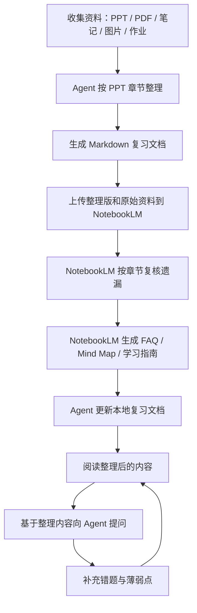

# AI 课程复习整理指南

本指南用于配合 Agent 和 NotebookLM 整理课程复习资料。目标是把 PPT、PDF、课堂笔记、图片、作业题整理成可读、可查、可追溯、可继续问答的 Markdown 复习文档。

核心原则：

1. 内容严格参照 PPT 和指定课程资料，不凭空扩展。
2. Agent 负责本地整理、Markdown 重构和文件维护。
3. NotebookLM 负责多源资料库、来源溯源、学习指南、FAQ、Mind Map 和遗漏复核。
4. 整理后的文档必须便于阅读，也必须便于后续按章节提问。

---

## 1. 工具分工

| 工具 | 主要用途 | 不适合做什么 |
| :- | :- | :- |
| Agent | 整理本地文件、合并笔记、重构 Markdown、生成表格/流程图、按要求修改课程整理文件 | 未经确认自动改动课程文件、凭空扩展课程外内容 |
| NotebookLM | 上传多份资料后做来源驱动问答、生成学习指南/FAQ/简报/Mind Map、检查遗漏、定位资料出处 | 直接维护本地 Markdown 文件、替代你阅读整理结果 |

推荐顺序：

1. Agent 先按 PPT 章节整理本地课程资料。
2. 把整理后的 Markdown/PDF 和原始 PPT/PDF 上传 NotebookLM。
3. NotebookLM 按章节复核遗漏、生成 Mind Map/FAQ/学习指南。
4. 把 NotebookLM 的遗漏清单交给 Agent 更新本地复习文档。
5. 后续提问时，优先基于整理后的本地复习文档回答；需要溯源时再问 NotebookLM。

---

## 2. 标准工作流



---

## 3. 复习文档固定格式

复习文档必须按 PPT 章节组织。目录和速背放在文档开头，作业题放在文档最后。

固定结构：

```markdown
# 目录

- [速背](#速背)
- [第 1 章 章节标题](#第-1-章-章节标题)
- [第 2 章 章节标题](#第-2-章-章节标题)
- [作业题](#作业题)

# 速背

## 全课程高频考点

## 高频公式 / 关键结论

## 高频易混淆点

# 第 1 章 章节标题

## 大知识点 1

### 核心概念

### 关键结论 / 公式

### 流程 / 推导 / 方法

### 易错点

### 可能考法

## 大知识点 2

### 核心概念

### 关键结论 / 公式

### 流程 / 推导 / 方法

### 易错点

### 可能考法

# 第 2 章 章节标题

## 大知识点 1

### 核心概念

### 关键结论 / 公式

### 流程 / 推导 / 方法

### 易错点

### 可能考法

# 作业题

## 第 1 章作业题

## 第 2 章作业题
```

格式要求：

- `#` 一级标题用于：`目录`、`速背`、具体章节、`作业题`。
- 课程正文的一级标题必须是具体章节，例如 `# 第 1 章 硅和硅片的制备`。
- `##` 二级标题必须是该章节内的大知识点，不能直接写成“核心概念”“重要公式”这类通用分类。
- `###` 三级标题用于大知识点内部细分，例如核心概念、公式、流程、易错点、可能考法。
- `# 作业题` 固定放在文档最后，并按章节归类。
- 不再使用“全课程总览”“总复盘”作为正文主结构；跨章节内容放入 `# 速背` 或相关章节下。

内容要求：

- 严格参照 PPT、课件、老师笔记、作业题，不主动扩展课外知识。
- PPT 中没有的内容，除非用户明确要求补充，否则不要写入正文。
- 如果资料表述不完整，标注“PPT 中未明确提供”。
- 每章都要汇总复习，但汇总方式必须服从该章实际大知识点。
- 定义、公式、流程、优缺点、适用场景归入对应章节的大知识点。
- 长段文字优先整理成表格、步骤列表、Mermaid 图。
- 关键图片要保留，并补充图片说明、图中重点和可能考法。

---

## 4. Agent 整理提示词

```text
你是我的课程复习整理助手。

任务：
请严格基于我指定的 PPT、PDF、课堂笔记和作业题，整理成 Markdown 复习文档。

硬性格式：
1. 文档开头必须是 # 目录。
2. 目录后必须是 # 速背。
3. 课程正文的一级标题必须是具体章节，例如 # 第 1 章 章节标题。
4. 每章的二级标题必须是该章内的大知识点。
5. 大知识点下面再用三级标题细分：核心概念、关键结论/公式、流程/推导/方法、易错点、可能考法。
6. 文档最后必须是 # 作业题，并按章节整理作业题。

内容要求：
1. 严格参照 PPT 和指定资料，不凭空扩展。
2. PPT 没有明确提供的内容，不要写入正文；必须保留时标注“PPT 中未明确提供”。
3. 每一章都要做汇总复习。
4. 长段内容压缩成表格、流程、清单。
5. 需要视觉强化时，优先使用表格、Mermaid 图、图片说明。
6. 整理完成后，内容必须方便后续按章节和知识点检索问答。
7. 未经我明确要求，不要改动具体课程整理文件。
```

---

## 5. NotebookLM 使用方式

NotebookLM 作为“课程资料库”和“复核工具”使用，不采用听觉强化。

推荐上传：

- 原始 PPT/PDF。
- 教材或讲义 PDF。
- 已整理的 Markdown 导出 PDF。
- 作业题、真题、答案。
- 关键图片或图示资料。

推荐生成：

- 学习指南：用于快速查看章节框架和重点问题。
- FAQ：用于整理常见问答。
- 简报/Briefing：用于压缩一章或一组资料。
- Mind Map：用于视觉化查看章节和知识点结构。
- 资料问答：用于确认某个说法来自哪份资料。

不优先使用：

- Audio Overview / 音频摘要。
- 与考试无关的扩展讨论。
- 没有来源引用的泛泛总结。

NotebookLM 提示词：

```text
请基于我上传的 PPT 和课程资料，生成一份视觉化复习提纲。

要求：
1. 严格按 PPT 章节组织。
2. 每个一级部分对应 PPT 的一个具体章节。
3. 每章下面按该章的大知识点划分。
4. 每个大知识点下整理：核心概念、关键结论/公式、流程/方法、易错点、可能考法。
5. 标注每个重点来自哪份资料。
6. 生成适合复习的 FAQ。
7. 如果可以，请生成 Mind Map 展示章节和知识点关系。
8. 不要生成音频摘要。
```

---

## 6. Agent 与 NotebookLM 的配合方式

### 6.1 Agent 先整理

```text
请读取指定课程资料，严格参照 PPT 章节整理。

输出格式：
1. 开头添加 # 目录。
2. 目录后添加 # 速背。
3. 正文一级标题为具体章节。
4. 每章二级标题为该章内的大知识点。
5. 大知识点下用三级标题继续细分。
6. 最后添加 # 作业题，并按章节整理作业题。
```

### 6.2 NotebookLM 再复核

```text
请比较“原始 PPT/讲义”和“整理版复习文档”。
请按 PPT 章节找出整理版遗漏的内容。

输出格式：
1. PPT 章节
2. 所属大知识点
3. 遗漏内容
4. 重要程度
5. 来源资料
6. 建议补充到整理版哪个标题下
```

### 6.3 Agent 最后更新

```text
下面是 NotebookLM 根据原始资料发现的遗漏点。
请只根据这些遗漏点更新指定课程整理文件。

要求：
1. 不改变既定文档结构：目录、速背、章节正文、作业题。
2. 按 PPT 章节和章内大知识点补充到最合适的位置。
3. 不删除已有内容。
4. 不主动扩展 PPT 外内容。
5. 对来源不足或资料未明确说明的内容标注“PPT 中未明确提供”。
```

---

## 7. 视觉强化方法

### 7.1 表格

适合对比类知识点。

```text
请严格基于 PPT，把本章容易混淆的概念整理成表格。
列包括：概念、定义、关键特征、优点、缺点、适用场景、PPT 来源页或章节。
```

### 7.2 Mermaid 流程图

适合工艺流程、推导流程、解题流程。

```text
请严格基于 PPT，把本章指定大知识点整理成 Mermaid 流程图。
要求：
1. 每个节点不超过 15 个字。
2. 标出关键输入、步骤、结果。
3. 如果 PPT 提到缺陷、限制或注意点，用单独节点标出。
4. 图后补充 5 条速记要点。
```

### 7.3 Mind Map

适合在 NotebookLM 中快速查看课程结构。

```text
请基于全部上传资料生成 Mind Map。
重点展示：
1. PPT 章节结构。
2. 每章大知识点。
3. 大知识点之间的从属关系。
4. 容易混淆的分支。
```

### 7.4 图片说明

适合已有截图、工艺图、结构图较多的课程。

```text
请检查当前笔记中的图片引用。
对每张关键图片补充：
1. 图片说明。
2. 图中最重要的结构或步骤。
3. 对应 PPT 章节。
4. 可能对应的考试问题。
```

---

## 8. 整理后问答

整理完成后，优先基于本地整理文件问 Agent；需要追溯来源时，再问 NotebookLM。

Agent 问答提示词：

```text
请基于整理后的课程复习文档回答我的问题。

回答要求：
1. 先给直接答案。
2. 再指出依据来自复习文档中的哪个章节、哪个大知识点。
3. 如果整理内容中没有明确依据，请说“整理内容中未提供”。
4. 如果我问的是考试题，请给出适合卷面作答的标准表述。
5. 如果存在易混淆点，请额外列出容易错在哪里。
```

NotebookLM 问答提示词：

```text
请基于上传的源资料回答这个问题。
要求：
1. 标注答案来自哪份 PPT/资料。
2. 如果不同资料说法不一致，请列出差异。
3. 如果源资料没有明确说明，请不要推测。
4. 最后给出适合考试复习的一句话总结。
```

---

## 9. 实际使用原则

- 先整理，再问答。
- 内容严格参照 PPT 和指定课程资料。
- Agent 负责本地文件，NotebookLM 负责多源复核。
- 先读整理后的内容，再让 AI 解答疑问。
- 重要知识点优先视觉化，不做听觉强化。
- 有来源冲突时，以课程 PPT、老师笔记、作业答案优先。
- 没有明确要求时，不让 Agent 自动改动课程文件。
- 每次修改课程文件前，先明确修改对象和修改范围。

---

## 10. 如何使用这套规则

### 10.1 新整理一门课程

直接对 Agent 说：

```text
请按照 AGENTS.md 和 AI复习指南.md 的规则，整理这门课。
资料范围是：某某课程文件夹中的 PPT/PDF/课堂笔记。
要求：
1. 严格参照 PPT。
2. 文档开头添加目录。
3. 目录后添加速背。
4. 一级标题为具体章节。
5. 二级标题为该章内的大知识点。
6. 末尾添加作业题。
7. 未经我确认，不要改动其他课程文件。
```

### 10.2 整理已有课程文件

如果课程已有 Markdown 文件，先让 Agent 检查结构，不要直接重写。

```text
请按照 AGENTS.md 的复习课程整理规则，检查这个课程整理文件的结构。
先只指出：
1. 是否有目录。
2. 是否有速背。
3. 一级标题是否都是具体章节。
4. 二级标题是否是章内大知识点。
5. 作业题是否放在最后。
6. 哪些地方需要调整。
暂时不要修改文件。
```

确认后再说：

```text
请根据刚才的检查结果，只调整这个课程整理文件的结构。
不要删除已有知识点。
不要补充 PPT 外内容。
作业题统一移动到文档最后。
```

### 10.3 结合 NotebookLM 复核

先把原始 PPT/PDF 和整理后的复习文档上传 NotebookLM，然后问：

```text
请比较原始 PPT 和整理版复习文档。
按 PPT 章节找出整理版遗漏的内容。
输出格式：
1. PPT 章节
2. 所属大知识点
3. 遗漏内容
4. 来源资料
5. 建议补充到整理版哪个标题下
```

然后把 NotebookLM 的结果交给 Agent：

```text
下面是 NotebookLM 找出的遗漏点。
请按照 AGENTS.md 的规则，只把这些遗漏点补充到指定课程整理文件中。
不要主动扩展其他内容。
```

### 10.4 基于整理内容提问

整理完成并阅读后，可以这样问：

```text
请基于这门课整理后的复习文档回答我的问题。
先给直接答案，再指出依据来自哪个章节、哪个大知识点。
如果整理内容中没有依据，请明确说“整理内容中未提供”。
```
