[TOC]

# 第一章 绪论

### 光伏发电原理
大面积p-n结，基于光生伏特效应。将光能转化为电能
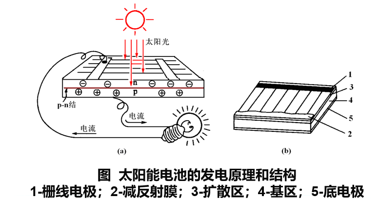

- 太阳能优点：永久性、清洁性、灵活性

### 独立（离网）光伏发电系统
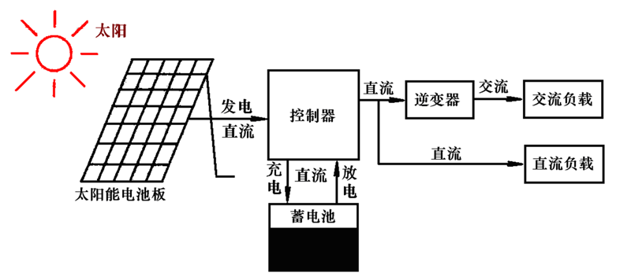
- 内部闭环形成回路，太阳能电池是唯一能源

### 并网光伏发电系统
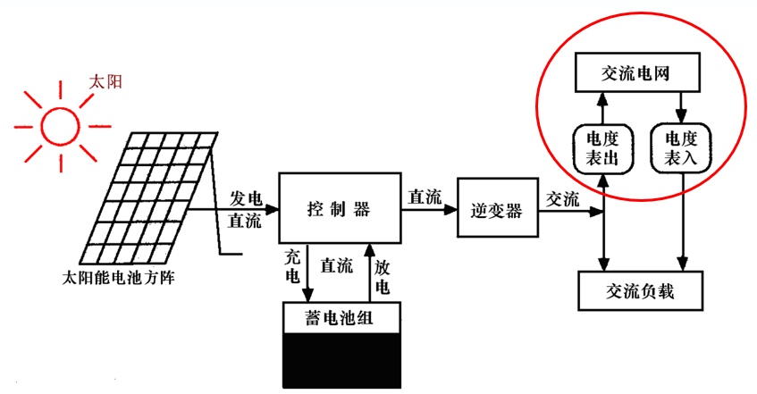
- 太阳能电池和电网两个能源

### BIPV（Building Integrated Photovoltaic）光伏建筑一体化

### BAPV（Building Attached Photovoltaic）建筑附着光伏（安装型光伏）

# 第二章 太阳辐射
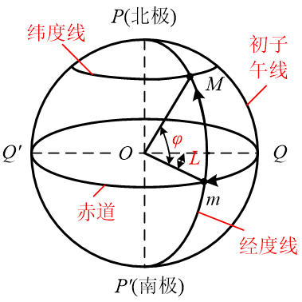
- 平行赤道线的圆周线为纬度线，垂直赤道的圆周线为经度线，$\phi$为纬度，$L$为经度

## 2.1 天球坐标

### 时角$\omega$：

$$
\omega = 15^\circ(t_s-12)
$$

其中，$t_s$ 为当地当时的小时，负号表示上午，正号表示下午

### 太阳赤纬角$\delta$：

$$
\delta = 23.45^\circ \mathrm{sin}(360^\circ \times \frac{284+n}{365})
$$
其中，$n$表示当天为一年中的第$n$天
- 春分、秋分附近：$\delta$ = 0
- 夏至：$\delta$ = $23.45^\circ$
- 冬至：$\delta$ = $-23.45^\circ$

### 太阳高度角$\alpha_s$：

$$
\mathrm{sin}\alpha_s = \mathrm{cos}\theta_z = \mathrm{sin}\phi\mathrm{sin}\delta + \mathrm{cos}\phi\mathrm{cos}\delta\mathrm{cos}\omega
$$

正午时，$\omega = 0^\circ$=，公式可以化简为：

$$
\mathrm{sin}\alpha_s=\mathrm{sin}[90^\circ \pm (\phi-\delta)]
$$

当$\phi>\delta$，即正午太阳在天顶以南时：
$$
\alpha = 90^\circ -\phi +\delta
$$

当$\phi<\delta$，即正午太阳在天顶以南时：
$$
\alpha = 90^\circ +\phi -\delta
$$

### 方位角$\gamma_s$：
$$
\begin{cases}

    \mathrm{sin}\gamma_s=\frac{\mathrm{cos}\delta\mathrm{sin}\omega}{\mathrm{cos}\alpha_s} \\
    \mathrm{cos}\gamma_s=\frac{\mathrm{sin}\alpha_s\mathrm{cos}\phi-\mathrm{sin}\delta}{\mathrm{cos}\alpha_s\mathrm{cos}\phi}

\end{cases}
$$

### 日出、日落时角$\omega_s$：

$$
\mathrm{cos}\omega_s = -\mathrm{tan}\phi\mathrm{cos}\delta \ \ \ (\omega_{sr}=-\omega_s,\omega_{ss}=\omega_s)
$$

其中，$\omega_{sr}<0$为日出时角，$\omega_{ss}>0$为日落时角，某地的某一时刻$\omega_{sr},\omega_{ss}$是关于太阳正午对称的

### 日照时间$N$：
当地由日出到日落的时间间隔
$$
\begin{cases}
    N &=\frac{\omega_{ss}+\omega_{sr}}{15^\circ}\\
    & =\frac{2}{15^\circ}\mathrm{arccos}(-\mathrm{tan}\phi\mathrm{tan}\delta)
\end{cases}
$$

### 日出、日落方位角$\gamma_{s,0}$：
日出日落时太阳高度角$\alpha_s=0^\circ$
$$
\mathrm{cos}\gamma_{s,0}=-\frac{\mathrm{sin}\delta}{\mathrm{cos}{\phi}}
$$

## 2.2 太阳辐照量

到地球表面的太阳辐射能=热能+推动海水及大气对流+光合作用

到地面的太阳辐射能=直接辐射（平行光到达）+散射辐射（大气、微尘散射）

### 太阳辐射功率（辐射通量）
单位时间内太阳辐射的能量

### 辐照度
太阳投射到单位面积上的辐射通量

### 辐照量
一段时间内，太阳投射到单位面积上的辐射能量

- 卡路里cal：将1克水在1大气压下提升1℃所需要的热量

### 太阳常数$\ I_{sc}=1367\pm7 \ \ W/m^2$：
日地平均距离处，地球大气层外垂直于太阳光的平面上的辐照度，也称为大气质量0（AM0）的辐射

非垂直的情况：$I=I_0\mathrm{sin}\alpha_s$

到达大气层上界的太阳辐射*-ppt-第二章p52-赌不考

### 大气质量AM：
为研究太阳辐射受大气的衰减作用，将太阳辐射通过大气的**厚度**成为大气质量，定义：太阳辐照通过大气的实际路程与大气的垂直厚度之比（AM越大表示太阳辐照经过的大气越多，衰减越多）

- 规定在1个标准大气压和0℃时，海平面上太阳光线垂直入射时的路径为AM=1(最小值)
- AM1.5为标况
- 太阳处于任意位置：$\mathrm{AM}=\frac{1}{\mathrm{sin}\alpha_s}\cdot\frac{P}{P_0}$，其中，$P$为当地大气压，$P_0$为海平面大气压

### 大气透明度：
表征大气对于太阳光透过程度的参数

- 到达地面的法向太阳辐照度-赌
- 水平面上太阳辐照度-赌
- 水平面上的散射辐照度-赌
- 水平面上的太阳总辐照度-赌

### 地表倾斜表面太阳辐照量-赌

# 第三章 太阳能光伏电池
- 太阳能电池的分类：
  - 硅太阳能电池：
    - 单晶（性能好，难制备，高成本）
    - 多晶（性能略差，成本低）
    - 非晶（性能继续降低，且存在光致衰退效应，弱光发电能力高，能耗低，成本低，面积容易做大，易于实现BIPV，用于薄膜太阳能电池）
    - 微晶（常温下可制备材料介于非晶和晶体硅之间，性能略好于非晶，无光致衰退效应，用于叠层太阳能电池，由于含非晶，难以形成PN结，必须做成PIN结）
  - 化合物太阳能电池：
    - 单晶化合物：砷化镓（砷有毒）
    - 多晶化合物：碲化镉（转换效率低）、铜铟镓硒（性能最高的薄膜太阳能电池，无毒，低成本）
    - 染料敏化：模仿光合作用
- 光致衰退效应：在持续光照下，性能衰退的现象

## 3.1晶体硅太阳能电池
- 硅的晶体结构：金刚石结构
- P型半导体：在本征半导体中掺杂受主杂质，形成的半导体是P型半导体。受主杂质代替硅原子，与相邻的4个原子形成共价键，会多出一个空穴，空穴为多子。
- N型半导体：在本征半导体中掺杂施主杂质，形成的半导体是N型半导体。施主杂质代替硅原子，与相邻的4个原子形成共价键，会多出一个电子，该电子只需要很小的能量就可以挣脱原子核的束缚成为自由电子，电子为多子。
- PN结的形成：n型半导体和p型半导体紧密接触，在交界处n区中电子浓度高，要向p区扩散，在N区一侧就形成一个正电荷的区域；同样，p区中空穴浓度高，要向n区扩散，p区一侧就形成一个负电荷的区域。这个n区和p区交界面两侧的正、负电荷薄层区域称为空间电荷区，即p-n结—内建电场$E$—电势差$U_D$，内建电场一方面阻止多子的扩散，促进了少子的漂移，最终达到平衡

### 内光电效应
光照射到半导体材料上时，如果有一些**光子的能量大于等于半导体禁带宽度**，就会使电子挣脱原子核的束缚，在半导体中产生大量的电子空穴对

- 大于禁带宽度的光子转化为电能，小于禁带宽度的光子转化为热能

### 光生电动势

光照射在半导体上，N区、P区、空间电荷区都会产生光生载流子，由于光会衰减，会产生光生载流子浓度梯度，从而产生其扩散运动。N区、P区和空间电荷区产生的光生载流子到空间电荷区边界时，空穴在内建电场的作用下向P区移动，电子向N区移动，从而产生光生电动势，**其方向与内建电场方向相反**

### 提高光伏电池转换效率
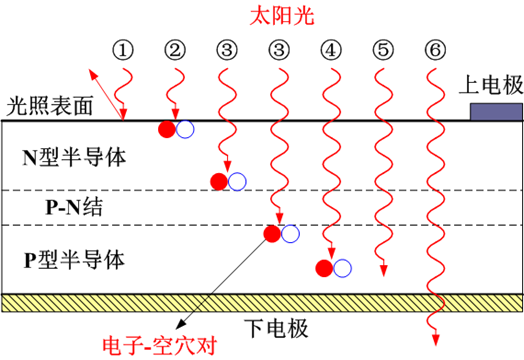
- 主要是光线③产生光生电动势，可以增加pn结范围
- 减少反射光强，增强入射光强（减反射膜、绒面技术）
- P型一侧为正极，N型一侧为负极

### 太阳能电池主要参数
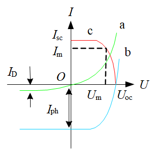
- 短路时，短路电流等于光电流
- 开路电压与电池面积无关
- 短路电流与电池面积有关
- 短路电流与入射光的辐照度成正比（影响很大）
- 辐照度较小时，开路电压与其成线性变化，辐照度较大时，成对数变化
- 功率与辐照度成正比
- 温度升高短路电流**略微**升高
- 开路电压和温度成反比
- 功率与温度成反比

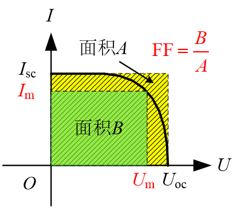

- 串联电阻越小，旁路电阻越大，填充因子越大，电池性能越好

- 转换效率：最大输出功率与全部辐射功率之比

## 薄膜太阳能电池
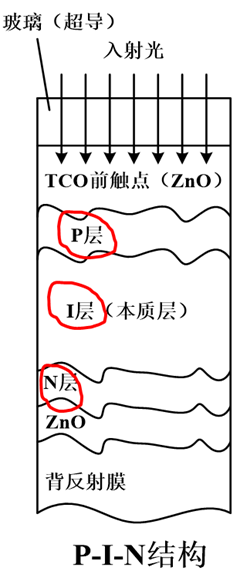

衬底：
- 第一层是普通玻璃，是电池的基底
- 第二层为TCO透明氧化物导电膜（透光率高、导电，制成绒面）

太阳能电池：
- 第一层为P层，窗口层，太阳入射层，收集空穴
- 第二层为I层，光敏区，及太阳能电池的本征层，光生载流子主要在这一层产生
- 第三层为N层，连接I层和背电极
- 第四层为背电极和Al/Ag电极
- 第五层为背反射膜

### 叠层太阳能电池
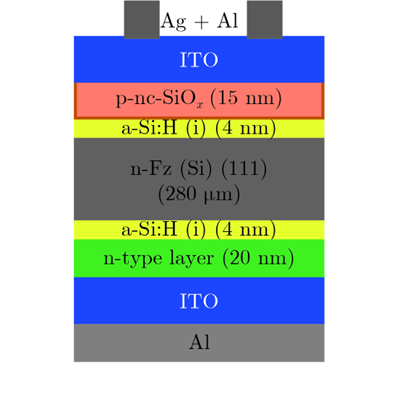

能隙从大到小排列：
- 波长最短的光被最外边的宽带隙材料电池吸收利用
- 波长较长的光能够透射进去让较窄能带隙材料电池吸收利用
- 最大限度地将光能转化成电能

参数：
- $U_{OC}$等于各个子电池$U_{OC}$之和
- $I_{SC}$等于各个子电池最小的$I_{SC}$

### 染料敏化太阳能电池
### 铜铟镓硒太阳能电池

## 聚光太阳能电池
将太阳光汇聚在太阳能电池上

## 3.2太阳能电池组件
单体电池不能直接作为电源使用（机械强度低、耐腐蚀性差、输出电压低、功率低）
- 若干电池串并联封装后可以直接作为电源使用——组件
- 为满足高功率需求将组件串并联——阵列

### 组件组成

- 串联时，输出电流不变，输出电压成比例增加
- 并联时，输出电压不变，输出电流成比例增加

## 3.3太阳能电池方阵

### 方阵要求
- 串联时需要工作电流相同的组件，并为每个组件并接旁路二极管（串联支路某个电池被遮挡或损坏，其他电池通过该二极管仍可以工作）
- 并联时需要工作电压相同的组件，并在每一条并联线路中串联防反充（防逆流）二极管
- 线路尽量短，使用较粗导线（电阻小）
- 防止个别性能变坏的电池组件混入电池方阵

### 连接组合损失
满足方阵对于组件的要求也难以保证组件完全一致，细微的差别会导致连接组合损失：
- 串联工作电流受限于其中工作电流最小的组件
- 并联工作电压受限于其中工作电压最小的组件
- 方阵总效率总是低于所有单个组件之和

### 热斑效应
太阳能电池阵列中，某一组件接收到的光被遮挡，其余组件正常发光，该组件需要其余组件提供负载所需的功率，使该组件如同一个工作在反偏电压下的二极管，其电阻和压降很大，从而消耗功率而发热，称为热斑
- 使用并联旁路二极管、串联防逆流二极管避免

# 第六章 太阳能电池制备

## 硅材制备

### 单晶硅制备

直拉法：熔化-种晶-引晶-缩颈-放肩-等径生长-收尾-冷却
- 将多晶硅原料加热熔融，籽晶一端插入熔体至融化，随后缓慢旋转并向上提拉，固液界面会逐渐经过冷凝形成单晶，整个过程是复制籽晶的过程。

### 多晶硅制备
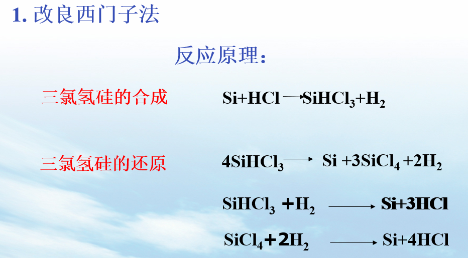
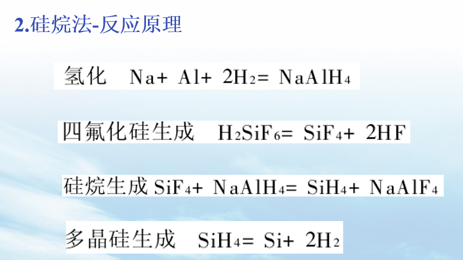

### 绒面
制作绒面的目的：
- 增强对太阳光的吸收，减少反射损失
- 使入射光多次反射折射，增加光的吸收率

单晶硅绒面：
- 有机腐蚀剂制造：EPW和联胺等
- 无机腐蚀剂制造：$\mathrm{KOH、NaOH、NH_4OH}$（碱性）等
- 各向异性腐蚀

多晶硅绒面：
- 化学腐蚀剂：$\mathrm{HF+HNO_3}$
- 活性离子刻蚀法、机械刻槽法
- 各向同性腐蚀

### 减反膜
- 材料常为：$\mathrm{SiO_2、TiO_2 、Ta_2O_5}$
- 制备方法：真空镀膜和离子镀膜法、溅射法、印刷法、喷涂法、PECVD沉积法

# 第七章 光伏系统部件

## 太阳能电池芯片、组件及阵列

### 防逆流元件

选择元件要求
- 能通过所在回路的最大电流
- 能承受该回路的最大反向电压
- 由于半导体元件的电气特性随使用温度的变化而发生变化，所以要合理地估计使用温度并选择合适的逆流防止元件

### 旁路元件

- 能通过纵列组件的短路电流
- 反向耐压为纵列组件的最大输出电压的1.5倍以上
- 由于使用温度的影响，应选择额定电流稍大的旁路元件

## 功率调节器

### 逆变器
把直流电变成交流电的装置

- 有源逆变：交流侧接电网
- 无源逆变：交流侧接负载

太阳光发电站要求逆变器：
- 逆变器效率高
- 抑制高次谐波电流流入电力系统，减少对电力系统的配电线的影响
- 能承受比较恶劣的使用条件，能在少维护条件下长期工作

### MPPT最大功率点跟随控制
干扰观测法（爬山法）
- 基本原理：先让光伏电池工作在某一电压下，检测输出功率，在此工作电压的基础上添加正向电压扰动量，若检测出输出功率增加了，则继续添加正向扰动；若检测出输出功率降低了，则在下一周期添加负向电压扰动，不断循环至找到最大功率点
- 通过改变负载实现光伏电池的输出电压扰动，负载电阻增大，添加正向扰动，负载电压减小，添加负向扰动

电导增量法  

## 蓄电池
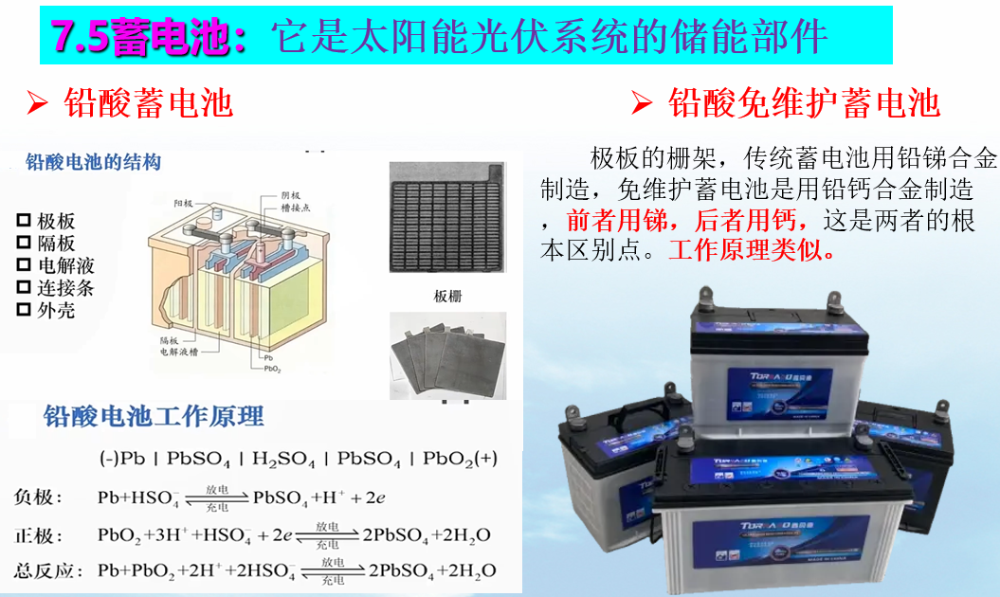

# 第八章 光伏系统的设计
## 确定蓄电池容量
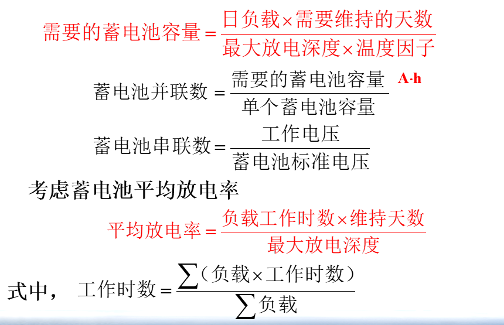

## 确定太阳能电池阵列
### 并联
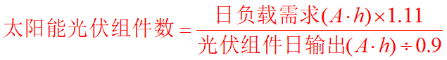
- 光伏组件日输出可以用全年的月太阳辐照平均值最低的数乘以选用的光伏组件的最大功率点的电流来求得
- 系数1.11是考虑到太阳能光伏组件给蓄电池充电的效率
- 0.9是考虑到太阳能光伏组件衰减和灰尘等因素引起光伏组件损失的修正系数

### 串联

# 第十章 光伏系统的应用

## BIPV光伏建筑一体化
光伏组件与建筑材料融为一体，采用特殊的材料和工艺手段，将光伏组件做成屋顶、外墙、窗户等形状，可以直接作为建筑材料使用，既能发电，又可作为建材，一举两得，能够进一步降低发电成本
## BAPV建筑附着光伏
将一般的光伏方阵安装在建筑物的屋顶或阳台上，通常其逆变控制器输出端与公共电网并联，共同向建筑物供电，这是光伏系统与建筑相结合的初级形式

# 作业

**1. 太阳能光伏发电有哪些类型？简述其工作原理**
- 独立（离网）光伏发电系统：在自己的闭合回路内部形成电路，系统中太阳能电池是方阵唯一的能量来源
- 并网光伏发电系统：系统中存在太阳能电池和电网两个能量来源
- 混合（互补）系统：存在独立（离网）和并网两种光伏发电系统，相互补充，混合使用

**2. 上海地区的维度是北纬$31.14^\circ$，求10月1日10时太阳的高度角、方位角、天顶角。**

**3. 大气质量AM和AM1.5的含义是什么**
- 大气质量：太阳光通过大气到达地面的距离与大气的垂直厚度之比
- AM1.5：太阳光以48.2$^\circ$天顶角穿过大气层时的光照条件，其路径与大气垂直厚度之比为1.5，AM1.5为测试硅太阳能电池标称输出功率的标准测试条件之一

**4. 什么是N型半导体，什么是P型半导体，它们是如何形成的？**
- N型半导体：在本征半导体中掺入施主杂质后形成的半导体。施主原子代替硅原子，与相邻的四个原子形成共价键，会多出电子，多出的电子只需要很小的能量就可以挣脱施主原子的束缚，成为自由电子
- P型半导体：在本征半导体中掺入受主杂质，形成P型半导体。受主杂质代替硅原子，与相邻的四个原子形成共价键，会多出空穴。
- 工艺上掺杂通过离子注入、扩散实现

**5. PN结形成原理**
- n型半导体和p型半导体紧密接触，在交界处n区中电子浓度高，要向p区扩散，在N区一侧就形成一个正电荷的区域；同样，p区中空穴浓度高，要向n区扩散，p区一侧就形成一个负电荷的区域。这个n区和p区交界面两侧的正、负电荷薄层区域称为空间电荷区，即p-n结—内建电场$E$—电势差$U_D$，内建电场一方面阻止多子的扩散，促进了少子的漂移，最终达到平衡

**6. 地面太阳能电池的标准测试条件是什么？**
- 辐照度1000$\mathrm{W/m^2}$
- 温度25$\mathrm{^\circ C}$
- AM1.5

**7. 某规格的光伏组件由转换效率为18.2%的单晶硅太阳能电池组件，电池有效面积为14858$\mathrm{cm^2}$实际测量功率为175W，求光伏组件封装功率损失了多少？光伏组件的转换效率是多少？**

**8. 单晶硅及多晶硅太阳能电池制作过程中制作绒面的目的和方法是什么？**
- 制作绒面的目的：增强对太阳光的吸收，减少反射损失；使入射光多次反射折射，增加了入射光的吸收率
- 制作方法：单晶硅使用有机腐蚀剂（EPW、联氨）或无机碱性腐蚀剂（$\mathrm{KOH、NaOH，NH_4OH}$）制备，为各向异性腐蚀；多晶硅使用酸性化学腐蚀剂（$\mathrm{HF+HNO_3}$）或活性离子刻蚀、机械刻槽法刻蚀，为各向同性腐蚀

**9.  为什么要在太阳能电池表面制作减反膜？减反膜的常用材料是什么？**
- 减少太阳光在太阳能电池表面的反射损失，让更多的入射光进入电池内部被吸收，从而提高短路电流和转换效率
- 减反膜常用材料：$\mathrm{TiO_2,SiO_2,Ta_2O_5}$

**10. 简述直拉单晶硅工艺的主要步骤**
熔化-种晶-引晶-缩颈-放肩-等径生长-收尾-冷却
- 将多晶硅原材料加热至熔融，将籽晶一端插入熔体至熔化，随后缓慢旋转并向上提拉，固液界面处逐渐冷凝形成单晶，整个过程是复制籽晶的过程

**11. 光伏系统中常用的二极管元件有哪两种？作用是什么？如何连接？**
- 防逆流元件：防止热斑效应发生，与光伏电池组件串联
- 旁路元件：防止热斑效应发生，与光伏电池组件并联

**12. 并网逆变器的作用是什么？**
- 直流变交流：将光伏阵列输出的直流电变为交流电
- 最大功率点跟踪：使光伏组件的工作状态处于最大功率点
- 并网同步：使输出交流电的电压、频率、相位与电网保持一致
- 支撑电网稳定性：满足电网故障穿越能力、实时动态响应电网调度
- 保护功能：孤岛保护、绝缘监测、PID防护等

**13. 某一通信离网光伏发电系统负载功率为150W，每天工作8h，蓄电池组放电深度DOD设计为60%，安全系数取1.2，为保证连续5个阴雨天负载仍能正常工作，需配备多大容量的蓄电池组。**

**14. 某太阳能路灯，灯泡负载功率为50W，工作电压为12V，每晚开灯8h，蓄电池放电深度为50%，输出回路效率为$\eta_2=0.9$，该地区最长阴雨天为3天，假定阴雨天前蓄电池处于充满状态，为保证阴雨天负载正常工作，蓄电池组容量至少应为多少A·h？**

**15. 光伏发电系统与建筑结合有哪两种方式？请分别加以说明。**
- BAPV建筑附着光伏：一般将光伏阵列安装在建筑的屋顶或阳台，通常将其逆变器输出端与公共电网并联，共同向建筑供电，这是光伏系统与建筑结合的初级形式。
- BIPV光伏建筑一体化：光伏组件与建筑材料融为一体，采用特殊材料和工艺手段，将光伏组件做成屋顶、外墙、窗户等形状，可以直接作为建筑材料使用，既能发电又能作为建筑材料，一举两得，可以进一步降低发电成本。