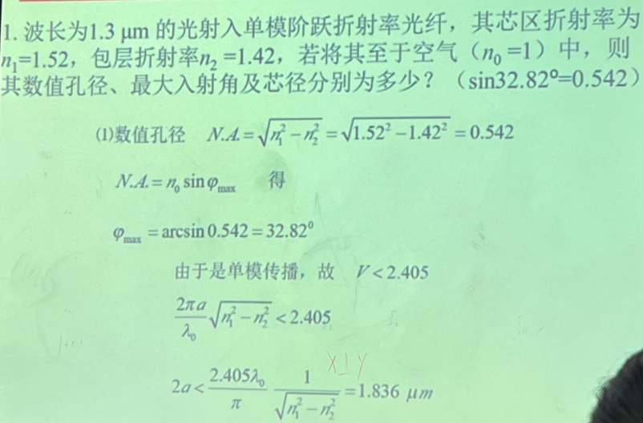

# 光电子学期末复习

> 题型：判断题5\*2，选择题10\*3，简答题5\*10，计算题1\*10

# 小题
## 1. 磁光调制法拉第效应特性
一束平面偏振光通过磁场作用下的某些物质时，其偏振方向受到正比于外加磁场的平行于传播方向分量的作用而发生偏转，这种现象称为法拉第效应

> 旋光现象：线偏振光沿光轴通过某些天然介质时，偏振面旋转的现象称为天然旋光，简称旋光现象

## 2. 信噪比——衡量探测器对微弱信号的识别能力

## 3. 非相干/相干光源的特征？
非相干光：原子或分子体系的自发辐射
- 光波方向、频率及相位等都是不确定的、分散的
- 杂乱无章的噪声光，传输衰减，出射光强恒小于入射光强

相干光：发散性小、频谱单一、亮度高、相位同步、出射光强增强

## 4. 光电显示自发光：OLED有机发光二极管

## 5. 光调制的目的：信息加载，便于传输
- 将电信号转化为光信号

## 6. 单模：适合长距离高速通信

## 7. 多模：阶跃+渐变折射率

## 8. 载流子、光电导
光电导效应：光照变化引起半导体材料电导变化的现象。

光伏效应：光照使不均匀半导体或半导体与金属组合的不同部位之间产生电位差的现象

## 9. 石英晶体双折射，玻璃非晶

## 10. 粒子数反转分布指的是？
粒子数反转：激发态电子数大于基态电子数，使受激发射占主导

## 11. 导引波条件是？
导引波（导波）：只沿z向传播功率，如同是被界面所引导
- 导引波是非均匀平面波、横电波、x方向为驻波，z方向为行波。
- 在光密媒质中形成

沿轴向均匀传播的条件：全反射+横向相位匹配

## 12. 阶跃折射率所有模式传播速度相同（错误）

# 大题
## 一、激光器的基本结构
- 激光工作物质：是激光形成的介质，通过受激发射形成粒子数反转，是激光形成的内因
- 泵浦源：提供形成激光的能量激励，是激光形成的外因
- 光学谐振腔：为激光器提供反馈放大机构，提高受激发射的强度、方向性、单色性

## 二、光电探测器的基本工作原理，并举例说明其在实际应用中的作用。
- 光电探测器的基本工作原理是基于光电效应，即当光照射到具有适当能带结构的半导体材料上时，光子能量激发电子跃迁，形成载流子，从而改变电流或电压
- 光电探测器主要包含：光敏电阻、光电二极管、光电晶体管
- 光电探测器广泛应用于：光学通信、图像传感器、红外探测、太阳能电池等领域，例如，图像传感器中，光电探测器将光信号转化为电信号，从而实现图像采集

## 三、阶跃折射率和渐变折射率光纤的主要区别是什么？分别适用于什么场景？
- 阶跃折射率光纤的折射率在纤芯和包层之间发生突变
- 渐变折射率光纤的折射率在纤芯中连续变化
- 阶跃折射率光纤比较容易发生较大的膜间散射，适用于短距离通信
- 渐变折射率光纤通过渐变的折射率减少了膜间散射，适用于高速、远距离通信

## 四、内光电效应和外光电效应的区别
- 内光电效应：发生在物质内部，主要体现为载流子的产生效应，红限和半导体禁带宽度成反比
- 外光电效应：发生在物质表面，主要体现为表面电子发射现象，红限和表面逸出功成反比
## 五、简述pn结电致发光原理
给pn结加正向压降时，势垒降低，耗尽层变薄，能量较大的电子和空穴分别注入到p区和n区，同p区的空穴和n区的电子复合，同时以光的形式辐射出多余的能量。

## 六、计算题
