# 公式速查

$$
pn结接触势垒：V_D=\frac{k_0T}{q}[ln\frac{N_AN_D}{n_i^2}]\\
$$

$$
pn结载流子分布：
\begin{cases}
n(x)=n_{p0}e^{-\frac{qV(x)}{k_0T}}\\
p(x)=p_{p0}e^{-\frac{qV(x)}{k_0T}}
\end{cases}
$$

$$
突变结的势垒宽度X_D=\sqrt{V_D\frac{2\varepsilon_r\varepsilon_0}{q}(\frac{1}{N_A}+\frac{1}{N_D})}
$$

[TOC]

# 半导体物理期末复习

## 第零章 绪论

### 0.1半导体物理概述

1. 19世纪末，经典力学无法描述微观系统，量子力学诞生
- 黑体辐射
- 光电效应：$E = h\nu - W$
- 德布意波（物质波）：$\lambda = \frac{h}{p}$
  - 对物质波来说，动量$\uparrow$，德布罗意波长$\downarrow$，物质越集中；动量$\downarrow$，德布罗意波长$\uparrow$，物质越发散。
  - 当实物粒子波波长很短时，物质集中性更强，波动性可以忽略。
- 海森堡测不准原理：$\Delta x \Delta p \geq \frac{h}{4\pi}$
- 薛定谔方程：$i\hbar \frac{\partial}{\partial t} \Psi(\mathbf{r},t) = -\frac{\hbar^2}{2m} \nabla^2 \Psi(\mathbf{r},t) + V(\mathbf{r},t)\Psi(\mathbf{r},t)$

2. 芯片、半导体、集成电路的联系
- 集成电路（$Integrated Circuit，IC$）: 将大量电子元器件集成在一块小小的半导体芯片上，形成一个完整的电路系统。
- 芯片（$Chip$）: 半导体元器件总称，可以使用的个体。
- 半导体（$Semiconductor$）: 集成电路的基础材料。
- 三者关系：半导体是芯片的材料，芯片上集成了电路，形成集成电路。
- 半导体产业>芯片产业>集成电路产业

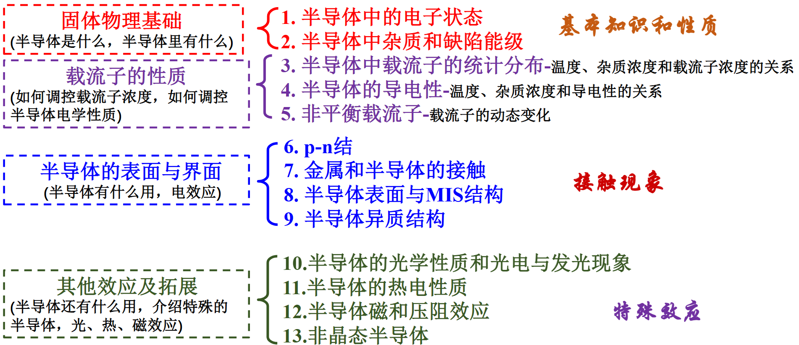

3. 半导体定义（$R=\rho\frac{L}{S}$）

|类型|导体|半导体|绝缘体|
|:-:|:-:|:-:|:-:|
|电阻率|$10^{-6}~10^{-4}$|$10^{-6}-10^{-4}$|$10^{-6}-10^{-4}$|

4. 半导体主要特征
   1. 微量杂质可以显著改变其导电性能
       - 硅中掺入百万分之一的磷（$\mathrm{P}$）或硼（$\mathrm{B}$）等杂质，可以使其导电性能提高约一百万倍。
   
   2. 半导体导电能力随温度增加而急剧增加
   

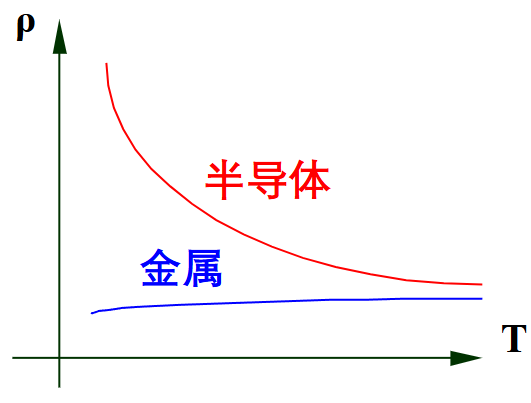

5. 光照可以显著改变半导体的导电能力

6. 电磁场可以显著改变半导体的导电能力

### 0.2半导体分类（按组成分）

- 无机半导体
  - 元素半导体：硅（$\mathrm{Si}$）、锗（$\mathrm{Ge}$）$\rightarrow$第一代半导体
  - 化合物半导体
    - 砷化镓（$\mathrm{GaAs}$）、磷化铟（$\mathrm{InP}$）$\rightarrow$第二代半导体
    - 碳化硅（$\mathrm{SiC}$）、氮化镓（$\mathrm{GaN}$）$\rightarrow$第三代宽禁带半导体
    - 氧化镓（$\mathrm{Ga_2O_3}$）、金刚石 $\rightarrow$ 第四代超宽禁带半导体
- 有机半导体

## 第一章 半导体中的电子状态
### 1.1 半导体的晶格结构和结合性质
#### 1.1.1固体
- 晶体
  - 单晶：固定熔点、规则外形、各向异性，长程有序（整个晶体内原子或分子均呈规则排列）
  - 多晶：在许多个原子或分子尺度上有序
- 非晶体（无定形材料）：无固定熔点、无规则外形、各向同性，短程有序（只在几个原子或分子内存在规则排列）

#### 1.1.2晶体中的化学键
1. **化学键**：原子/离子间的相互作用力

2. 原子的电负性：吸引电子的能力，电负性$\uparrow$，吸引电子能力$\uparrow$，电离能$\uparrow$（电子难以挣脱原子的束缚），亲和能$\uparrow$（原子有较大能量获取外来电子），反应了最外层电子得失的难易程度
  - 电离能：原子失去一个电子需要的能量
  - 亲和能：中性原子获得一个电子，放出的能量
  - 同族，从上到下，电负性$\downarrow$
  - 同周期，从左到右，电负性$\uparrow$（左上最大，右下最小）
> 电子总是向电负性大的原子转移

3. 离子键和离子晶体
  - 离子键：正负离子之间的静电引力形成的结合力，极性键，离子晶体是极性晶体，**电负性差距大的元素易形成离子晶体**。
  - 配位数：一个原子/离子最邻近的原子数/离子数，**配位数越大，原子排列越紧密**。

4. 共价键和共价晶体
  - 共价键(半导体键)：依靠共有自旋相反的配对的价电子所形成的结合力。
  - 共价晶体：金刚石$\mathrm{C}$、$\mathrm{Si}$、$\mathrm{Ge}$。
    - 饱和性：原子和周围原子共价键有数目限制，如：$\mathrm{Si}$周围4个未配对价电子$\rightarrow$只能形成4个共价键$\rightarrow$配位数为4。
    - 方向性：电子云的重叠在空间的确定方向上（共价键方向）具有最高密度。

5. 金属键和金属晶体
  - 电子气：电子为全晶体共有，波函数有相同组成形式。
  - 金属键：电子气和原子实之间的库仑引力所形成的结合力。
  - > 原子排列紧密，占有空间小，从而最稳定，配位数是所有晶体类型中最大的。

6. 混合键和混合晶体
  - 混合键：同时存在几种化学键。

7. 晶体结构的基本概念
  - 布拉菲空间点阵学说：晶体对称性$\rightarrow$布拉菲空间点阵对称性。
  - 基元：组成晶体的最小单元（实际粒子）。
  - 格点：晶体中各个基元的几何位置。
  - 晶体点阵（晶格）：用一个几何点表示基元后，晶体所构成的几何点阵列。
> 点阵+基元=晶体结构

#### 1.1.3 半导体的晶体结构
1. 原胞：**体积最小**的周期单元，不考虑对称性。

2. 晶胞：最小的晶体周期单元，考虑对称性。
  - 立方晶系晶胞
    

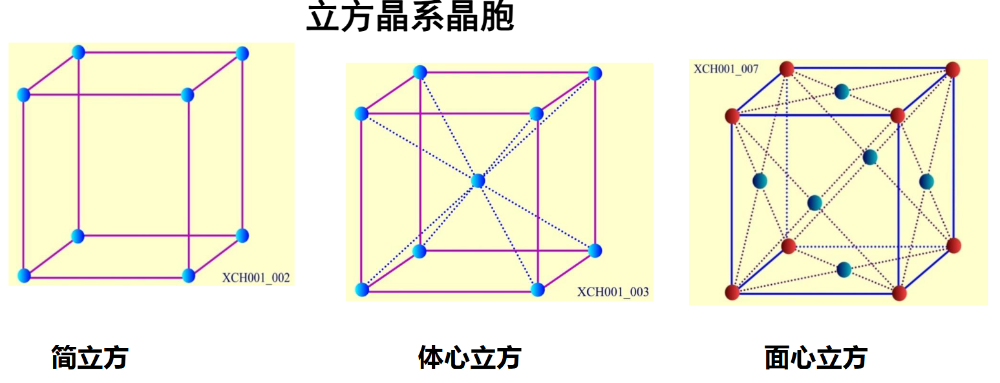
    

  - 金刚石结构：面心立方结构沿着对角线位移$\frac{1}{4}$长度

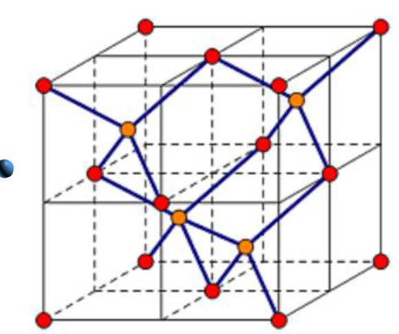

  - 四面体结构：共价键从正四面体中心原子指向四个顶角原子

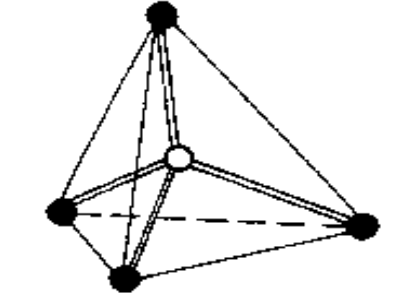

  - 六角密堆积结构：

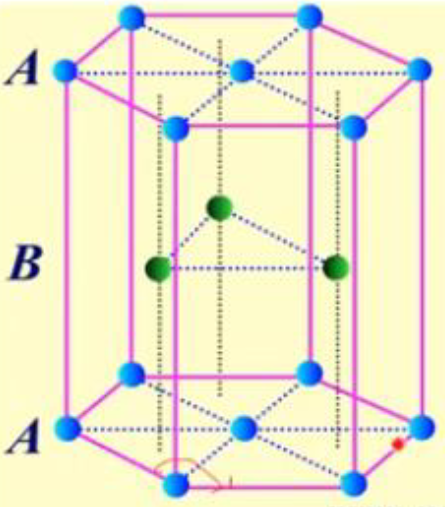

  - 闪锌矿结构：以III-V族化合物为主，**两类原子**各自组成面心立方晶格，沿着对角线位移$\frac{1}{4}$长度，因为两类原子电负性不同，其共价键有一定极性（离子键成分）

  - 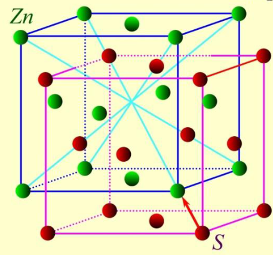

  - 纤锌矿结构：以II-VI族化合物为主，离子性更强

    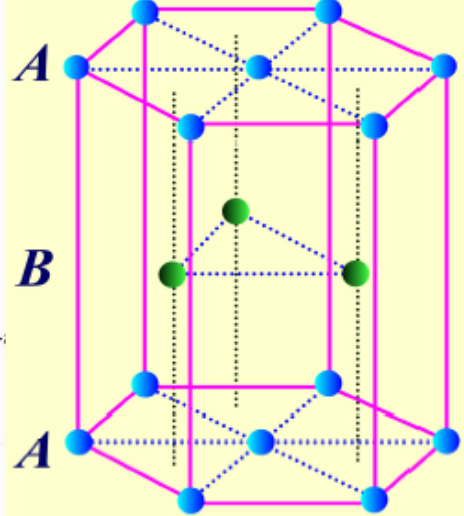

  - 氯化钠型晶体结构：主要为IV-VI族化合物，由两个面心立方晶体沿着对角线方向位移$\frac{1}{2}$长度形成，如硫化铅、硒化铅

    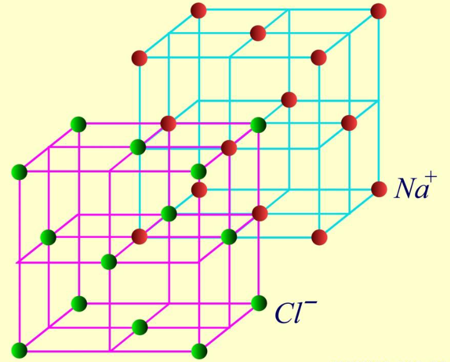

  - 氯化铯结构：由两个简立方晶格沿着对角线位移$\frac{1}{2}$长度形成!

  - 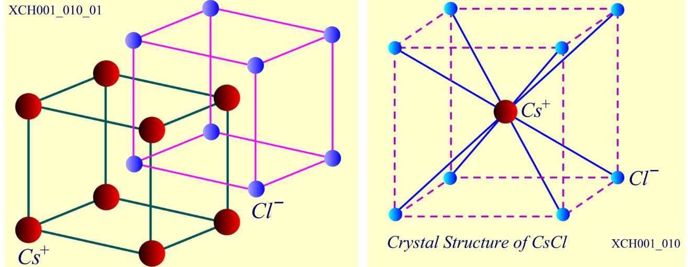

  - 钙钛矿结构：$\mathrm{ABO_3}$型，$\mathrm{A}$代表二价/一价金属，$\mathrm{B}$代表四价价/五价金属，$\mathrm{BO_3}$称为氧八面体基团

    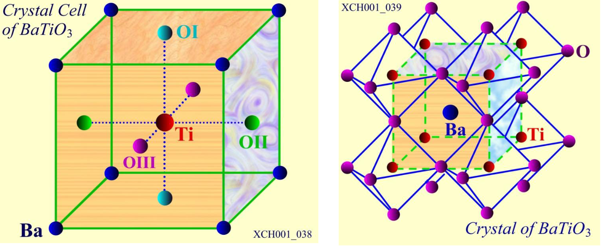

  - 二维结构：石墨烯、二硫化钼、黑磷等。

1. 晶向和晶面
  - 晶体基本特点：各向异性。

  - 晶列：布拉菲格点可以看成分布在一系列互相平行的直线系上，即为晶列
> 一族平行的晶列包含所有格点；同族相邻晶列之间距离相等；通过一格点有无限多的晶列，每一晶列都有一族平行的晶列与之对应

  - **晶向**：用晶向区分经过同一个格点的不同晶列
    - 选取原点后，沿着晶向到最近一个格点的位矢$\vec{A}=l_1\vec{a_1}+l_2\vec{a_2}+l_3\vec{a_3}$
    
      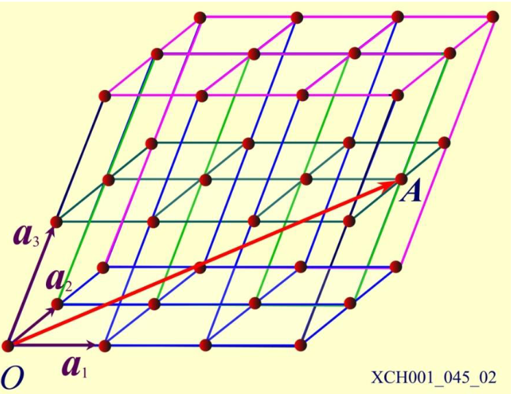
    
    - **晶向指数**：[$uvw$]=[$l_1 l_2 l_3$]，为互质整数
    
  - 同类晶向记为<$mnp$>
    - <100>代表了[100]、[$\overline{1}00$]、[010]、[$0\overline{1}0$]、[001]、[$00\overline{1}$]六个晶向
    - <111>代表了对角线的8个晶向
    - <110>代表了12个面对角线的晶向
    
  - **晶面**：与晶列对应，布拉菲格点分布在平行等距的平面系上，即**晶面**
    - **密勒指数**（$hkl$）：区分不同晶面的依据，取该晶面与各坐标轴截距的倒数，化为最简整数比，即**密勒指数**。
      - 密勒指数$\downarrow$，格点密度$\uparrow$，晶面密度$\downarrow$，晶体的晶面数$\uparrow$。
      - 面密度：晶面中格点数目/晶面面积。
      - 晶面距离：相邻两层平行晶面之间的距离。

### 1.2 半导体中的电子状态（能量状态）和能带
#### 1.2.1 原子的能级和晶体的能带
##### 一、原子的能级和晶体的能带定性说明
1. 孤立能级：原子处于一种单独的能级，不受其他原子的影响。
  - 需要四个量子数：
    - $n$-主量子数，表征量子态具有能量的大小
    - $l$-角量子数，表征角动量的大小
    - $m$-磁量子数，决定轨道角动量在空间的方位
    - $s$-自旋量子数，表征自旋角动量在空间的方位

2. 核外电子在壳层上的分布：原子中的电子处在不同的能级上形成电子壳层，
  - 能量最低原理：优先占据能量最低的量子态
  - 泡利不相容原理：同一量子态不能容纳自旋相同的两个电子

3. 电子壳层交叠：多个原子靠近时，电子壳层会发生交叠，相邻原子交叠的最多

4. ***电子共有化运动：发生电子壳层交叠后，电子不再完全局限于某一原子上，可以由一个原子转移到相邻的原子上去，因而可以在整个晶体中运动，这种运动称为电子的共有化运动。***
  - 各原子中相似的壳层上的电子才有相同的能量，电子只能在相似壳层间转移

5. 能带的形成：原子靠近$\rightarrow$电子壳层交叠$\rightarrow$电子共有化运动$\rightarrow$分立的能级形成能带。
  - 外层电子**共有化运动强**，能级分裂早，**能带宽度大**，外层电子称为准自由电子。
  - 简并：一个原子有N种能量状态，即为N度简并。
  - 对于相距很远的N个相同原子，每个原子的能级结构都是一样的，针对某一个能级，就会出现N个完全相同、能量相同的状态。P5
  - ***当这$N$个原子结合成晶体，每个原子都会受到周围原子的周期性势场的作用，最终每个$N$度简并的能级都会分裂成$N$个相近的能级，这$N$个能级非常接近，形成一个连续的能带***。

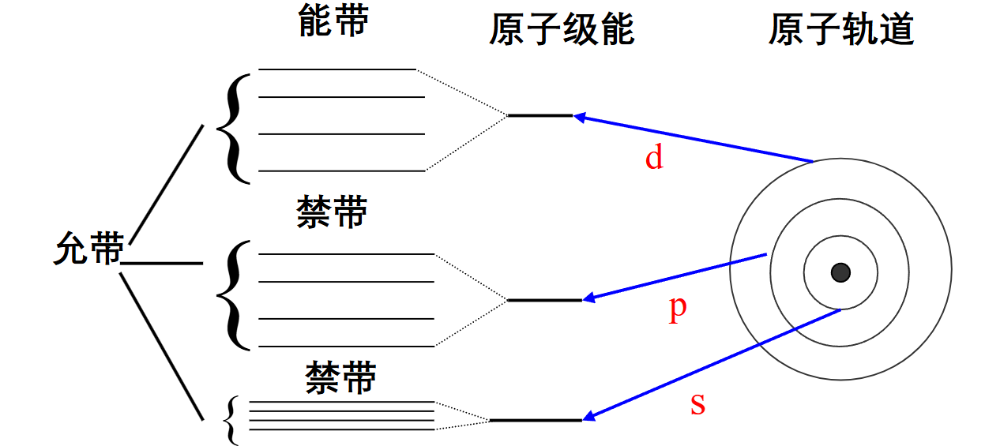

> 电子壳层交叠，电子云重叠，电子共有化运动，电子不再分立的存在于能级中，各个能级的电子都存在，使得能级分裂成能带。

##### 二、半导体中电子的状态和能带（定量计算）

1. 计算理想近似
  - 单电子近似：晶体中的某一个电子在周期性排列且固定不动的原子核的势场，以及其他大量电子的平均势场中运动，这个势场也是周期性变化的，且周期与晶格周期相同。P6

> 晶体中有许多电子相互作用，假设电子间没有相互作用，而是在于一个平均势场中运动，则电子的运动可以用单电子薛定谔方程来描述。

  - 绝热近似：电子的质量比原子核小得多，电子运动远快于原子核，故考虑电子运动规律时，近似认为原子核固定不动。

2. 氢原子的能带
$$
\begin{align*}
E_n&=-\frac{m_0q^4}{8\varepsilon_0^2\hbar^2}·\frac{1}{n^2}
\tag{1.1}\\
&=-13.6\frac{1}{n^2}(n=1,2,3\cdots)
\end{align*}
$$

- n表示量子数

3. 自由电子
- 德布罗意关系：
  - $E=h\nu=\hbar\omega$
  - $p=\frac{h}{\lambda}=\hbar k$

- 德布罗意平面波：
$$
\begin{align*}
\psi&=Ae^{\vec{p}·\vec{r}-Et}
\tag{1.2}\\
&=Ae^{i(\vec{k}·\vec{r}-\omega t)}
\end{align*}
$$

- 一维情况下自由电子波函数：
$$
\begin{align*}
\psi(x,t)&=Ae^{i(\vec{k}·\vec{x}-\omega t)}
\tag{1.3}\\
&=Ae^{ikx}e^{-i\omega t}\\&=\psi(x)e^{-i\omega t}
\end{align*}
$$

- 定态薛定谔方程：
$$
\frac{-\hbar^2}{2m}\nabla^2\psi(x)=E\psi
\tag{1.4}
$$

- 粒子的动能关系：
  - 动量：$p=m_0v$
  - 动能：$E=\frac{p^2}{2m_0}$$\rightarrow$波矢连续变化，自由电子的能量是连续能谱

- 自由电子的波函数：$\psi(x)=Ae^{ikx}$

> $|\psi|^2=|\psi·\psi^*|=A^2$表明电子在空间各点等几率出现，即电子是自由的。

   - 德布罗意关系代入动能公式：
$$
\begin{cases}
v&=\frac{\hbar k}{m_0}\\
E&=\frac{\hbar^2k^2}{2m_0}
\end{cases}
$$

> 当波矢$\vec{k}$确定时，$E,p,v$都可以确定$\rightarrow$**波矢$\vec{k}$可以描述自由电子的运动状态**

1. 半导体中电子的状态及能带
   - 布洛赫定理：在晶体中，近似认为电子在周期性势场$V(x)=V(x+sa)$中运动（s为整数），此条件下满足薛定谔方程的波函数满足两个条件：
$$
\begin{cases}
\psi(x)&=u_k(x)e^{ikx}\\
u_k(x)&=u_k(x+na)，n为整数
\end{cases}
$$

> 即电子的波函数可以用周期性势场来描述，周期与晶格周期相同。

> 晶体中的电子既有共有化倾向，又有周期性排列的离子的束缚的特点。

> $|\psi·\psi^*|=|u_k(x)u_k^*(x)|$表明电子在空间各点出现的概率与波函数在该点的强度有关，晶体中找到该电子的几率周期性变化，电子不再属于某一个原子，而是可以半自由的运动到其他格点上。

> 布洛赫波函数中波矢$\vec{k}$具有量子数的作用，不同的$\vec{k}$标志着不同的共有化运动状态

1. 近自由电子近似：将周期性势场视为微扰，电子波的传播，受到晶格原子的反射，一般情况下，各反射波相互抵消；当满足布拉格反射条件$2dsin\theta=n\lambda$时，形成驻波$\rightarrow$**即为定态**

- 一维晶格中布拉格反射条件：$k=\frac{n\pi}{a},n=0,\pm1,\pm2,\cdots$

- 电子运动可视为波包运动，波包的群速可视为电子运动的平均速度
  - 相关参量为
$$
\begin{cases}
v&=\frac{dw}{dk} \ \ \ \ \ &\text(电子运动速度)\\
E&=h\nu&（波包能量）\\
\omega&=2\pi\nu&（波包频率）
\end{cases}
$$
  - ***$\rightarrow \nu=\frac{1}{\hbar}\frac{dE}{dk}\rightarrow$电子速度为$E-k$图的斜率***

- 当$k=\frac{n\pi}{a}$时，发生布拉格反射，形成驻波，电子速度$v=0$，在原子位置固定时，驻波有两种形式，一种是原子在驻波的波节、一种是原子在驻波的波腹，故存在两种能量，所以在发生布拉格反射的点存在边界分裂，形成禁带$\rightarrow$**能带结构形成的根本原因是布拉格反射**。

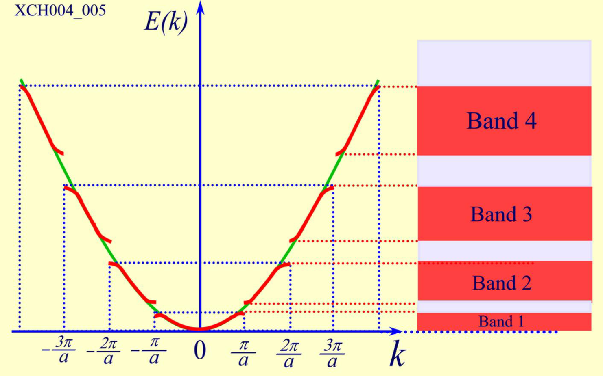

6. 紧束缚近似：从孤立原子出发，视晶体为原子相互靠拢到一定程度形成的，晶体中电子做共有化运动，能级必须展宽为能带

7. 克隆尼格潘纳近似

8. 布里渊区和能带

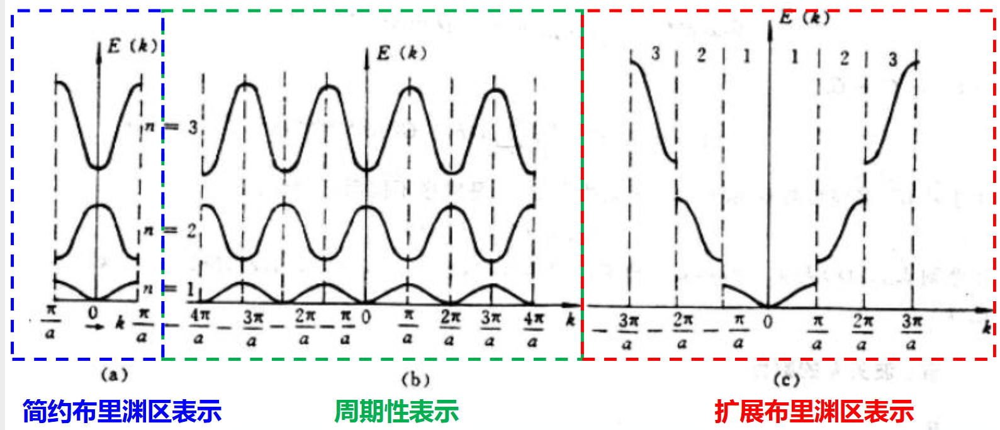

9. 能带中的量子数（允带中$k$的取值与数量）

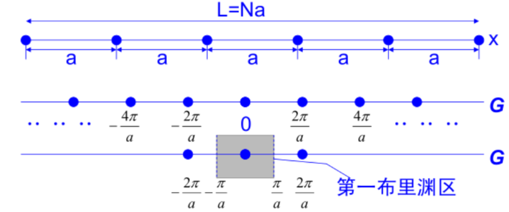

   - 线长为$L$，周期为$a$的一维线性晶体
   - 周期性边界条件：
$$
\psi(x)=\psi(x+L)
\tag{1.5}
$$
   - $L$作为周期性条件，要求允许的波矢为$k=0,\pm\frac{2\pi}{L},\pm\frac{4\pi}{L},\cdots,\pm\frac{2n\pi}{L}$
   - 间隔$\frac{2\pi}{L}$就有一个允许的波矢
   - 第一布里渊区波矢数：
$$
n_1=\frac{\frac{2\pi}{a}}{\frac{2\pi}{L}}=\frac{L}{a}
\tag{1.6}
$$

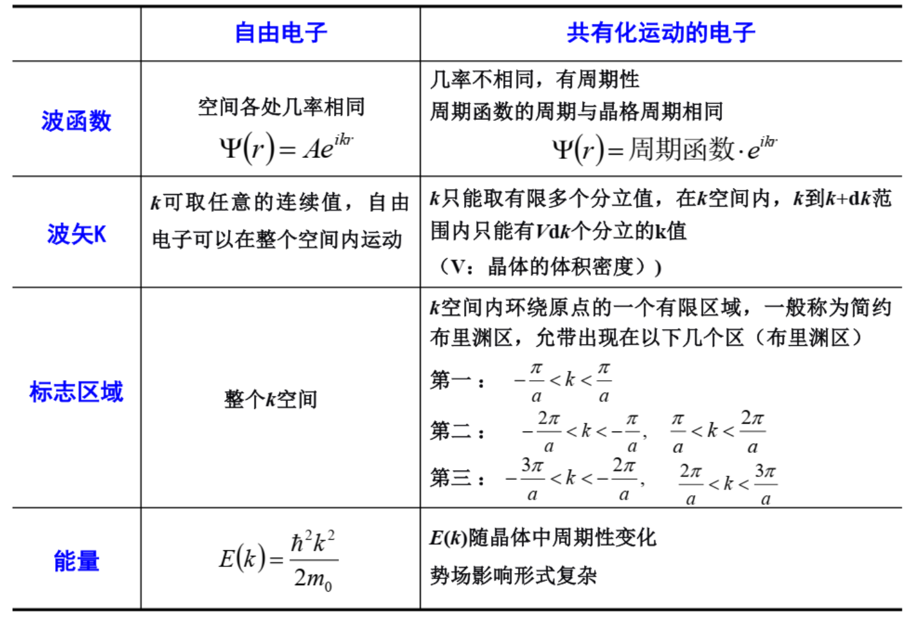

10. 导体、半导体、绝缘体的能带
- 导电：电子参与导电是由于外力作用下，电子状态及分布发生改变
- 满带下电子不导电：导带中电子一直处于满的状态，没有改变

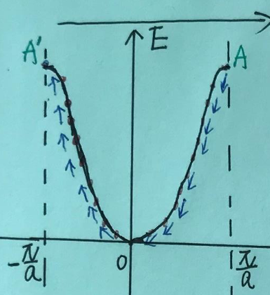

- 半满带下电子导电：在外力的作用下，电子**分布**发生改变

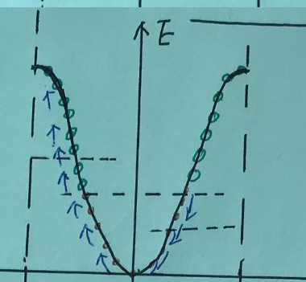

$$
\begin{cases}
\text{导体：存在未填满的价带} \\
\text{半导体：价带是满带，导带是空带，禁带宽度小} \\
\text{绝缘体：价带是满带，导带是空带，禁带宽度大} \\
\end{cases}
$$

> 绝缘体和半导体的差距：绝缘体禁带宽度远大于半导体

> 半导体在常温下有相当数量的电子被激发到导带，所以常温下具有一定导电能力

> $T=0\mathrm{K}$时，半导体的能带结构与绝缘体相似

- 本征激发
  - 本征半导体：纯净不含任何杂质缺陷的半导体
  - 本征激发：价带电子激发成为导带的过程

### 1.3 半导体中电子的运动——有效质量
在量子力学中，牛顿第二运动定律不再成立，使用有效质量$m_n^*$代替惯性质量描述电子运动规律，
$$
m_n^*=\frac{\hbar^2}{\frac{d^2E}{dk^2}}\tag{1.7}
$$

- 有效质量的意义：利用有效质量，**直接把外力$f$和电子加速度联系起来，而内部势场的作用由有效质量加以概括（有效质量的含义包含了内部势场的作用，故表面上看上去无内部势场的作用）。**

### 1.4 本征半导体的导电机构——空穴
- 热力学温度为0时，纯净半导体导带为空，价带被价电子填满，故不导电。在一定温度下，价带顶的少量电子被激发到导带底，其有效质量为正，导带中的电子参与导电，同时价带少了一些电子后呈现不满带状态，价带电子也表现出
导电特性，用空穴导电来描述。
- 半导体导电：导带电子、价带空穴共同导电
- 导体导电：只有电子一种载流子参与导电

### 1.5 回旋共振实验-第一次测出有效质量
1. $k$空间等能面
  - 等能球面
$$
\begin{cases}
\begin{align*}
\text{导带底：}E(k)-E(0)&=\frac{h^2}{2m_n^*}(k_x^2+k_y^2+k_z^2)\\
\text{价带顶：}E(k)-E(0)&=-\frac{h^2}{2m_p^*}(k_x^2+k_y^2+k_z^2)\\
\text{等能球面半径为：}r&=\sqrt{\frac{2m_n^*}{h^2}[E(k)-E(0)]}
\end{align*}
\end{cases}
$$

- 等能椭球面
  - 晶体各向异性$\rightarrow$$E-k$关系（与$m^*_n$有关）沿不同的$k$方向不一定相同$\rightarrow$$m^*_n$不一定相同
  - 能带极值不一定处于$k=0处$$\\$
  $\rightarrow$定义：$m^*_x,m^*_y,m^*_z$为相应方向导带电子有效质量
  - 一般等能面都是椭球面

则等能椭球面为：
$$
\frac{k_x^2}{\frac{2m_x^2(E-E_c)}{\hbar^2}}+\frac{k_y^2}{\frac{2m_y^2(E-E_c)}{\hbar^2}}+\frac{k_z^2}{\frac{2m_z^2(E-E_c)}{\hbar^2}}=1
\tag{1.8}
$$

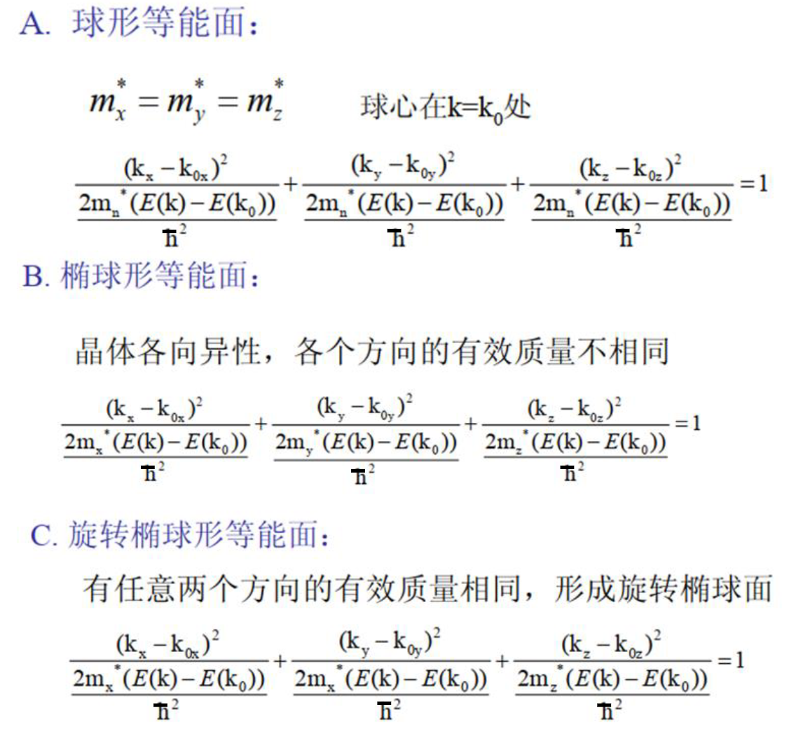

2. 回旋共振实验（测量有效质量，了解能带结构）
  - 各向同性晶体
     - 将半导体样品置于均匀的磁场中，同时对半导体加上交变电磁场。
     - 当**电磁场的角频率=半导体中电子回旋共振的角频率**时，可以观察到半导体对交变电磁场能量的吸收峰（P-B）。
     - 由于电子回旋频率与电子的有效质量有一定的关系，从中可以测得电子的有效质量。

> 磁场作用下电子的运动轨迹

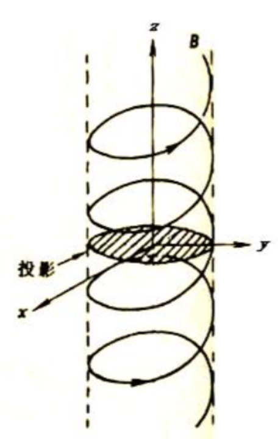

**有效质量求解公式：**
$$
\omega_c=\frac{qB}{m_n^*}\rightarrow m_n^*=\frac{qB}{\omega_c}
\tag{1.9}
$$

  - 各向异性晶体
    - $B$沿$k_x,k_y,k_z$轴的方向余弦分别为$\alpha,\beta,\gamma$
    - 沿$k_x,k_y,k_z$轴的有效质量分别为$m^*_x,m^*_y,m^*_z$

---

### 1.6 硅和锗的能带结构
- 叙述能带结构的几个必须点
  - 极值位置
  - 极值点个数
  - 极值点附近等能面的形状
  - 椭球轴的长轴方向
- $\vec{B}$对晶轴有不同取向时，可以得到为数不等的吸收峰，由此可以判断等能面的形状及个数，并计算有效质量
  - $\vec{B}$沿[111]晶轴方向，一个吸收峰
  - $\vec{B}$沿[110]晶轴方向，两个吸收峰
  - $\vec{B}$沿[100]晶轴方向，两个吸收峰
  - $\vec{B}$沿任意方向，三个吸收峰

- 设硅导带底附近的等能面为沿[100]方向的旋转椭球面，由晶体立方对称性要求，必有同样的等能面在其他五个方向上

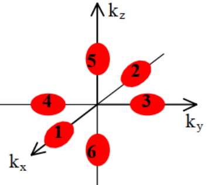

- 令$E(\vec{k})-E_c=\frac{h^2}{2m_n^*}\vec{k}\cdot\vec{k}$，设$\vec{k_{0s}}$表示第$s$个极值所对应的波矢，可以求解椭球面的方程：
$$
\frac{(k_x-k_{0x})^2}{\frac{2m_x^2(E-E_c)}{\hbar^2}}+\frac{(k_y-k_{0y})^2}{\frac{2m_y^2(E-E_c)}{\hbar^2}}+\frac{(k_z-k_{0z})^2}{\frac{2m_z^2(E-E_c)}{\hbar^2}}=1
\tag{1.9}
$$
- $\mathrm{Si}$的导带底结构是沿长轴[100]方向的六个旋转椭球构成的，**旋转椭球中心为导带极小值点**，位于第一布里渊区中心至边界0.85倍处

- 设$\vec{B}$与三个坐标轴的夹角分别为，$\alpha$，$\beta$，$\gamma$，以[001]方向的旋转椭球为例，有效质量为：
$$
\frac{1}{m_n^*}=\sqrt{\frac{m_x^*\alpha^2+m_y^*\beta^2+m_z^*\gamma^2}{m_x^*m_y^*m_z^*}}
\tag{1.10}
$$

- $\mathrm{Si}和\mathrm{Ge}$的导带底结构：
$$
\begin{cases}
\text{价带结构复杂}\\
\text{价带顶（价带极大值$E_v$位于$k=0$处）}\\
\text{能带简并（多个$k$值对应一个$E$）}\\
\end{cases}
$$

- 禁带宽度
  - 室温下$T=300\mathrm{K}$
    - $Si$$\rightarrow$$E_g=1.12\mathrm{eV}$
    - $Ge$$\rightarrow$$E_g=0.67\mathrm{eV}$
  - 温度$\uparrow$禁带宽度$\downarrow$

- 导带结构
1. $Ge$
$$
\begin{cases}
\text{导带最低能值位于[111]方向布里渊区边界}\\
\text{共8个等价点，每个等价点在简约布里渊区内只有半个能谷，共四个等价能谷}\\
\text{在$k=0$和[100]方向还有较高的能谷}
\end{cases}
$$
2. $Si$
$$
\begin{cases}
\text{导带极小值位于[100]方向，非布里渊区边界而是第一布里渊区中心至边界0.85倍处}\\
\text{6个等价能谷}\\
\end{cases}
$$

$\rightarrow\rightarrow\rightarrow\rightarrow\rightarrow\rightarrow Ge和Si具有多能谷结构$

- 价带
$$
\begin{cases}
\text{$Ge$和$Si$的价带极大值都位于布里渊区边界的中心（$k=0$）}\\
\text{价带中空穴主要分布在极大值附近}\\
\text{同一$k$值，$E(k)$可以有两个值}\\
\text{$k=0$处，$E(k)$的两个值重合$\rightarrow$存在有效质量不同的空穴}
\end{cases}
$$
$$
\begin{cases}
\text{曲率大$\rightarrow$有效质量大$\rightarrow$重空穴$\rightarrow$ $(m_p)_h$}\\
\text{曲率小$\rightarrow$有效质量小$\rightarrow$轻空穴$\rightarrow$ $(m_p)_l$\\}
\end{cases}
$$

- $E_g(T)=E_g(0)+\beta T$
$$
\begin{cases}
\text{温度$\uparrow$禁带宽度$\downarrow$}\\
\text{$\beta=\frac{dE_g}{dP}$}
\end{cases}
$$

- 间接带隙半导体
  - 导带底和价带顶对应$k$值不同$\rightarrow$电子跃迁需要同时改变能量和动量$\rightarrow$必须借助声子补偿动量$\rightarrow$发光效率低，结构、工艺好

- 直接带隙半导体
  - 电子跃迁不需要借助声子$\rightarrow$发光效率高

- $\mathrm{GaAs}$的能带结构
  - 第一布里渊区和金刚石结构相同，都是截角八面体
  - 具有与$\mathrm{Si,Ge}$相似的价带结构
    - 价带在第一布里渊区中心是简并的
    - 布里渊区中心是简并的
    - 只有一个自选轨道耦合分裂出来的第三代
    - **不同之处**：价带极值稍微偏离布里渊区

## 第二章 半导体中的杂质和缺陷能级
### 2.1 理想与实际半导体
理想半导体|实际半导体
:-:|:-:
原子静止|原子在晶格平衡位置振动
无杂质|存在杂质
无缺陷|有缺陷

### 2.2 杂质和缺陷的分类
- 杂质：存在与本体不同的元素
- 缺陷：周期性结构被破坏

### 2.3 杂质的分类
间隙式杂质|替位式杂质
:-:|:-:
杂质比本体原子小|杂质比本体原子大
杂质填充晶体间隙|杂质替代本体元素

### 2.4 施主受主（常指在$\mathrm{Si,Ge}$中掺入）
- 杂质电离能：杂质中的电子释放出来成为导电电子所需的能量
- 施主电离能：施主给电子需要的能量
- 受主电离能：受主给空穴需要的能量

施主杂质|受主杂质
:-:|:-:
给电子的杂质|给空穴的杂质
形成$\mathrm{N}$型半导体|形成$\mathrm{P}$型半导体
核外电子>4，常为$\mathrm{V}$族元素|核外电子<4，常为$\mathrm{III}$族元素
形成施主能级$E_D$（施主束缚的电子所在的能级）|形成受主能级$E_D$（施主束缚的电子所在的能级）
施主电离能$\Delta E_D=E_C-E_D$|受主电离能$\Delta E_A=E_A-E_V$
给电子后施主由束缚态$\rightarrow$离化态|给空穴后受主由束缚态$\rightarrow$离化态
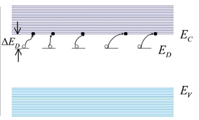|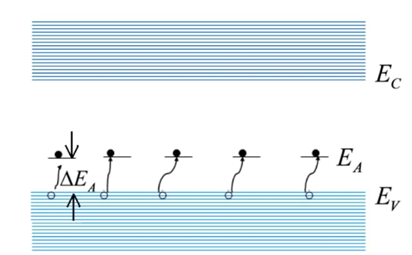

### 2.5 浅能级、深能级杂质（掺入$\mathrm{Si,Ge}$）

浅能级杂质|深能级杂质
:-:|:-:
电离能很小的杂质|电离能很大的杂质
常在$\mathrm{III,V}$族元素掺入$\mathrm{Si,Ge}$|常在$\mathrm{III,V}$族**以外**的元素掺入$\mathrm{Si,Ge}$
$\Delta E_D,\Delta E_A<<E_g$|杂质能级在禁带中心
室温下，晶格原子热振动+小电离能（小束缚）$\rightarrow$杂质几乎全部离化|室温下杂质几乎不电离，易多级电离，产生多个能级（电离能很大，不易被激发）
类氢模型计算电离能|类氦模型计算电离能
显著影响载流子浓度、导电类型|对载流子复合作用强，常称为复合中心，载流子寿命降低，用作高速开关器件

浅能级杂质电离能计算（类氢模型近似）
- 氢原子电离能计算公式：$E_0=E_\infty-E_1=\frac{m_0q^4}{8\pi\varepsilon_0^2h^2}=13.6\mathrm{eV}$ 
$$
\text{需要进行两项修正}
\begin{cases}
\text{晶体适用于相对介电常数$\varepsilon=\varepsilon_0\varepsilon_r$}\\
\text{有效质量$m^*$替代惯性质量$m$}\\
\end{cases}
$$

即可得到浅能级杂质电离能计算公式：
$$
\begin{align*}
\Delta E_D&=\frac{m^*q^4}{8\pi\varepsilon_0^2\varepsilon_r^2h^2}\\
&=\frac{m^*}{m_0}·\frac{1}{\varepsilon_r^2}·\frac{m_0q^4}{8\pi\varepsilon_0^2h^2}\\
&=\frac{m^*}{m_0}·\frac{1}{\varepsilon_r^2}·13.6\mathrm{eV}\tag{2.1}
\end{align*}
$$

### 2.6 杂质的补偿作用

- 当半导体中既含有施主杂志又含有受主杂质，二者共同作用决定半导体导电性质

$N_D>N_A$|$N_D<N_A$
:-:|:-:
施主给的电子剩余$\rightarrow$等效于施主掺杂|受主给的空穴剩余$\rightarrow$等效于受主掺杂
有效掺杂浓度为施主受主浓度差|~

### 2.7 $\mathrm{III}-\mathrm{V}$杂质化合物中的杂质能级（以$\mathrm{GaAs}$为例）
- 不同族元素掺杂后，可能产生：替代$\mathrm{Ga}$、替代$\mathrm{As}$、填补空隙
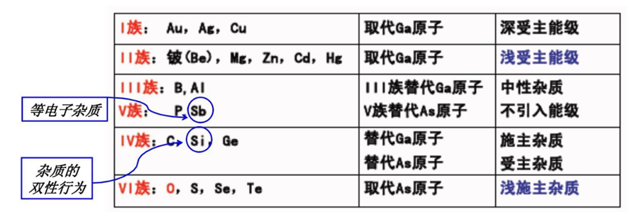
- 两性杂质：随着掺$\mathrm{Si}$浓度提高，先替代$\mathrm{Ga}$，起施主作用，再替代$\mathrm{As}$，起补偿作用
- 等电子杂质：掺入同族元素，电子数相同，但是电负性不同，可以吸引电子成为负电中心（等电子陷阱）或吸引空穴成为正电中心（空穴陷阱）

### 2.9 缺陷
- 点缺陷

弗兰克尔缺陷|肖特基缺陷
:-:|:-:
原子跑到间隙中|原子跑到非间隙中

- 线缺陷：位错

刃位错|螺位错
:-:|:-:
滑移矢量与位错线垂直|滑移矢量与位错线平行
改变原子周期性势场，在禁带中引入缺陷能级|~

## 第三章 半导体中载流子的统计分布

### 3.1 载流子的产生与复合

载流子的产生|载流子的复合
:-:|:-:
电子由低能级跃迁到高能级|高能级跃迁到低能级
本征激发、杂质电离|--
单位时间单位体积产生的载流子数目$\mathrm{G}\rightarrow$产生率|~消失数目$\mathrm{R}\rightarrow$复合率

- 热平衡状态：$\mathrm{G_0}=\mathrm{R_0}$，载流子浓度恒定，此时的电子空穴称为热平衡载流子$n_0,p_0$
- 状态密度：$dE$内含有的能量态数，即
$$
g(E)=\frac{dZ}{dE}\tag{3.1}
$$
- 由式(1.5)，$\vec{k}$空间中波矢取值只能为$k_{x,y,z}=0,\pm\frac{2\pi}{L},\pm\frac{4\pi}{L},\cdots,\pm\frac{2n\pi}{L}$，故电子在$\vec{k}$空间中可以取得值为离散点，点密度为$\frac{V}{8\pi^2}$，即在$\vec{k}$空间中，电子允许的能量状态密度是$\frac{V}{8\pi^2}$，若计入自旋，为$\frac{2V}{8\pi^2}$

### 3.2 费米能级与载流子的统计分布
#### 3.2.1 费米分布函数
费米分布函数为热平衡下，电子在允许的量子态下的一个分布函数，表示对于能量为$E$的一个量子态，被一个电子占据的概率为：
$$
f(E)=\frac{1}{1+e^{\frac{E-E_F}{k_0T}}}\tag{3.2}
$$

当$T=0\mathrm{K}$时
$$
\begin{cases}
\text{若$E<E_F$，$f(E)=1$}\\
\text{若$E\geq E_F$，$f(E)=0$}\\
\end{cases}
$$
即，绝对零度时，小于费米能级处全为电子，无跃迁

#### 3.2.2 玻尔兹曼分布函数
当$E-E_F>>k_0T$时，$f(E)$特别小，费米分布函数近似为：
$$
f(E)=e^{\frac{E_F-E}{k_0T}}
$$
此时，泡利不相容原理近似失效（电子几乎不占据能态，更不用说两个自旋相反的电子挤占一个能态）

将常系数提出可以得到玻尔兹曼分布函数：
$$
f(E)=e^{\frac{E_F}{k_0T}}·e^{-\frac{E}{k_0T}}\tag{3.3}
$$

费米分布函数|玻尔兹曼分布函数
:-:|:-:
简并性系统|非简并性系统
服从泡利不相容原理|不服从~

#### 3.2.3 费米能级
- 费米能级衡量了电子填充能级（占用量子态）的水平
$$
\text{一般可以认为}
\begin{cases}
\text{费米能级以上，} &f(E) = 0，text{总没电子} \\
\text{费米能级，} &f(E) = \frac{1}{2}，\text{半数电子} \\
\text{费米能级以下，} &f(E) = 1，\text{全是电子}
\end{cases}
$$

- 费米能级高说明，电子占据的量子态的能量高，即电子填充能级的水平很高
- 半导体中，费米能级常在禁带中$\rightarrow$导带中有电子的几率很小，且分布在底部$\rightarrow$服从玻尔兹曼分布函数
> 电子优先占据低能级，空穴优先占据高能级

### 3.3 半导体中载流子的分布（本征、非简并半导体）
- 电子在$E$到$E+dE$之间的电子数目：$f(E)g(E)dE$
通过微积分推导可以得到热平衡载流子浓度$n_0,p_0$

$$
\begin{cases}
\text{导带中电子浓度：} n_0&=N_Cf(E_C)\tag{3.4}\\
&=2\frac{(2\pi m_n^*k_0T)^{\frac{3}{2}}}{h^3}·e^{-\frac{E_C-E_F}{k_0T}}\\
\text{价带中电子浓度：} p_0&=N_Cf(E_V)\\
&=2\frac{(2\pi m_p^*k_0T)^{\frac{3}{2}}}{h^3}·e^{\frac{E_V-E_F}{k_0T}}\\
\end{cases}
$$

- 导带中所有量子态集中在导带底$E_C$，其状态密度为$N_C$
- 价带中所有量子态集中在价带顶$E_V$，其状态密度为$N_V$

可以推出一个重要公式：
$$
n_0p_0=4(\frac{2\pi k_0}{h^2})^3(m_n^*m_p^*)^{\frac{3}{2}}T^3·e^{-\frac{E_g}{k_0T}}=n_i^2\tag{3.5}
$$

$T=0\mathrm{K}$：价带全满，导带空 \
$T>0\mathrm{K}$：本征激发，电子和空穴成对出现

### 3.4 杂质半导体的载流子浓度
电子占据施主能级的概率是：
$$
f(E_D)=\frac{1}{1+\frac{1}{g_D}e^{\frac{E_D-E_F}{2k_0T}}}\tag{3.6}
$$

空穴占据受主能级的概率是：
$$
f(E_A)=\frac{1}{1+\frac{1}{g_A}e^{\frac{E_A-E_F}{2k_0T}}}\tag{3.7}
$$

其中，$g_D,g_A$是基态简并度，称为简并因子，对$\mathrm{Si,Ge,GaAs}$等半导体材料，$g_D=2，g_A=4$

特征|电中性方程|载流子浓度|费米能级
:-:|:-:|:-:|:-:
弱电离：导带电子由施主电离产生|$p_0=0\newline n_0=n_D^+$|$n_0=(N_CN_D)^\frac{1}{2}e^{\frac{\Delta E_D}{2k_0T}}$|$E_F=\frac{E_C+E_D}{2}+\frac{k_0T}{2}ln\frac{N_D}{2N_C}$
中间电离：导带电子由施主电离产生|同上|$n_D=\frac{2}{3}N_D\newline n_0=\frac{1}{3}N_D$|$\begin{cases}2N_C>N_D \\ E_F<\frac{E_C+E_D}{2} \\ 极限E_F=E_D\end{cases}$
强电离（饱和）：导带电子浓度等于施主浓度|$n_D^+=N_D$|$n_0=N_D$|$\begin{cases}E_F=E_C+k_0Tln\frac{N_D}{N_C} \\ E_F<E_D \\ \end{cases}$
过度区：到带点子来源于全部杂质电离和部分本征激发|$n_0=N_D+p_0$|$n_0=N_D+\frac{n_i^2}{N_D}$|$E_F=E_i+k_0Tsh^{-1}\frac{N_D}{2n_i}$
高温本征激发区：$n_0>>N_D\newline p_0>>N_D$|$n_0=p_0$|$n_i=(N_CN_V)^\frac{1}{2}e^{-\frac{E_g}{2k_0T}}$|$E_F=E_i$

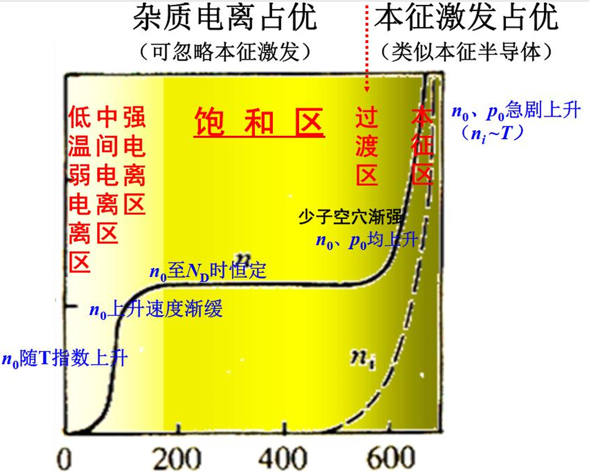

- 杂质浓度越高，其作用越强，费米能级越靠近价带顶（导带底），极限工作温度越高

### 3.5简并半导体
一般情况，$E_F$在$E_C$之下；重掺杂时，$E_F$大于等于$E_C$$\rightarrow$载流子简并化$\rightarrow$玻尔兹曼分布函数（导带底电子较少）不成立，使用费米分布函数（导带电子数目多）

$E_F$和$E_C$相对位置可以区分简并和非简并
简并化条件|载流子服从的分布|载流子浓度
:-:|:-:|:-:
$E_C-E_F>2k_0T$，简并|费米分布（本征、杂质）$\newline$导带电子多|$n_0=N_C\frac{2}{\sqrt{\pi}}F_\frac{1}{2}\frac{E_F-E_C}{k_0T}$
$0<E_C-E_F\leq 2k_0T$，弱简并|同上|同上
$E_C-E_F\leq 0$，非简并|玻尔兹曼分布$\newline$导带底电子较少|$n_0=N_Ce^{\frac{E_C-E_F}{k_0T}}\newline 且满足n_0p_0=n_i^2$

- 简并半导体禁带变窄效应：杂质原子相互靠近，其电子波函数发生交叠，使孤立的杂质能级扩展为杂质能带，当掺杂浓度大于$3*10^{18}$时，杂质能带进入导带（价带），并于导带（价带）相连，形成了新的简并能带，使能带的状态密度发生改变，兼并能带的尾部伸入禁带，称为带尾，禁带宽度变窄

## 第四章 半导体的导电性
### 4.1 欧姆定律
$$
\text{欧姆定律：}J=\frac{I}{S}=\frac{V}{RS}=\frac{l|E|}{RS}=\sigma|E|\tag{4.1}
$$

### 4.2 漂移速度、电导率和迁移率
$$
\text{漂移电流密度:}J=-nq\bar{v_d}\tag{4.2}
$$

由式(4.1)和式(4.2)，可以推出：
$$
-\bar{v_d}=\frac{\sigma}{nq}|E|\tag{4.3}
$$

在此给出**迁移率**$\mu$的定义：
$$
\text{迁移率：}\mu=\frac{\sigma}{nq}\tag{4.4}
$$

$$
\text{电导率：}\sigma=nq\mu\tag{4.5}
$$

- 迁移率表示单位场强下，载流子平均漂移速度，单位$\mathrm{m^2/V·s}$。反应了外电场作用下载流子做漂移运动的难易程度、能力

### 4.3 半导体中的电导率和迁移率
$$
\text{电导率：}\sigma=nq\mu_n+pq\mu_p\tag{4.6}
$$

参量|本征半导体|n型半导体|p型半导体
:-:|:-:|:-:|:-:
载流子浓度|$n_0=p_0=n_i$|$n_0\approx N_D>>p_0$|$p_0\approx N_A>>n_0$
电导率|$\sigma_i=n_iq(\mu_n+\mu_p)$|$\sigma_n=n_0q\mu_n$|$\sigma_p=p_0q\mu_p$
电流密度|$J=J_n+J_p\newline=n_iq(\mu_n+\mu_p)\vert E\vert$|$J=J_n=n_0q\mu_n\vert E\vert$|$J=J_p=p_0q\mu_p\vert E\vert$

### 4.4 载流子散射
半导体中的散射机构（散射强弱用散射几率来衡量）：
$$
\begin{cases}

\text{电离杂质散射：}P_i\propto{N_iT^{-\frac{3}{2}}}\rightarrow\mu_i=\frac{q}{m^*}\frac{1}{P_i}\propto{N_i^{-1}T^{\frac{3}{2}}}\tag{4.7}\\

\text{晶格振动散射}
\begin{cases}
\text{长纵声学波：}P_s\propto{T^{-\frac{3}{2}}}\rightarrow\mu_s=\frac{q}{m^*}\frac{1}{P_s}\propto{T^{-\frac{3}{2}}}\\
\text{长纵光学波}
\end{cases}

\end{cases}
$$
载流子寿命$\tau=\frac{1}{P}$

- 多种散射机构同时存在，总迁移率计算：
$$
\begin{align*}
\frac{1}{\mu}&=\sum_{i=1}^N\frac{1}{\mu_N}\\
\rightarrow\mu&=\frac{q}{m^*}\frac{1}{AT^{\frac{3}{2}}+BN_iT^{-\frac{3}{2}}}\tag{4.8}
\end{align*}
$$

- 杂质浓度$\uparrow$迁移率$\downarrow$
  - 温度一定、晶格散射不变时，杂质越多其散射越强，迁移率越小
  - 当杂质浓度很高时，逐渐出现简并化，杂质不能全部电离，影响程度显著下降

- 迁移率与温度的关系需要看哪种散射机构占主导
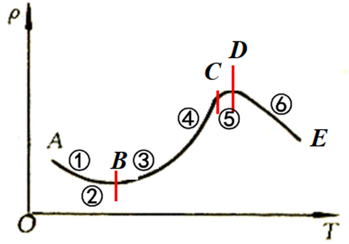
$$
\begin{cases}
\text{A-B区：}

\begin{cases}
\text{①低温弱电离区，电离杂质散射占优：}T\uparrow,n\downarrow,\mu\uparrow,\rho\downarrow\\
\text{②中间电离、强电离区，$n$随$T$增大趋势减缓；仍是电离杂质散射占优，随着$T\uparrow$电离施主增多，限制$\mu$增加，故$\rho$降势减缓，直至最低}
\end{cases}
\\

\text{B-C区：}
\begin{cases}
\text{饱和区，杂质全部电离，本征激发还不明显，载流子浓度基本不变，类似金属}\\
\text{③随着温度升高，以晶格振动散射为主，$T\uparrow,\mu\downarrow,\rho\uparrow$}\\
\text{④温度进一步升高，晶格振动散射更占优，$\mu$下降的趋势更显著}
\end{cases}
\\

\text{C-D区：⑤本征激发开始，$n$缓慢增大，开始抵消晶格振动散射，$\rho$上升趋势减缓直至最高点}\\
\text{D-E区：本征激发占优，载流子浓度迅速增大，$\rho\downarrow$}
\end{cases}
$$

### 4.5 霍尔效应与霍尔系数
当有一方向与电流垂直的磁场作用于一有限半导体时，半导体两侧会产生一横向电势差（**霍尔电场**），其方向同时垂直于电流和磁场，这种现象称为半导体的**霍尔效应**。

霍尔系数$R_H$：
$$
R_H=\frac{p\mu_p^2-n\mu_n^2}{q(p\mu_p+n\mu_n)^2}\tag{4.9}
$$

令$b=\frac{\mu_n}{\mu_p}$，霍尔系数公式更新为：
$$
R_H=\frac{p-nb^2}{q(p+nb)^2}\tag{4.10}
$$
绝大多数半导体$b>1$

$$
\text{在温度不太高时}
\begin{cases}
\text{n型半导体：}n>>p,\ \ \ R_H\approx-\frac{1}{nq}<0\\
\text{p型半导体：}p>>n,\ \ \ R_H\approx\frac{1}{pq}>0\\
\end{cases}
$$

- 本征情况下$R_H<0$

## 第五章非平衡载流子
### 5.1 非子注入、复合与寿命
光照作用下，载流子数量偏离平衡态，改变的这一部分载流子叫做**非平衡载流子**。
$n=n_0+\Delta n,p=p_0+\Delta p$

- 非子注入形成非平衡状态，非子复合恢复成平衡态
- 非子复合率$U=R(\text{载流子复合率})-G(\text{载流子产生率})$
- 非子的寿命$\tau$：撤销光注入后，非子浓度呈指数衰减，至原来数值$\frac{1}{e}$所经历的时间即为非子寿命

### 5.2 准费米能级
外界破坏热平衡后，导带、价带的电子费米能级不在统一，而是有各自的费米能级，分别称为电子费米能级、空穴费米能级。

$$
\begin{cases}

n>n_0\rightarrow E_{Fn}>E_F\rightarrow\text{电子费米能级比平衡费米能级高}\\

p>p_0\ \rightarrow E_{Fp}>E_F\rightarrow\text{空穴费米能级比平衡费米能级底}

\end{cases}
$$

电子浓度|空穴浓度|二者关系
:-:|:-:|:-:
$n=n_0+\Delta n$|$p=p_0+\Delta p$|$np\neq n_i^2$
$n=N_Ce^{-\frac{E_C-E_{Fn}}{k_0T}}\\=n_0e^{\frac{E_{Fn}-E_F}{k_0T}}\\=n_ie^{\frac{E_{Fn}-E_i}{k_0T}}$|$p=N_Ve^{-\frac{E_{Fp}-E_V}{k_0T}}\\=p_0e^{\frac{E_F-E_{Fp}}{k_0T}}\\=p_ie^{\frac{E_i-E_{Fp}}{k_0T}}$|$np=n_0p_0e^{\frac{E_{Fn}-E_{Fp}}{k_0T}}\\=n_i^2e^{\frac{E_{Fn}-E_{Fp}}{k_0T}}$

- 非子浓度越大，准费米能级偏离平衡费米能级越远
- 一般注入的非子浓度比平衡时多子浓度少得多，称为小注入，反之为大注入
- 即使是小注入，非子浓度还是比平衡少子多

### 5.3 复合理论
$$
\begin{cases}
\text{直接复合：电子在导带和夹带之间直接跃迁引起复合}\\
\text{间接复合：电子和空穴通过禁带中的能级复合}

\begin{cases}
\text{体内复合}\\
\text{表面复合}
\end{cases}

\end{cases}
$$

$$
\text{载流子复合释放出多余的能量}
\begin{cases}
\text{发射光子（发光）}\\
\text{发射声子（传给晶格）}\\
\text{转移给其他载流子（Auger俄歇复合）}
\end{cases}
$$

$$
\begin{cases}

\text{电子俘获率}=r_nn(N_t-n_t)&,r_n电子俘获系数\\
\text{电子产生率}=s_-n_t&,s_-电子激发几率\\
\text{空穴俘获率}=r_pn_tp&,r_p空穴俘获系数\\
\text{空穴产生率}=s_+(N_t-n_t)&,s_+空穴激发几率

\end{cases}
$$

$$
\text{其中}
\begin{cases}

s_-=r_nn_1&,n_1=N_Ce^{-\frac{E_C-E_t}{k_0T}}\\
s_+=r_pp_1&,p_1=N_Ve^{\frac{E_V-E_t}{k_0T}}

\end{cases}
$$

比较|直接复合|间接复合
:-:|:-:|:-:
小注入|$\tau=\frac{1}{r(n_0+p_0)}$|n型：$\tau=\tau_n=\frac{1}{N_tr_n}\\p型：\tau=\tau_p=\frac{1}{N_tr_n}$
大注入|$\tau=\frac{1}{r\Delta p}$|$\tau=\frac{1}{N_tr_n}+\frac{1}{N_tr_p}=\tau_n+\tau_p$

### 5.5 陷阱效应
陷阱效应：杂质能级积累非子的作用，可以和导带、价带中的非子数目比拟，对应的杂质或缺陷称为陷阱中心

### 5.6 载流子的漂移扩散、爱因斯坦关系式

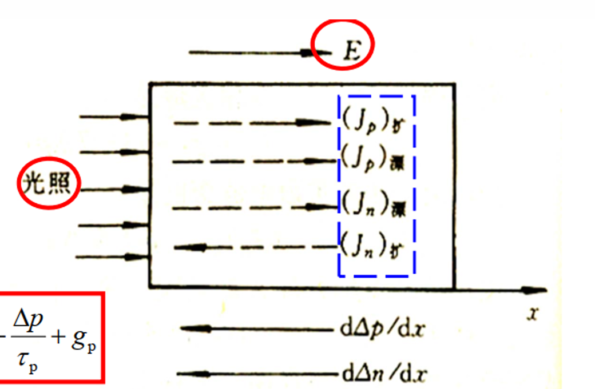

非子对漂移电流也有贡献，若外加电场$E$，漂移电流密度为：

$$
\begin{cases}

(J_n)_漂=q(n_0+\Delta n)\mu_nE=qn\mu_nE\\
(J_p)_漂=q(p_0+\Delta p)\mu_pE=qp\mu_pE \tag{5.12}

\end{cases}
$$

扩散电流密度为：
$$
\begin{cases}

(J_n)_扩=qD_n\frac{d^2n}{dx^2}\\
(J_p)_扩=qD_p\frac{d^2p}{dx^2}\tag{5.13}

\end{cases}
$$

再在表面加光注入非子，少子的电流密度为：
$$
\begin{cases}

J_p=(J_p)_漂+(J_p)_扩=q p\mu_pE+qD_p\frac{dp}{dx}\\
J_n=(J_n)_漂+(J_n)_扩=q n\mu_nE+qD_n\frac{dn}{dx}\tag{5.14}

\end{cases}
$$

- 爱因斯坦关系式
$$
\begin{cases}

\frac{D_n}{\mu_n}=\frac{k_0T}{q}\\
\frac{D_p}{\mu_p}=\frac{k_0T}{q}\tag{5.15}

\end{cases}
$$
> 表明了非简并情况下载流子迁移率和扩散系数之间的关系。

### 5.7 连续性方程

仍考察一维情况下$n$型半导体中少子空穴
$$
空穴浓度(x,t)
\begin{cases}

扩散：空穴累计率&=-\frac{dS_p(x)}{dx}=D_p\frac{d^2p}{dx^2}\\
漂移：空穴累计率&=-\frac{1}{q}\frac{d(J_p)_漂}{dx}\\
&=-\mu_p|E|\frac{dp}{dx}-\mu_pp\frac{d|E|}{dx}\\
复合：\frac{\Delta p}{\tau}\\
其他：g_p

\end{cases}
$$

稳态时：
$$
D_p\frac{d^2p}{dx^2}-\mu_p|E|\frac{dp}{dx}-\mu_pp\frac{d|E|}{dx}+g_p-\frac{\Delta p}{\tau_p}=0\tag{5.16}
$$

非稳态时：
$$
\frac{\partial p}{\partial t}=D_p\frac{\partial^2 p}{\partial x^2}-\mu_p|E|\frac{\partial p}{\partial x}-\mu_pp\frac{\partial |E|}{\partial x}+g_p-\frac{\Delta p}{\tau_p}\tag{5.17}
$$

## 第六章 pn结

### 6.1 pn结的结构

- 合金法：形成突变结，结处载流子浓度突变
- 扩散法：形成缓变结，载流子浓度缓慢变化

### 6.2 空间电荷区

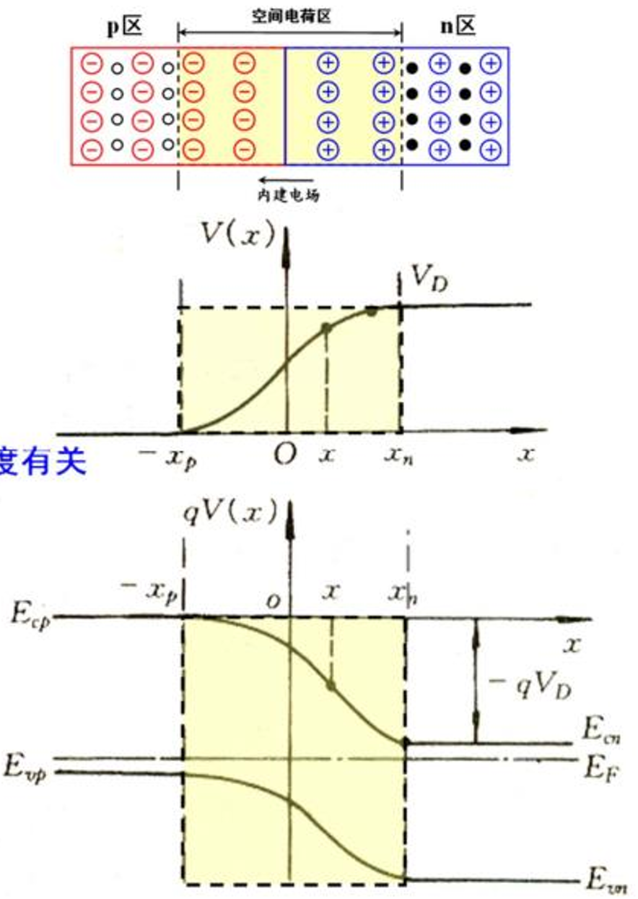

$$
\begin{cases}

pn结势垒高度：qV_D=(E_F)_n-(E_F)_p\\
pn结接触势垒：V_D=\frac{k_0T}{q}[ln\frac{N_AN_D}{n_i^2}]\tag{6.2}\\
pn结载流子分布：
\begin{cases}
n(x)=n_{p0}e^{-\frac{qV(x)}{k_0T}}\\
p(x)=p_{p0}e^{-\frac{qV(x)}{k_0T}}
\end{cases}

\\

突变结的势垒宽度X_D=\sqrt{V_D\frac{2\varepsilon_r\varepsilon_0}{q}(\frac{1}{N_A}+\frac{1}{N_D})}

\end{cases}
$$

### 6.3 I-V特性

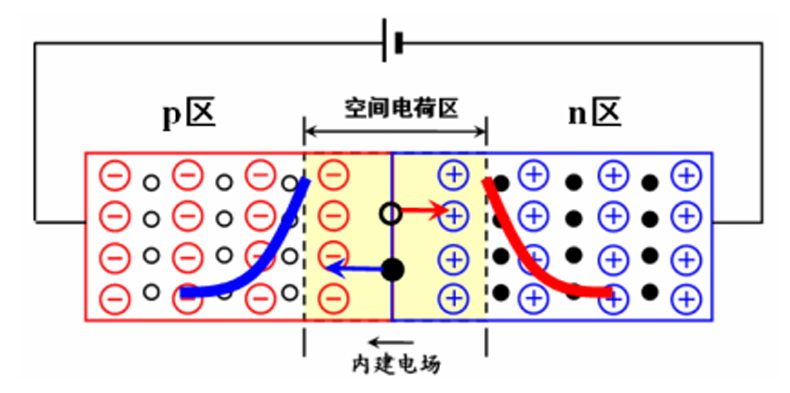

- 加正向偏压，结区扩散大于漂移，形成正向扩散电流$\rightarrow$**非平衡少子的电注入**

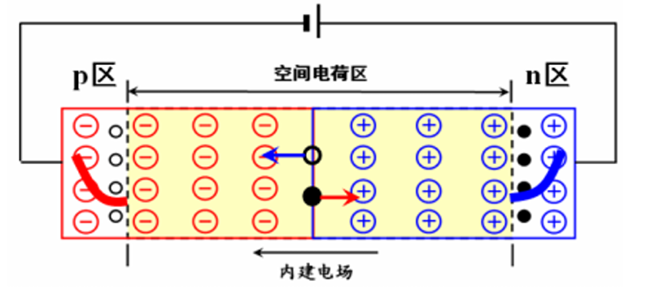

- 加反向偏压，结区漂移大于扩散，形成反向扩散电流$\rightarrow$**非平衡少子的抽取或吸出**

I-V曲线|方程
:-:|:-:
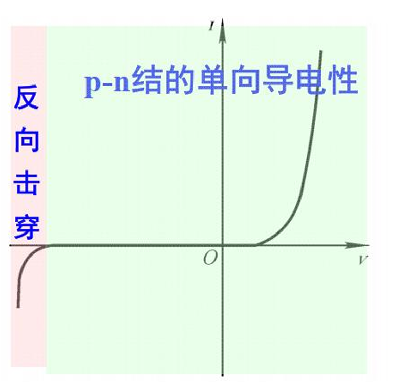|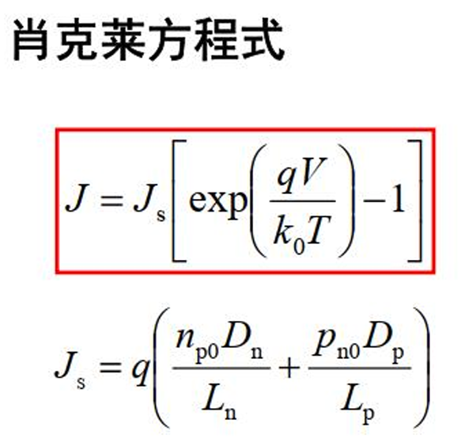
- 单向导电性即**整流特性**

### 6.4 能带图

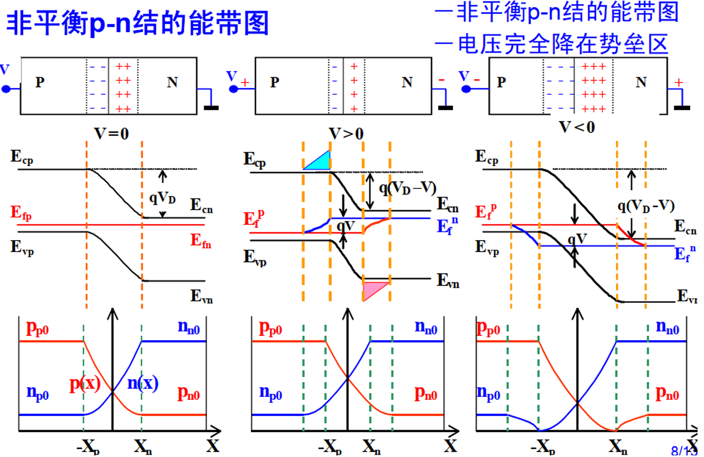

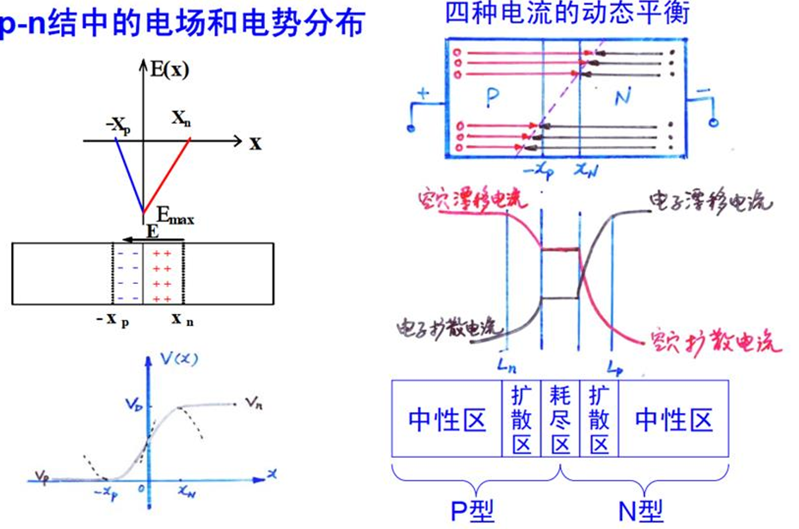

## 第七章 金半接触
### 7.1 金属和半导体的功函数
- 功函数：费米能级与真空静止电子能级之差，使电子逸出需要的最小能量，标志着束缚电子能力的强弱
- 金属的功函数：
$$
W_m=E_0-(E_F)_m\rightarrow为固定值
$$

- 半导体的功函数
$$
\begin{align*}
W_m &= E_0 - (E_F)_s \\
&=\chi + E_n
\end{align*}
$$
随着$n$的变化而变化

### 7.2 金半接触
- 金属和半导体接触后，电子将由功函数低的地方流向功函数高的地方
$$
金半接触方式
\begin{cases}

整流接触\\
欧姆接触

\end{cases}
$$

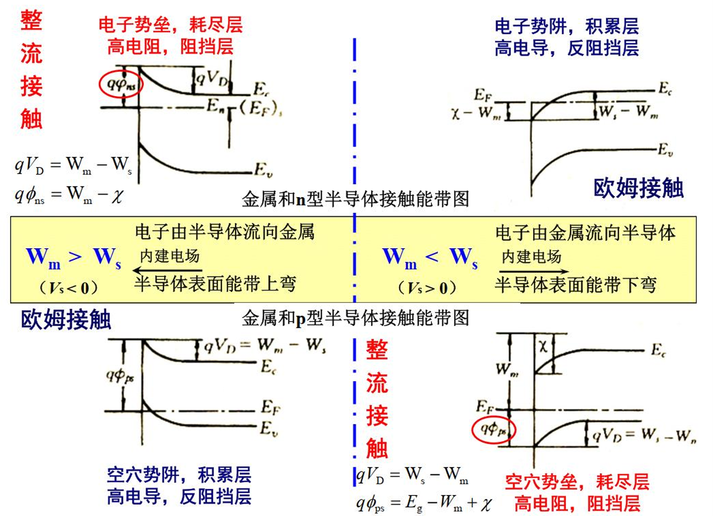

- 表面态的影响
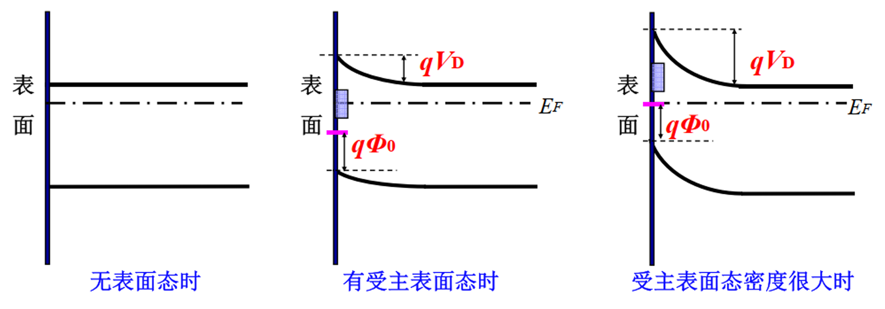
  - 此时未接触金属，由于表面态的作用，表面势垒已经形成了。
  - 受主表面态对应的能级小于费米能级，会将表面处的导带、价带拉高。
  - 当再次与金属接触，若电子由金属流向半导体，电子进入半导体表面态被其容纳，费米能级几乎不变
  - 若电子由半导体流向金属，表面态提供足够的电子，费米能级几乎不变（**钉扎效应**）

- n型阻挡层$W_m>W_s,V_s<0$
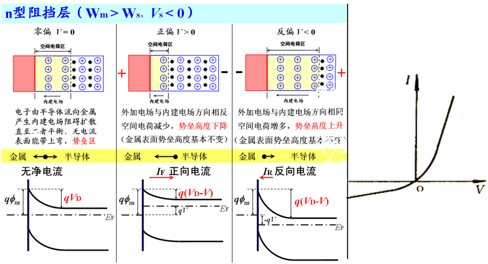
- p型阻挡层$W_m<W_s,V_s>0$
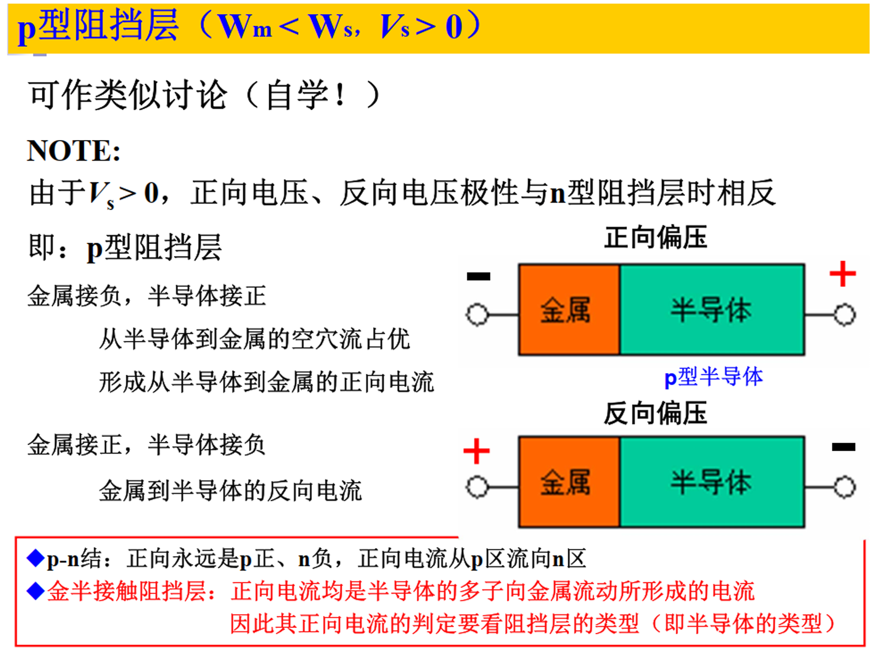

肖特基势垒二极管|pn结二极管
:-:|:-:
多子器件|少子器件
载流子不明显积累|由载流子积累形成
扩散电容很小|
具有良好的开关特性|
反向饱和电流大的多|
正向导通电压较低（0.3V左右）|

- 欧姆接触：接触电阻很小，具有线性和对称的I-V关系$\\$
高表面态密度$\rightarrow$形成势垒$\rightarrow$与金属功函数关系不大$\rightarrow$不能选择金属的方法获得欧姆接触
$\rightarrow$利用重掺杂、隧道效应形成欧姆接触

## 第八章 MIS结构

MIS结构：金属-绝缘体-半导体，实际上就是一个电容，再金属和半导体间加栅压，在绝缘层中形成电场

多子累计状态|平带状态|多子耗尽状态|弱反型状态|强反型状态
:-:|:-:|:-:|:-:|:-:
$V_G<0$|$V_G=0$|$V_G>0$|$V_G>>0$|$V_G>>>0$
接负电压（金属接负极）||

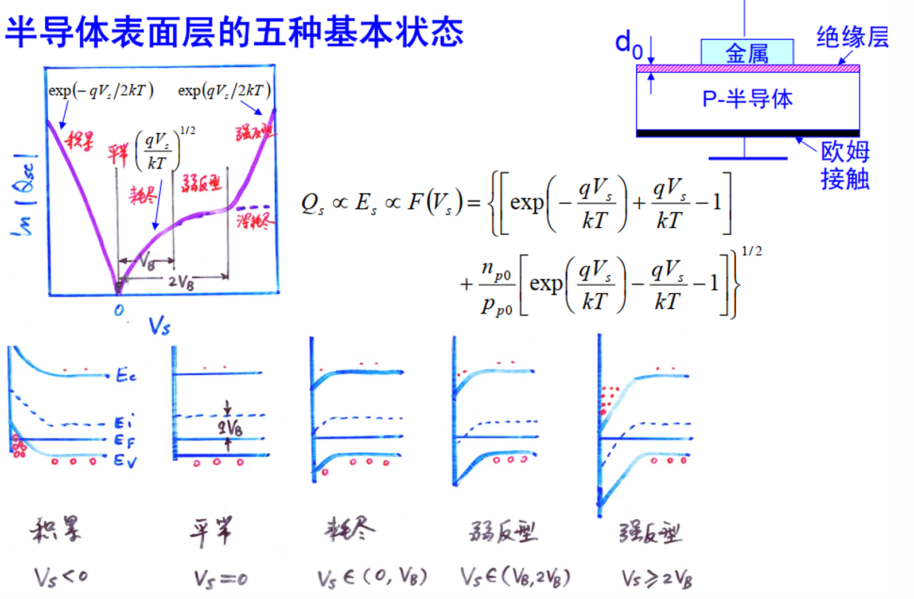