# 单片机原理与$\mathrm{C51}$编程期末复习
[TOC]
## 第一章 基础知识

-  原反补码
$$
\begin{cases}
    原码，以8位为例：-127~127 \\
    反码，以8位为例：-127~127 \\
    补码，以8位为例：-128~127
\end{cases}
$$

> 原码、反码的$\mathrm{-0,+0}$有区别

- $\mathrm{BCD}$码
$$
\begin{cases}
    压缩BCD码：只能表示0~9，4位 \\
    非压缩BCD码：0~9，8位，高四位不做限制
\end{cases}
$$

- 单片机和$\mathrm{PC}$机
$$
\begin{cases}
单片机=单片微机=微控制器=嵌入式微控制器=芯片形态的计算机 \\
PC机：主要处理数据 \\
单片机：主要处理指令，测试+控制
\end{cases}
$$

- 体系结构
$$
冯诺依曼体系结构
\begin{cases}
    1. 二进制表示数据指令 \\
    2. 指令、数据不加区分的存在Memory中 \\
    3. 顺序指令 \\
    4. 运算器+存储器+I+O+控制器
\end{cases} \\
$$

$$
哈佛结构
\begin{cases}
    1. 指令、数据分开存储 \\
    2. 两条总线
\end{cases} \\
$$

- 以$\mathrm{CPU}$字长对单片机分类：1位机、4位机、8位机···

- 单片机特点
$$
\begin{cases}
    1. 哈佛结构 
    \begin{cases}
        \mathrm{ROM}(程序存储器) \rightarrow 程序+固定常数+数据表格 \\
        \mathrm{RAM}(数据存储器) \rightarrow 工作区+用户数据 \\
    \end{cases} \\
    2. I/O通常为多功能 \\
    3. 有面向控制的指令系统 \\
    4. 外扩能力强 \\
\end{cases}
$$

## 第二章 $\mathrm{MCS-51}$系列单片机内部结构和引脚

- 单片机 $\rightarrow$ 硬件($\mathrm{CPU, ROM, RAM, I/O}$)+软件(机器语言、汇编语言、高级语言)

### 2.1 中央处理器$\mathrm{CPU}$
1. 寄存器阵列：通用寄存器、专用寄存器
2. 运算器：累加器$A$、暂存寄存器、标志寄存器、算术逻辑单元$\mathrm{ALU}$
3. 控制器：程序计数器$PC$、指令寄存器$IR$、指令译码器、指令译码器、定时和控制电路

### 2.2 总线
1. 数据总线
2. 地址总线
3. 控制总线

### 2.3 存储器
$$
\begin{cases}
    \mathrm{ROM}(只读存储器) \rightarrow 可读可写+速度快+端点数据丢失 \\
    \mathrm{RAM}(随机存储器) \rightarrow 只读+速度慢+断电数据不丢失 \\
\end{cases}
$$

### 2.4 $I/O$设备及其接口
1. 输入设备
2. 输出设备
3. $\mathrm{I/O}$接口电路
> 输入输出设备不能与$\mathrm{CPU}$直接相连，而是通过$\mathrm{I/O}$接口电路实现各种功能


### 2.5 $\mathrm{MCS-51}$单片机外部引脚

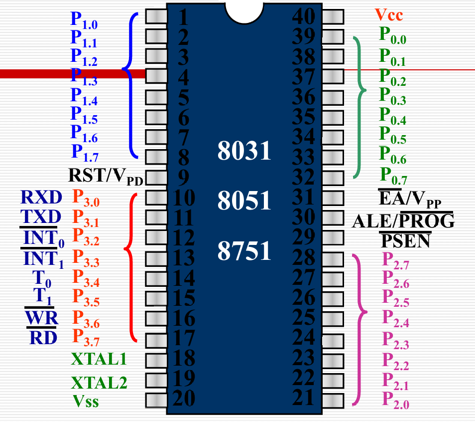

#### 2.5.1 电源与时钟
$$
\begin{cases}
    \mathrm{V_{CC}} \rightarrow 电源电压 \\
    \mathrm{V_{SS}} \rightarrow 接地端 \\
    \mathrm{XTAL1} \rightarrow 片内振荡电路输入端 \\
    \mathrm{XTAL2} \rightarrow 片内振荡电路输出端 \\
\end{cases}
$$

#### 2.5.2. 控制信号
$$
\begin{cases}
    \mathrm{\overline{EA}/V_{PP}} \rightarrow \mathrm{ROM}选择信号
         \begin{cases}
             \mathrm{\overline{EA}=0} \rightarrow 选择外部\mathrm{ROM} \\
             \mathrm{\overline{EA}=1}
                \begin{cases}
                    地址<4k \rightarrow 内部\mathrm{ROM} \\
                    地址>4k \rightarrow 外部\mathrm{ROM}
                \end{cases} \\
         \end{cases} \\
    \mathrm{ALE/\overline{PROG}} \rightarrow 地址锁存信号
         \begin{cases}
             \mathrm{ALE=0} \rightarrow \mathrm{P_{0}}口为地址 \\
             \mathrm{ALE=1} \rightarrow \mathrm{P_{0}}口为数据 \\
             下降沿 \downarrow 锁存\mathrm{P_{0}}到外部锁存器 \\
         \end{cases} \\
    \mathrm{\overline{PSEN}} \rightarrow 片外取指信号(片外\mathrm{ROM}读)输出端
         \begin{cases}
             \mathrm{\overline{PSEN}=0} \rightarrow 片外取指 \\
             \mathrm{\overline{PSEN}=1} \rightarrow 片内取指 \\
         \end{cases}
\end{cases}
$$

#### 2.5.3 $\mathrm{MCS-51}$内部数据存储器$\mathrm{RAM:00H}$~$\mathrm{FFH}$
$$
256B
\begin{cases}
    \mathrm{128B \  RAM：00H \textasciitilde 7FH},直接、间接寻址
         \begin{cases}
             数据缓冲区 \rightarrow \mathrm{30H \textasciitilde 7FH} \\
             位寻址区 \rightarrow \mathrm{20H \textasciitilde 2FH}\\
             工作寄存器 \rightarrow \mathrm{00H \textasciitilde 1FH}(8个字节分一个区，一个区对应8个寄存器R_0~R_7,亦可以作普通\mathrm{RAM}) \\
         \end{cases} \\
    \mathrm{128B \  SFR：80H~FFH},直接 \\
\end{cases}
$$

- 位寻址区（16个$\mathrm{RAM}$单元，12个$\mathrm{SFR}$）
$$
共221位构成布尔处理机
\begin{cases}
    字节地址：20H \textasciitilde 2FH \\
    共16个\mathrm{RAM}字节 \rightarrow 128个\mathrm{RAM}位 \\
    位地址：00H \textasciitilde 7FH \\
    12个\mathrm{SFR}(直接地址可以被8整除的)中93位具有位寻址功能 \\
\end{cases}
$$
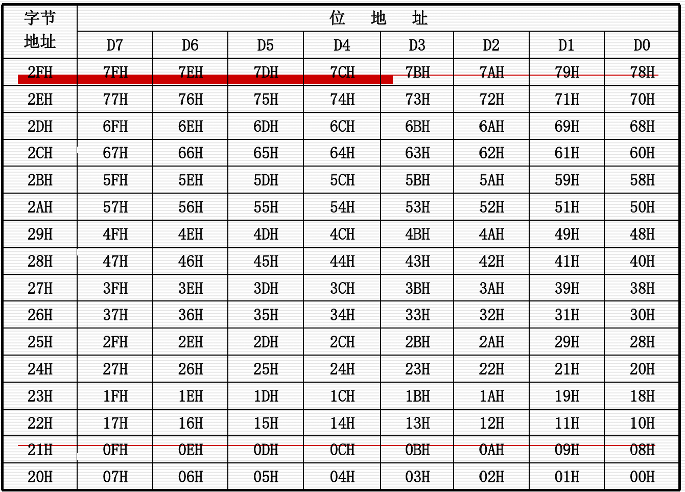

- 用户$\mathrm{RAM}$区（数据缓冲区）共80个单元
$$
\begin{cases}
    字节地址：30H \textasciitilde 7FH,真正的\mathrm{RAM}单元 \\
    片内\mathrm{RAM}部分单元可以用作堆栈
\end{cases}
$$

#### 2.5.4 专用寄存器区
$$
\begin{cases}

    1. 程序计数器\mathrm{PC}
        \begin{cases}
            16位，寻址范围64\mathrm{KB} \\
            通电自动复位，自动清零 \\
            存放下一条指令，每执行一条指令自动加1 \\
            顺序执行指令，跳过任何指令可以在程序中安排转移指令 \\
        \end{cases} \\

    2. 累加器\mathrm{A}
        \begin{cases}
            地址为\mathrm{0E0H}，位寻址 \\
            操作数取自\mathrm{A}，结果存于\mathrm{A/AB} \\
            指令系统采用\mathrm{A}作为累加器的标识符
        \end{cases} \\

    3. 寄存器\mathrm{B}
        \begin{cases}
            地址为\mathrm{0F0H}，次累加器 \\
            8位寄存器，作\mathrm{RAM}使用 \\
            与\mathrm{A}配合使用，一般作乘除 \\
            存放第二操作数，乘积的高字节 \\
        \end{cases} \\

    4. 程序状态字\mathrm{PSW}
        \begin{cases}
            地址为\mathrm{0D0H}，位寻址 \\
            进/借位标志\mathrm{Cy(PSW.7)}:0-无进/借位，1-有进/借位 \\
            辅助进位标志\mathrm{AC(PSW.6)}:8位加减运算，判断低半字节，0-无进/借位，1-有进/借位 \\
            用户定义标志\mathrm{F_0(PSW.5)} \\
            工作寄存器选择位\mathrm{RS_1(PSW.4),RS_0(PSW.3)}:两位组合确定选择几区（2.5.3工作寄存器地址） \\
            逸出标志位\mathrm{RES(PSW.2)} \\
            奇偶标志位\mathrm{RES(PSW.0)}：0-\mathrm{A}中1的个数位偶数，1-奇数 \\
        \end{cases} \\

    5. 堆栈指针\mathrm{SP}
        \begin{cases}
            8位寄存器，存放栈顶指针 \\
            用于保护\mathrm{CPU}现场和断点地址 \\
            入栈时\mathrm{SP+1},出栈时\mathrm{SP-1} \\
        \end{cases} \\

    6. 数据指针\mathrm{DPTR}
        \begin{cases}
            16位寄存器，高字节\mathrm{DPH}，低字节\mathrm{DPL} \\
            对外部\mathrm{RAM,I/O}寻址，范围64\mathrm{KB} \\
        \end{cases} \\

    7. \mathrm{I/O}端口\mathrm{P0~P3}
        \begin{cases}
            地址为\mathrm{80H,90H,0A0H,0B0H} \\
            分别是端口\mathrm{P0~P3}的锁存器 \\
        \end{cases} \\

    8. 串行数据缓冲器\mathrm{SBUF}：两个缓冲器公用一个地址\mathrm{99H}
        \begin{cases}
            存放欲发送的数据 & "写"发送缓冲器 \\
            存放已接收的数据 & "读"接收缓冲器 \\
        \end{cases} \\

    9. 定时/计数器\mathrm{T_0,T_1}：16位 \\
    
    10. 其他控制寄存器
        \begin{cases}
            \mathrm{IP} & \mathrm{0B8H} & 终端优先控制寄存器 \\
            \mathrm{IE} & \mathrm{0A8H} & 中断允许寄存器 \\
            \mathrm{TMOD} & \mathrm{89H} & 定时/计数器方式寄存器 \\
            \mathrm{TCON} & \mathrm{88H} & 定时/计数器控制寄存器 \\
            \mathrm{SCON} & \mathrm{99H} & 串行口控制寄存器 \\
            \mathrm{PCON} & \mathrm{97H} & 电源及波特率选择控制寄存器 \\
        \end{cases} \\

\end{cases}
$$


#### 2.5.5 $\mathrm{I/O}$接口$\mathrm{P0 \textasciitilde P3}$

##### $\mathrm{P_0}$端口结构与功能
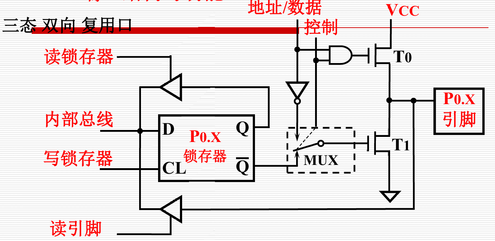
$$
作通用\mathrm{I/O}口使用输入时
\begin{cases}
    锁存器写1(内部总线为1) \rightarrow \mathrm{T_0,T_1}截止 \rightarrow 读引脚信号 \\
    若锁存器写0(内部总线为0) \rightarrow \mathrm{T_0,T_1}导通 \rightarrow \mathrm{P_{0,X}}引脚被钳位成低电平 
\end{cases}
$$
> 负载能力为8个$\mathrm{LSTTL}$门电路

##### $\mathrm{P_1}$端口结构与功能--准双向口
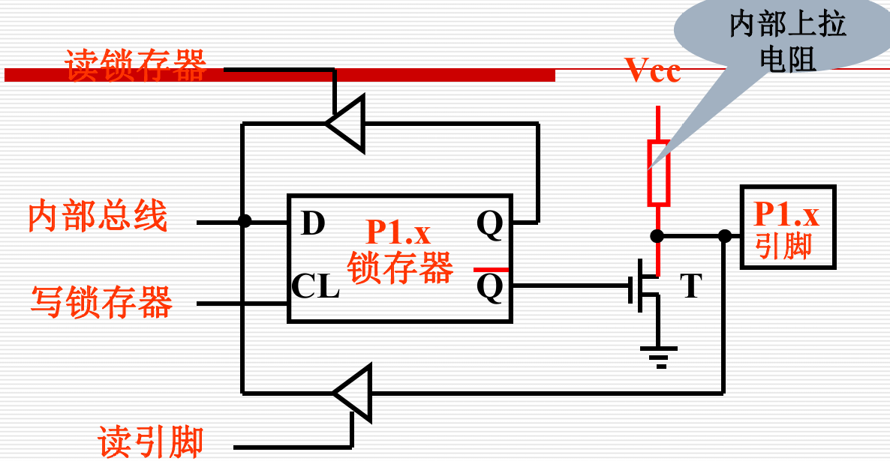
$$
\begin{cases}
作通用\mathrm{I/O}口使用输出时
    \begin{cases}
        锁存器写1 \rightarrow \mathrm{\overline{Q}=0,T}截止 \rightarrow 输出高电平 \\
        锁存器写0 \rightarrow \mathrm{\overline{Q}=1,T}导通 \rightarrow 输出低电平 \\
    \end{cases} \\

作通用\mathrm{I/O}口使用输入时，口锁存器必须写1 \rightarrow \mathrm{T}截止 \rightarrow 口线上的电平即外部输入 \\
\end{cases}
$$
> 负载能力为4个$\mathrm{TTL}$门电路


##### $\mathrm{P_2}$端口结构与功能--准双向口
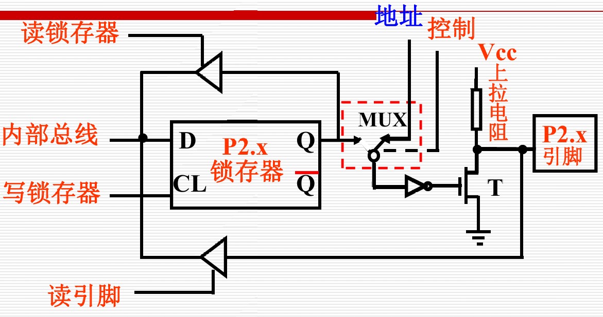
在$\mathrm{CPU}$的控制下，$\mathrm{MUX}$倒向右边，接通内部总线，$\mathrm{P_2}$口线状态取决于片内输出地址信息。
> 负载能力为4个$\mathrm{TTL}$门电路

##### $\mathrm{P_3}$端口结构与功能--双功能口
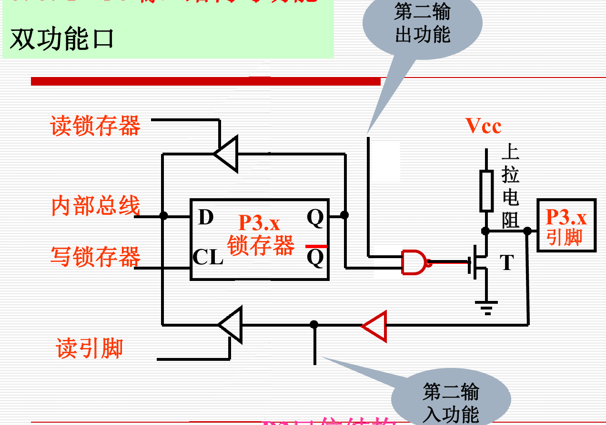
- 第二功能状态
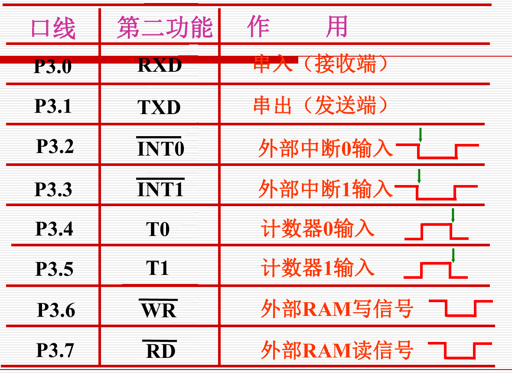
- 做第一功能口使用时：输出控制线为高电平，与非门输出取决于$\mathrm{Q}$端状态，与$\mathrm{P_1}$相同
- 作第二功能口使用时：口锁存器必须为1，与非门输出取决于第二功能输出线；第二功能输入时,信号取自第一个缓冲器的输出端; 第二个缓冲器的输出, 仍是第一功能的读引脚信号缓冲器。
> 负载能力为4个$\mathrm{TTL}$门电路


#### 2.5.6 时钟电路
- 内时钟方式：在$\mathrm{XTAL1,XTAL2}$上外接定时元件，使其形成自激振荡器
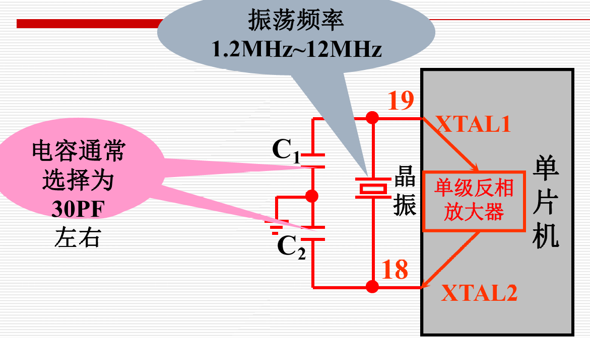
- 外时钟方式：$\mathrm{XTAL1}$接地，$\mathrm{XTAL2}$接外部振荡器
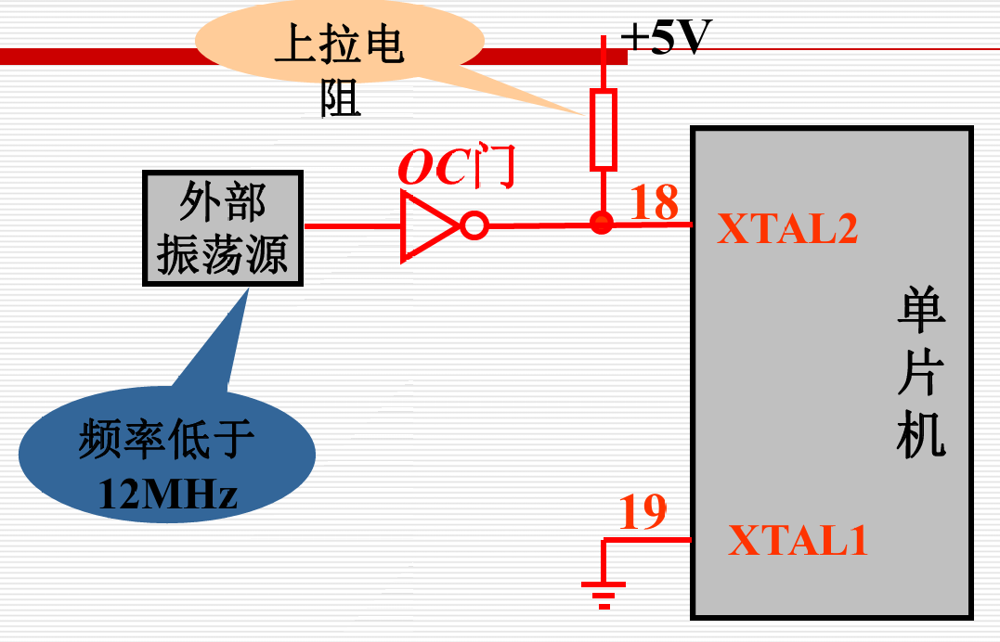

- 周期区别
$$
\begin{cases}
    振荡周期\mathrm{T}：由晶振电路直接产生 \\
    时钟周期\mathrm{S}：
    \begin{cases}
        \mathrm{S=2T} \\
        \mathrm{S}分为\mathrm{P_1,P_2}两个节拍
            \begin{cases}
                \mathrm{P_1}完成算术逻辑运算 \\
                \mathrm{P_2}完成内部寄存器数据传输 \\
            \end{cases}
    \end{cases} \\
    机器周期\mathrm{MC}：\mathrm{MC=6S=12T} \\
    指令周期\mathrm{IC}：执行一条指令的周期，\mathrm{MCS-51}单片机中，\mathrm{IC=1,2,4MC} \\
\end{cases}
$$

#### 2.5.7 复位电路
电路|复位后状态
:-:|:-:
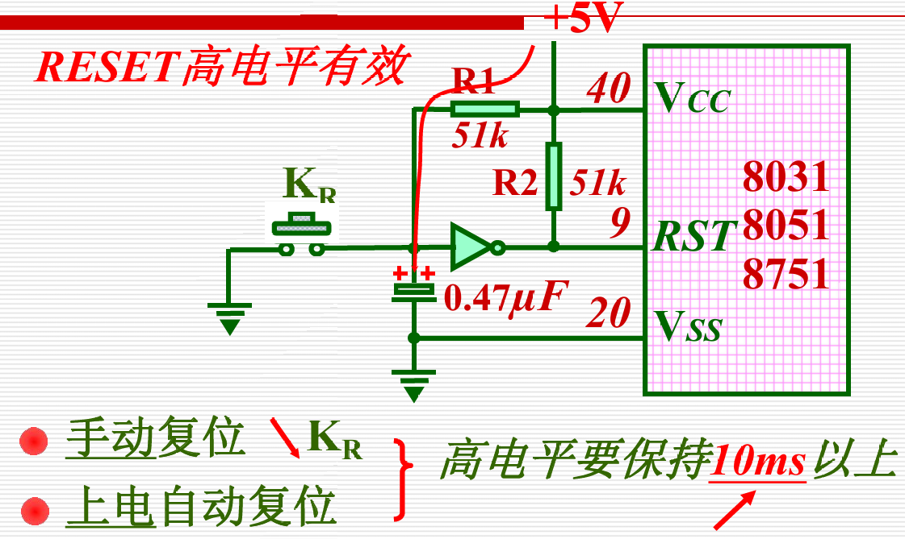|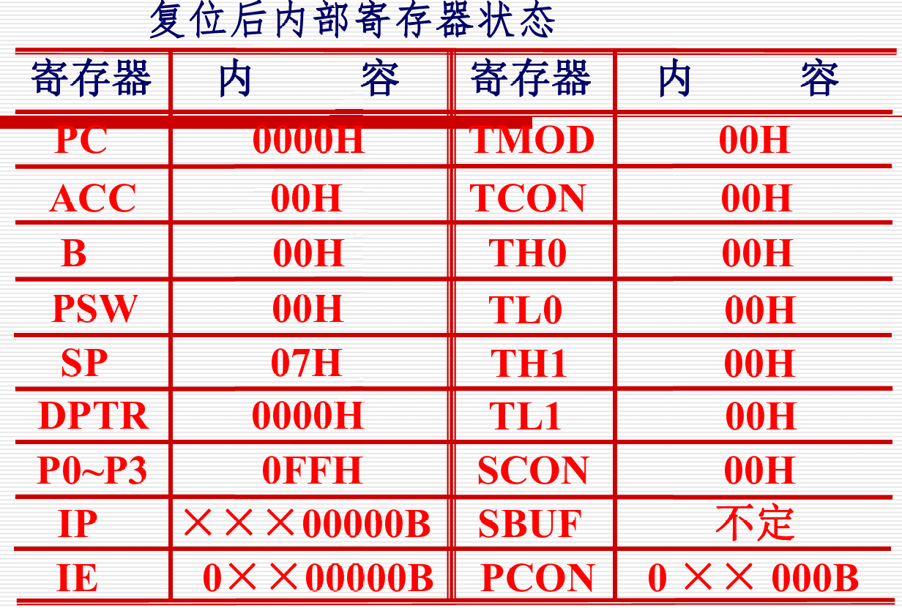

#### 2.5.8 掉电、节点方式

掉电、节点方式由$\mathrm{PCON}$决定
$$
\begin{cases}
    \mathrm{SMOD} & 波特率倍增位（串行通信中使用） \\
    \mathrm{GF1,GF0} & 通用标志位 \\
    \mathrm{PD} & 掉电方式控制位 & 1-掉电模式 \\
    \mathrm{IDL} & 待机（休闲）方式控制位 & 1-待机方式 \\
\end{cases}
$$
> $\mathrm{PCON}$字节地址为$\mathrm{87H}$，不能位寻址 $\\$
> 读写时只能整体字节操作，不能按位操作

待机（休闲）方式|掉电保护方式
:-:|:-:
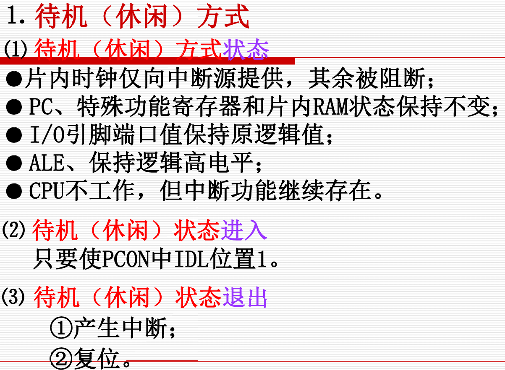|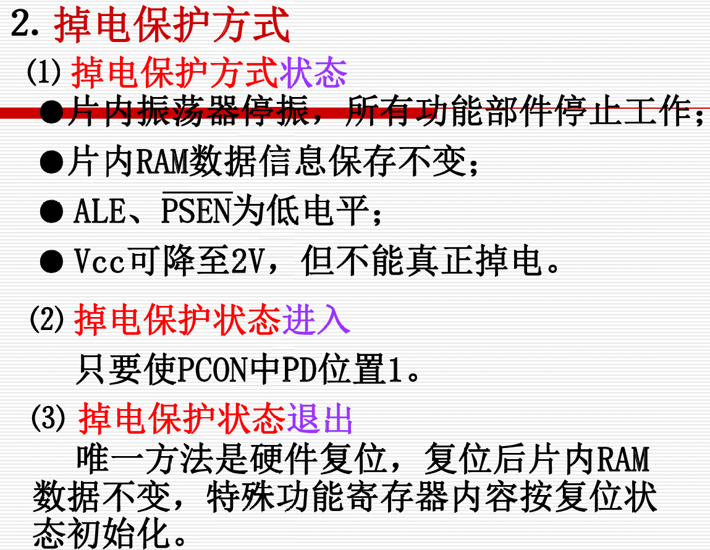


## 第三章 $\mathrm{80C51}$系列单片机指令系统和汇编程序设计

### 3.1 指令系统

#### 3.1.1 指令格式
标号:操作码[目的操作数,源操作数];注释
> Example:MOV A,#100;例子

#### 3.1.2 指令分类
- 按指令字长分类：1字节、2字节、3字节···
- 按指令执行时间分类：1机器周期、2机器周期、3机器周期···
- 按指令功能分类：数据传输、算术运算、逻辑运算、位操作、控制转移···

#### 3.1.3 常用符号
$$
\begin{cases}
    1. 立即数符\#: & \# data(8位立即数)、\# data16(16位立即数) \\
    2. 8位直接地址\mathrm{direct}: & 代表\mathrm{RAM \  00H \textasciitilde 7FH}、\mathrm{SFR \ 80H \textasciitilde  FFH} \\
    3. 间接寻址符@:& \\
    4. \mathrm{addr11}: & 11位地址 \\
    5. \mathrm{addr16}: & 16位地址 \\
    6. \mathrm{rel}: & 带符号的8位偏移地址，用于转移指令，范围相对下一条指令第一字节地址-128 \textasciitilde 127个字节 \\
    7. \mathrm{bit}：& 位地址，代表片内\mathrm{RAM}中可寻址位\mathrm{00H \textasciitilde 7FH}及\mathrm{SFR}中的可寻址位 \\
\end{cases}
$$

### 3.2 寻址方式
$$
\begin{cases}
    1. 立即寻址： & 指令直接给出操作数 \text{[\#0]} \\
    2. 直接寻址： & 指令直接给出操作数的地址  \\
    3. 寄存器寻址： & 指令给出操作数的寄存器地址（规定的寄存器有\mathrm{R0~R7,A,AB,DPTR,Cy}） \\
    4. 寄存器间接寻址： & 将3.中的操作数作为地址 \text{[@R0]} \\
    5. 变址寻址： & 操作数=基址+变址 \text{[@A+DPTR]} \\
    6. 相对寻址： & 一般用于相对转移指令，转移目的地址=\mathrm{PC+rel} \\
    7. 位寻址： & 对内\mathrm{RAM}和特殊功能寄存器中的可寻址位进行操作[\mathrm{MOV \  C,07H;将最高位传至Cy}]
\end{cases}
$$

### 3.3 指令系统
#### 3.3.1 数据传送指令
- 内$\mathrm{RAM}$数据传送指令：$\mathrm{MOV \ direct,A;(direct) \rightarrow A}$
- 外$\mathrm{RAM}$数据传送指令：$\mathrm{MOVX \ A,@Ri;(Ri) \rightarrow A}$
- 读$\mathrm{ROM}$指令：
$$
\begin{cases}
    \mathrm{MOVC \ A,@A+DPTR;(A+DPTR) \rightarrow A} \\
    \mathrm{MOVC \ A,@A+PC;PC+1 \rightarrow PC, (A+PC) \rightarrow A} \\
\end{cases}
$$

- 堆栈操作指令：
$$
\begin{cases}
    入栈：\mathrm{PUSH \ A;[SP+1 \rightarrow SP,A \rightarrow (SP)]} \\
    出栈：\mathrm{POP \ A;[(SP) \rightarrow A,SP-1 \rightarrow SP]} \\
\end{cases}
$$

- 交换指令：
$$
\begin{cases}
    字节交换指令： & \mathrm{XCH \ A,Rn;[Rn \leftarrow\rightarrow A]} \\
    半字节交换指令： & \mathrm{XCHD \ A,Rn;高四位不变，低四位交换} \\
    累加器高低四位互换： & \mathrm{SWAP \ A;A的高低四位交换}
\end{cases}
$$

#### 3.3.2 算术运算指令
$$
\begin{cases}
    加法指令： & \mathrm{ADD \ A,Rn;[A+Rn \rightarrow A]} \\
    累加器加法指令： & \mathrm{ADDC \ A,Rn;[A+Rn+Cy \rightarrow A]} \\
    减法指令： & \mathrm{SUB \ A,Rn;[A-Rn \rightarrow A]} \\
    累加器减法指令： & \mathrm{SUBB \ A,Rn;[A-Rn-AC \rightarrow A]} \\
    加1指令： & \mathrm{INC \ A;[A+1 \rightarrow A]} \\
    减1指令： & \mathrm{DEC \ A;[A-1 \rightarrow A]} \\
    \mathrm{BCD}码调整指令： & \mathrm{DA \ A;[\mathrm{BCD}码 \leftarrow A]} \\
    乘法指令： & \mathrm{MUL \ AB;[A*B \rightarrow AB]} \\
    除法指令： & \mathrm{DIV \ AB;[A/B商 \rightarrow A,余数 \rightarrow B,Cy=0,OV=0]} \\
\end{cases}
$$
> 加1减1指令涉及$\mathrm{A}$时，影响$\mathrm{P}$，但不影响其他标志位

#### 3.3.3 逻辑运算指令
$$
\begin{cases}
    与： & \mathrm{AND \ A,Rn;[A\&Rn \rightarrow A]} \\
    或： & \mathrm{OR \ A,Rn;[A\|Rn \rightarrow A]} \\
    异或(同为0，异为1)： & \mathrm{XOR \ A,Rn;[A\oplus Rn \rightarrow A]} \\
    清零： & \mathrm{CLR \ A;[0 \rightarrow A]} \\
    取反： & \mathrm{CPL \ A;[\overline{A} \rightarrow A]} \\
    循环左移： & \mathrm{RL \ A;[A<<1 \rightarrow A]} \\
    带进位循环左移： & \mathrm{RLC \ A;} \\
    循环右移： & \mathrm{RR \ A;[A>>1 \rightarrow A]} \\
    带进位循环右移： & \mathrm{RRC \ A;} \\
\end{cases}
$$
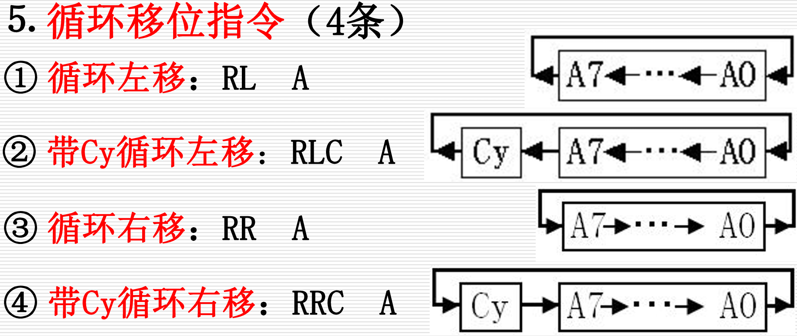

#### 3.3.4 位操作指令
$$
\begin{cases}
    位传送： & \mathrm{MOV \ bit,A;[A \rightarrow bit]} \\
    位清0： & \mathrm{CLR \ bit;[0 \rightarrow bit]} \\
    位取反： & \mathrm{CPL \ bit;[\overline{bit} \rightarrow bit]} \\
    位置1： & \mathrm{SETB \ bit;[1 \rightarrow bit]} \\
    位与： & \mathrm{ANL \ C,bit;[C\&bit \rightarrow C]} \\
    位或： & \mathrm{ORL \ C,bit;[C\|bit \rightarrow C]} \\
\end{cases}
$$

#### 3.3.5 控制转移指令（转移至$\mathrm{PC}$）
- 无条件转移指令：
$$
\begin{cases}
    长转移： & 转移范围64\mathrm{KB},3字节指令 & \mathrm{LJMP \ addr16;[addr16 \rightarrow PC]} \\
    短转移： & 转移范围-2\mathrm{KB},2字节指令 & \mathrm{AJMP \ addr11;[addr11 \rightarrow PC,PC的高5位不变]} \\
    相对转移： & 转移范围-128\mathrm{B} \textasciitilde 127\mathrm{B}，2字节指令 & \mathrm{SJMP \ rel;[PC+2 \rightarrow PC,PC+rel \rightarrow PC]} \\
    间接转移： &  & \mathrm{JMP \ @A+DPTR;[A+DPTR \rightarrow PC]} \\
\end{cases}
$$

- 条件转移：
1. 判$\mathrm{C}$转移：
$$
    \begin{cases}
            \mathrm{C=1}转移：\mathrm{JC \ rel} & \mathrm{;[PC+2 \rightarrow PC} \\
             & \mathrm{若C=1，PC+rel \rightarrow PC} \\
             & \mathrm{否则顺序执行]} \\

            \mathrm{C=0}转移：\mathrm{JNC \ rel} & \mathrm{;[PC+2 \rightarrow PC} \\
             & \mathrm{若C=0，PC+rel \rightarrow PC} \\
             & \mathrm{否则顺序执行]} \\
    \end{cases} \\
$$

2. 判$\mathrm{bit}$转移：
$$
        \begin{cases}
            \mathrm{(bit)=1}转移：\mathrm{JZ \ rel} & \mathrm{;[PC+3 \rightarrow PC} \\
             & \mathrm{若(bit)=1，PC+rel \rightarrow PC} \\
             & \mathrm{否则顺序执行]} \\

            \mathrm{(bit)=0}转移：\mathrm{JNB \ rel} & \mathrm{;[PC+3 \rightarrow PC} \\
             & \mathrm{若(bit)=0，PC+rel \rightarrow PC} \\
             & \mathrm{否则顺序执行]} \\

             \mathrm{(bit)=1}转移并清0：\mathrm{JBC \ bit,rel} & \mathrm{;[PC+3 \rightarrow PC} \\
             & \mathrm{若(bit)=1，PC+rel \rightarrow PC,0 \rightarrow (bit)} \\
             & \mathrm{否则顺序执行]} \\
        \end{cases} \\
$$

1. 判$\mathrm{A}$转移：
$$
        \begin{cases}
            \mathrm{A=0}转移：\mathrm{JZ \ rel} & \mathrm{;[PC+2 \rightarrow PC} \\
             & \mathrm{若A=0，PC+rel \rightarrow PC} \\
             & \mathrm{否则顺序执行]} \\

             \mathrm{A \neq 0}转移：\mathrm{JNZ \ rel} & \mathrm{;[PC+2 \rightarrow PC} \\
             & \mathrm{若A \neq 0，PC+rel \rightarrow PC} \\
             & \mathrm{否则顺序执行]} \\


        \end{cases} \\
$$

4. 减1非0转移：
$$
        \begin{cases}
            \mathrm{Rn-1 \neq 0}转移：\mathrm{DJNZ \ Rn,rel} & \mathrm{;[PC+2 \rightarrow PC,Rn-1 \rightarrow Rn} \\
             & \mathrm{若Rn \neq 0，PC+rel \rightarrow PC} \\
             & \mathrm{否则顺序执行]} \\

             \mathrm{(direct)-1 \neq 0}转移：\mathrm{DJNZ \ direct,rel} & \mathrm{;[PC+3 \rightarrow PC,(direct)-1 \rightarrow (direct)} \\
             & \mathrm{若Rn \neq 0，PC+rel \rightarrow PC} \\
             & \mathrm{否则顺序执行]} \\
        \end{cases} \\
$$
> 尤其注意，直接寻址的指令地址为3字节，寄存器寻址指令自己为2字节

5. 比较转移：
$$
        \begin{cases}
            \mathrm{CJNE \ A,direct,rel} & \mathrm{;[PC+3 \rightarrow PC} \\
             & \mathrm{若A \neq (direct)，PC+rel \rightarrow PC} \\
             & \mathrm{否则顺序执行]} \\
             & \mathrm{且若A \geq (direct),Cy=0} \\
             & \mathrm{否则Cy=1} \\

            
        \end{cases} \\
$$

- 调用和返回：

长调用LCALL|短调用ACALL|返回RET
:-:|:-:|:-:
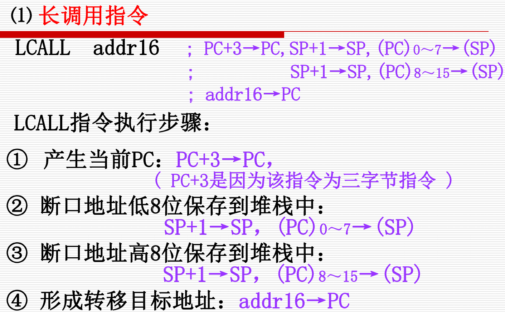|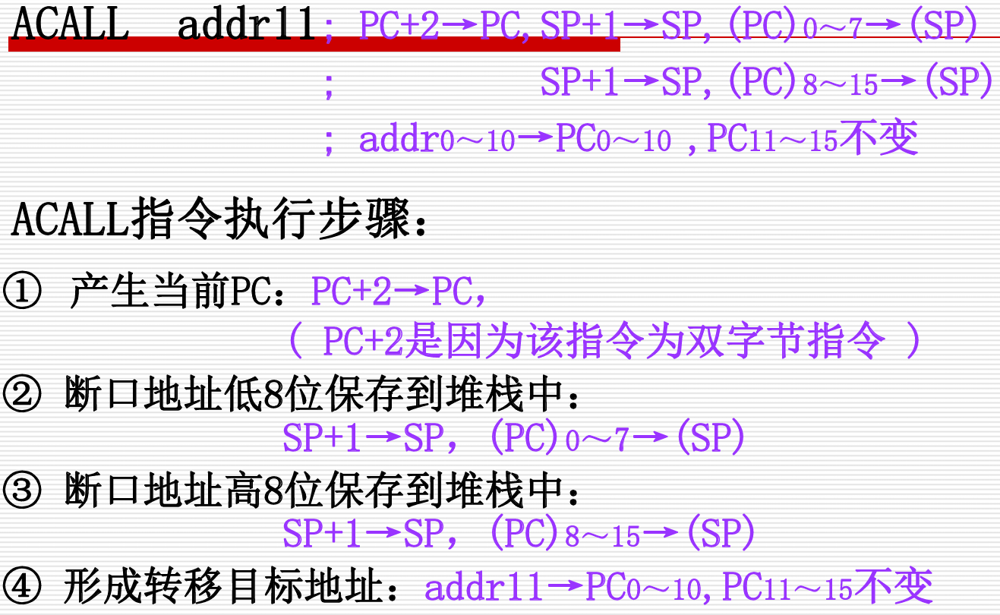|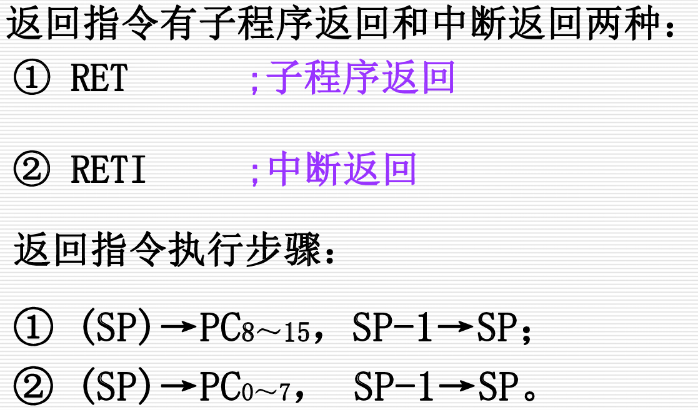
全部地址调用|低11位地址调用|

- 空操作

$\mathrm{NOR;PC+1 \rightarrow PC}$
常用于时间微调

### 3.4 汇编程序设计

#### 3.4.1 汇编程序伪指令
$$
\begin{cases}
    1. \mathrm{ORG}： & 起始地址 \\
    2. \mathrm{END}: & 结束地址 \\
    3. \mathrm{EQU}: & 等值伪指令\mathrm{[A \ EQU \ 100,将100(可以是数据或汇编符号)用A表示]} \\
    4. \mathrm{DATA}: & 数据地址赋值\mathrm{[A \ DATA \ B,将B(表达式)赋值给A]} \\
    5. \mathrm{DB}: & 定义字节数据，8位2进制数表 \\
    6. \mathrm{DW}: & 定义字数据，16位2进制数表 \\
    7. \mathrm{BIT}: & 定义位数据，1位2进制数表 \\

\end{cases}
$$

#### 3.4.2 顺序程序
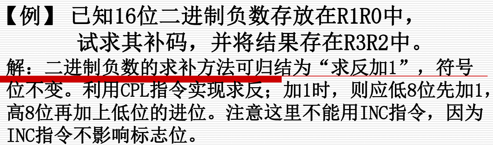
> 1. 已经给出两个寄存器，均为8位，故不能直接读16位
> 2. 实际取反码符号位是不变的，故高8位取反后需要确定符号位不变
```
DEMO: MOV       A,R0         ;读取低8位
      CPL       A            ;低8位取反
      ADD       A,#01H       ;低8位加1，不能使用INC，不影响标志位
      MOV       R2,A         ;低8位存入R2
      MOV       A,R1         ;读取高8位
      CPL       A            ;高8位取反
      ADDC      A,#80H       ;取反后加上符号位确保符号位不变
      MOV       R3,A         ;高8位存入R3
      RET                    ;
```

#### 3.4.3 分支程序
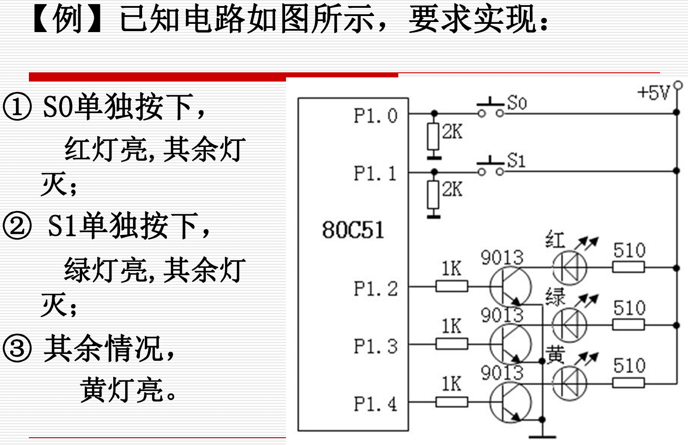
> 1. $\mathrm{S_1S_0}$为10,01时分别为红灯单独亮、绿灯单独亮，00和11时为黄灯单独亮
> 2. 默认端口处置为全1
> 3. JNB表示为0跳转至相对转移地址rel，CPU可以识别label自动跳转
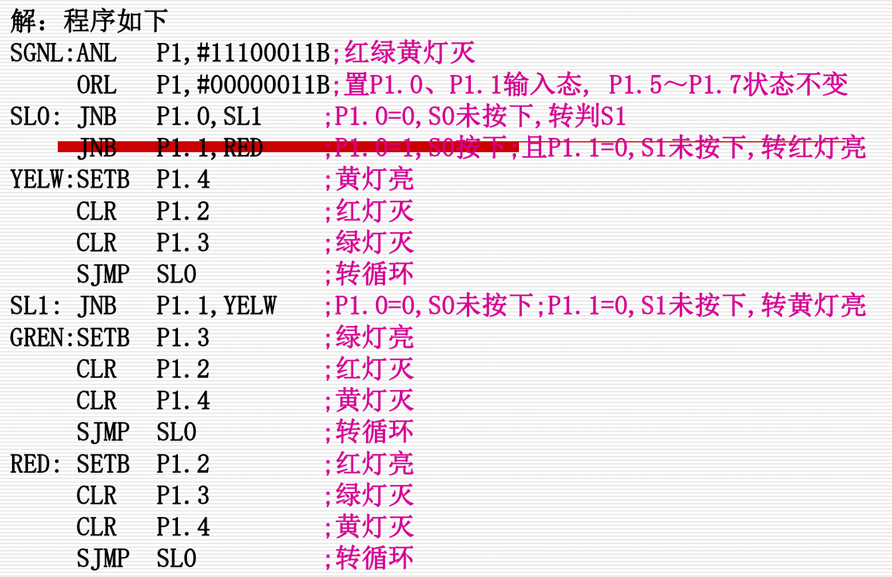
```
SGNL:   MOV     P1,#11100011B    ;初始化端口状态，使三灯全灭
SL0:    JNB     P1.0,SL1         ;若P1.0=0，则跳至SL1
        JNB     P1.1,RED         ;P1.0=1，若P1.1=0，则跳至RED
YELW:   SETB    P1.4             ;P1.0=1，P1.1=1，则黄灯亮
        CLR     P1.2             ;红灯灭
        CLR     P1.3             ;绿灯灭
        SJMP    SL0              ;循环
RED:    SETB    P1.2             ;红灯亮
        CLR     P1.4             ;黄灯灭
        CLR     P1.3             ;绿灯灭
        SJMP    SL0              ;循环
SL1:    JNB     P1.1,YELW        ;P1.0=0，若P1.1=0，则跳至YELW
GREN:   SETB    P1.3             ;绿灯亮
        CLR     P1.4             ;黄灯灭
        CLR     P1.2             ;红灯灭
        SJMP    SL0              ;循环
```

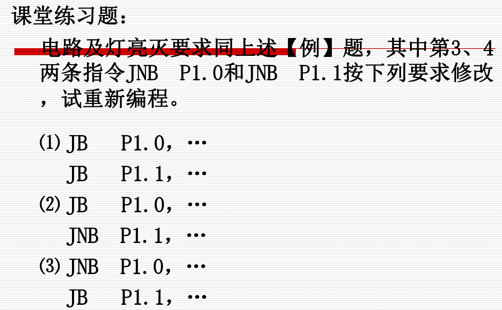
1. JB+JB
```
SGNL:   MOV     P1,#11100011B    ;初始化端口状态，使三灯全灭
SL0:    JB      P1.0,SL1         ;若P1.0=1，则跳至SL1
        JB      P1.1,GREN        ;P1.0=0，若P1.1=1，则跳至GREN
YELW:   SETB    P1.4             ;P1.0=1，P1.1=1，则黄灯亮
        CLR     P1.2             ;红灯灭
        CLR     P1.3             ;绿灯灭
        SJMP    SL0              ;循环
RED:    SETB    P1.2             ;红灯亮
        CLR     P1.4             ;黄灯灭
        CLR     P1.3             ;绿灯灭
        SJMP    SL0              ;循环
SL1:    JNB     P1.1,RED         ;P1.0=1，若P1.1=0，则跳至RED
        JB      P1.1,YELW        ;P1.0=1，若P1.1=1，则跳至YELW
GREN:   SETB    P1.3             ;绿灯亮
        CLR     P1.4             ;黄灯灭
        CLR     P1.2             ;红灯灭
        SJMP    SL0              ;循环
```
2. JB+JNB
```
SGNL:   MOV     P1,#11100011B    ;初始化端口状态，使三灯全灭
SL0:    JB      P1.0,SL1         ;若P1.0=1，则跳至SL1
        JNB     P1.1,YELW        ;P1.0=0，若P1.1=0，则跳至YELW
GREN:   SETB    P1.3             ;绿灯亮
        CLR     P1.4             ;黄灯灭
        CLR     P1.2             ;红灯灭
        SJMP    SL0              ;循环
YELW:   SETB    P1.4             ;P1.0=1，P1.1=1，则黄灯亮
        CLR     P1.2             ;红灯灭
        CLR     P1.3             ;绿灯灭
        SJMP    SL0              ;循环
RED:    SETB    P1.2             ;红灯亮
        CLR     P1.4             ;黄灯灭
        CLR     P1.3             ;绿灯灭
        SJMP    SL0              ;循环
SL1:    JNB     P1.1,RED         ;P1.0=1，若P1.1=0，则跳至RED
        JB      P1.1,YELW        ;P1.0=1，若P1.1=1，则跳至YELW
```
3. JNB+JB
```
SGNL:   MOV     P1,#11100011B    ;初始化端口状态，使三灯全灭
SL0:    JNB     P1.0,SL1         ;若P1.0=0，则跳至SL1
        JB      P1.1,YELW         ;P1.0=1，若P1.1=1，则跳至YELW
RED:    SETB    P1.2             ;红灯亮
        CLR     P1.4             ;黄灯灭
        CLR     P1.3             ;绿灯灭
        SJMP    SL0              ;循环
YELW:   SETB    P1.4             ;P1.0=1，P1.1=1，则黄灯亮
        CLR     P1.2             ;红灯灭
        CLR     P1.3             ;绿灯灭
        SJMP    SL0              ;循环
SL1:    JNB     P1.1,YELW        ;P1.0=0，若P1.1=0，则跳至YELW
GREN:   SETB    P1.3             ;绿灯亮
        CLR     P1.4             ;黄灯灭
        CLR     P1.2             ;红灯灭
        SJMP    SL0              ;循环
```

#### 3.4.4 循环程序

> 循环结构分以下几个部分
> 1. 循环初值
> 2. 循环体
> 3. 循环修改
> 4. 循环控制
> 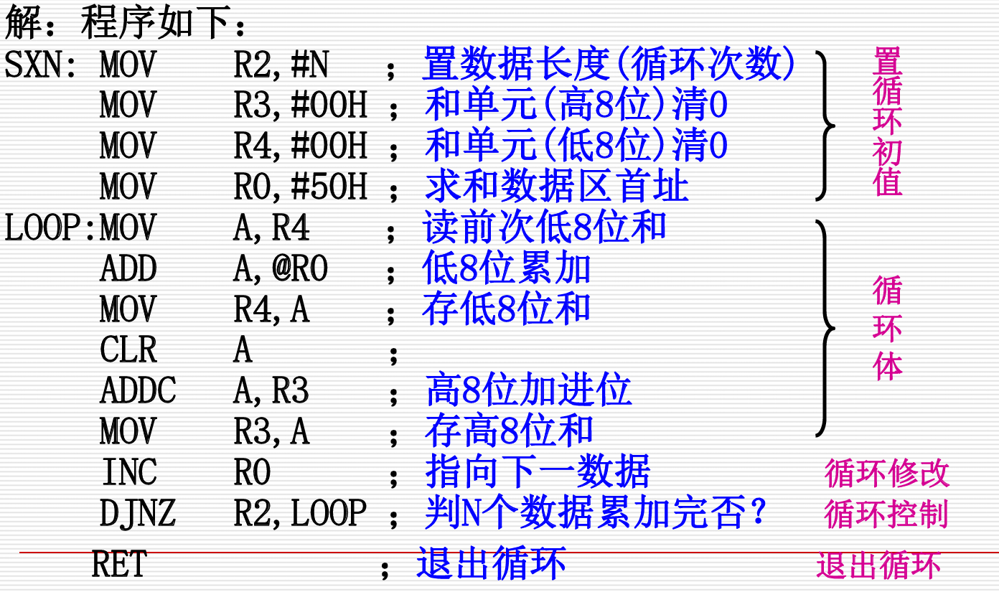
```
\\ 1. 循环初值
SXN:    MOV     R0,#50H      ;设置数据区首地址
        MOV     R2,#N        ;设置循环次数
        MOV     R3,#00H      ;初值高8位清0
        MOV     R4,#01H      ;初值低8位清0
\\ 2. 循环体
LOOP:   MOV     A,R4         ;取低8位
        ADD     A,@R0        ;低8位累加
        MOV     R4,A         ;存入低8位
        CLR     A            ;清空A
        ADDC    A,R3         ;累加高8位及进位
        MOV     R3,A         ;存入高8位
\\ 3. 循环修改
        INC     R0           ;修改数据区指针
        DJNZ    R2,LOOP      ;循环次数减1，若不为0，则跳至LOOP
\\ 4. 循环控制
        RET                  ;返回
```
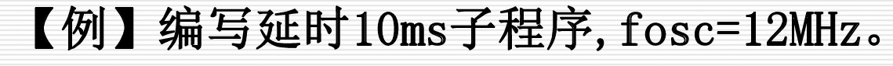
> 1. MOV Rn为1个机器周期
> 2. DJNZ为2个机器周期
> 3. RET为2个机器周期
> 晶振频率为12$\mathrm{MHz}\rightarrow$机器周期为1$\mathrm{us}$
> 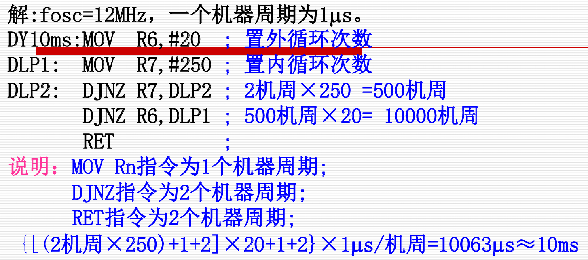
```
DY10ms:     MOV     R6,#20      ;设置外循环次数
DLP1:       MOV     R7,#250     ;设置内循环次数
DLP2:       DJNZ    R7,DLP2     ;DJNZ占2机周，一次内循环2*250+=500机周
            DJNZ    R6,DLP1     ;20层内循环
            RET                 ;返回
```
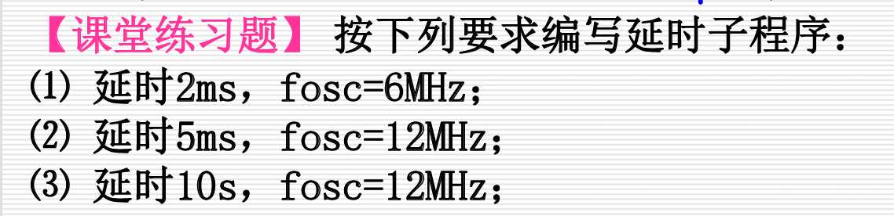
1. 2ms+6$\mathrm{MHz}$
> 晶振频率6$\mathrm{MHz}$对应机周2$\mathrm{\mu s}$，DJNZ指令周期2机周=4$\mathrm{\mu s}$，DJNZ需要执行$\frac{2ms}{4\mu s}$=500=10*50次
```
DY2ms:      MOV     R6,#20      ;外层循环20次
DLP1:       MOV     R7,#50      ;内层循坏50次
DLP2:       DJNZ    R7,DLP2     ;减1非0跳转，构成内循环
            DJNZ    R6,DLP1     ;构成外循环
            RET                 ;返回
```
2. 5ms+12$\mathrm{MHz}$
> 机周1$\mathrm{\mu s}$，DJNZ指令周期2机周=2$\mathrm{\mu s}$，DJNZ需要执行$\frac{5ms}{2\mu s}$=2500=10*250次
```
DY5ms:      MOV     R6,#10      ;外层循环10次
DLP1:       MOV     R7,#250     ;内层循坏250次
DLP2:       DJNZ    R7,DLP2     ;减1非0跳转，构成内循环
            DJNZ    R6,DLP1     ;构成外循环
            RET                 ;返回
```
3. 10s+12$\mathrm{MHz}$
> 机周1$\mathrm{\mu s}$，DJNZ指令周期2机周=2$\mathrm{\mu s}$，DJNZ需要执行$\frac{10s}{2\mu s}$=500 0000=200*25000次
```
DY10s:      MOV     R6,#200     ;外层循环200次
DLP1:       MOV     R7,#25000   ;内层循坏25000次
DLP2:       DJNZ    R7,DLP2     ;减1非0跳转，构成内循环
            DJNZ    R6,DLP1     ;构成外循环
            RET                 ;返回
```
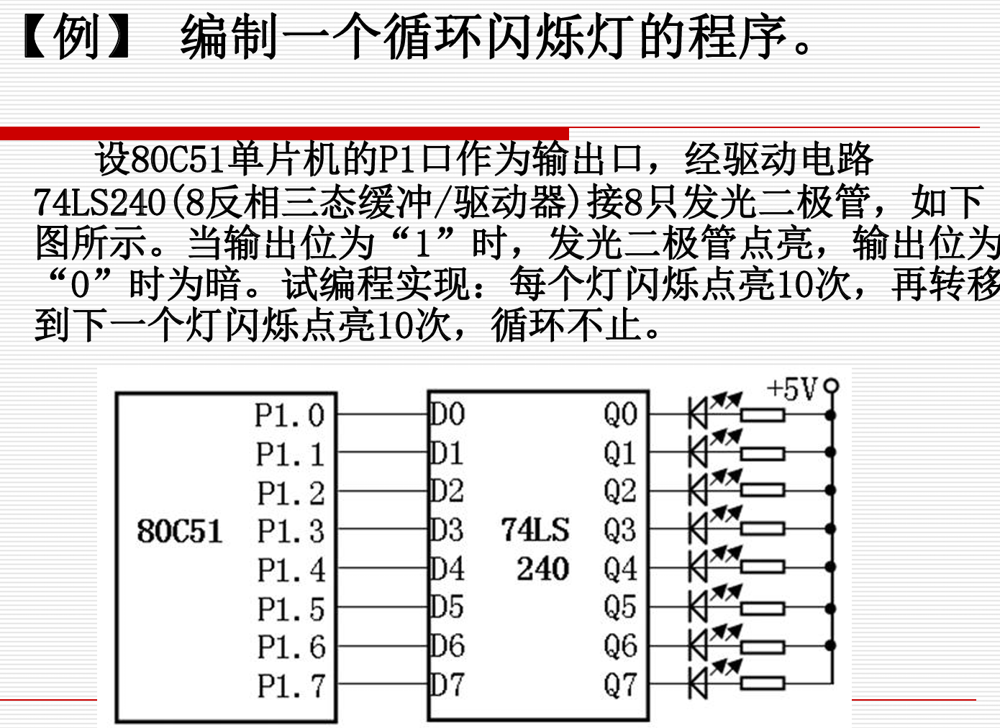
> 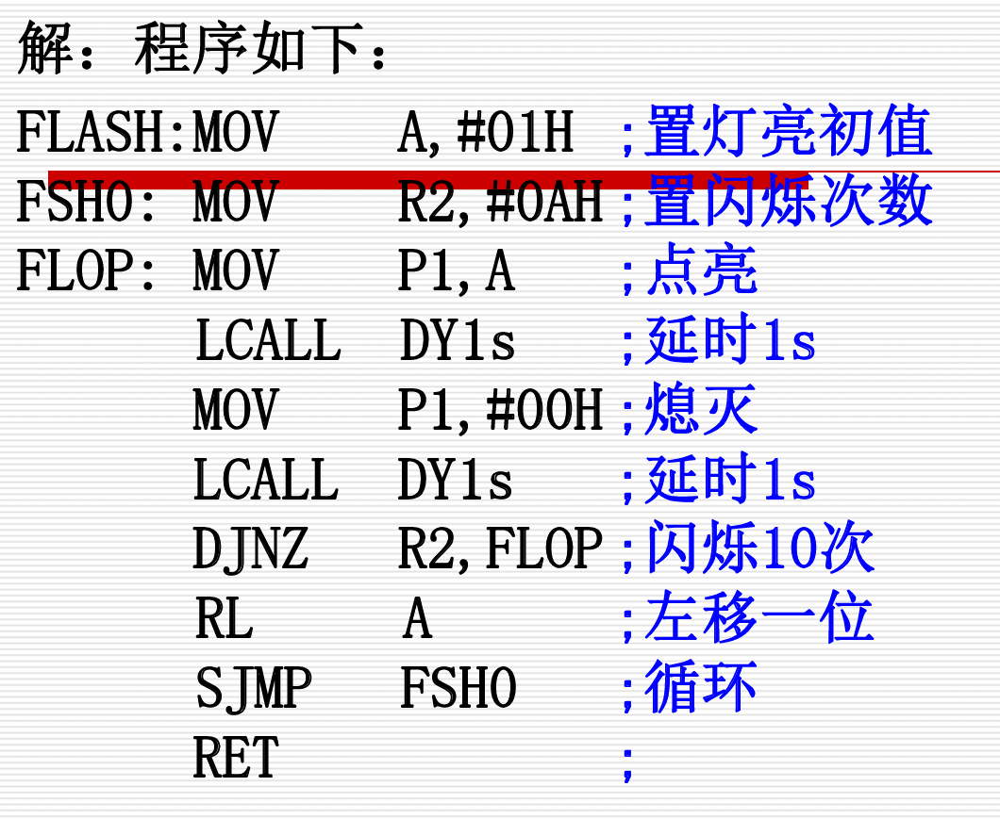
> 带延时程序，假设晶振频率是12$\mathrm{MHz}$，机周1$\mu s$，延时1s需要DJNZ执行$\frac{1s}{2\mu s}$=50 0000=200*2500次
```
FLASH:      MOV     A,#01H      ;初始为当前灯亮
FCI:        MOV     R2,#0AH     ;闪烁次数设置为10
FLOP:       MOV     P1,A        ;点亮当前灯
            LCALL   DY1s        ;延时1s
            CLR     P1          ;当前灯熄灭
            LCALL   DY1s        ;延时1s
            DJNZ    R2,FLOP     ;减1非0跳转开始循环
            RL      A           ;若闪烁点亮10次，切换到下一个灯
            SJMP    FCI         ;

DY1s:       MOV     R6,#200     ;外层循环200次
DY1:        MOV     R7,#2500    ;内层循环2500次
DY2:        DJNZ    R7,DY2      ;开始内层循环
            DJNZ    R6,DY1      ;外层循环
            RET                 ;
```
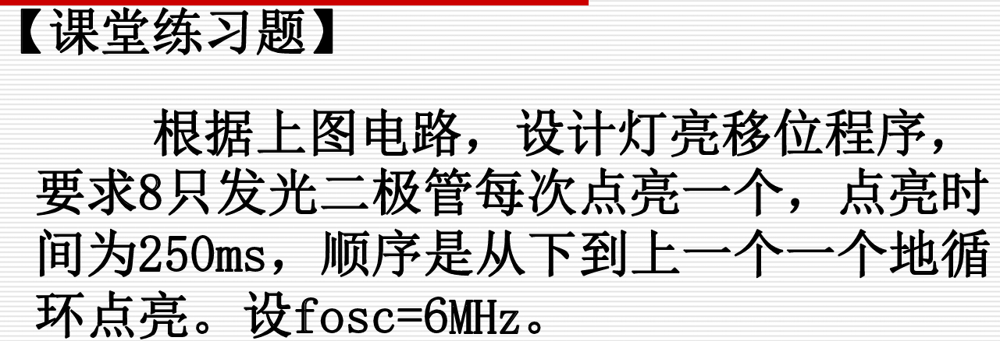
> 带延时程序，晶振频率为6$\mathrm{MHz}$，机周为2$\mu s$，DJNZ指令周期为4$\mathrm{\mu s}$，DJNZ需要执行$\frac{250ms}{4\mu s}$=62500=250*250次
```
FLASH:      MOV     A,#80H      ;初始灯为第八个灯
FLOP:       MOV     P1,A        ;当前灯亮
            LCALL   DY250ms     ;延时250ms
            CLR     P1          ;灯灭
            RR      A           ;循环右移
            SJMP    FLOP        ;进入循环

DL250ms:    MOV     R6,#250     ;外层循环250次
D1:         MOV     R7,#250     ;内层循环250次
D2:         DJNZ    R7,D2       ;
            DJNZ    R6,D1       ;
            RET                 ;
```


> 1. 全部累加后平均
> 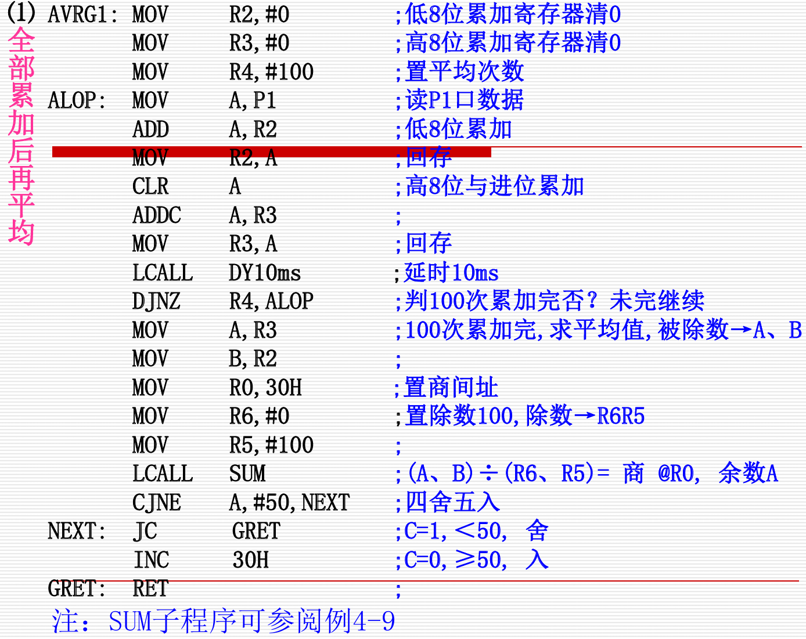
> SUM是什么？？
```
AVRG1:      MOV     R2,#0       ;低8位置零
            MOV     R3,#0       ;高8位置零
            MOV     R4,#100     ;均值次数
ALOP:       MOV     A,P1        ;读P1口数据
            ADD     A,R2        ;低8位累加
            MOV     R2,A        ;回存
            CLR     A           ;
            ADDC    A,R3        ;高8位加进位累加
            MOV     R3,A        ;回存
            LCALL   DY10ms      ;延时10ms
            DJNZ    R4,ALOP     ;循环读数累加
            MOV     A,R3        ;
            ···
            
```
> 2. 边平均边累加
> 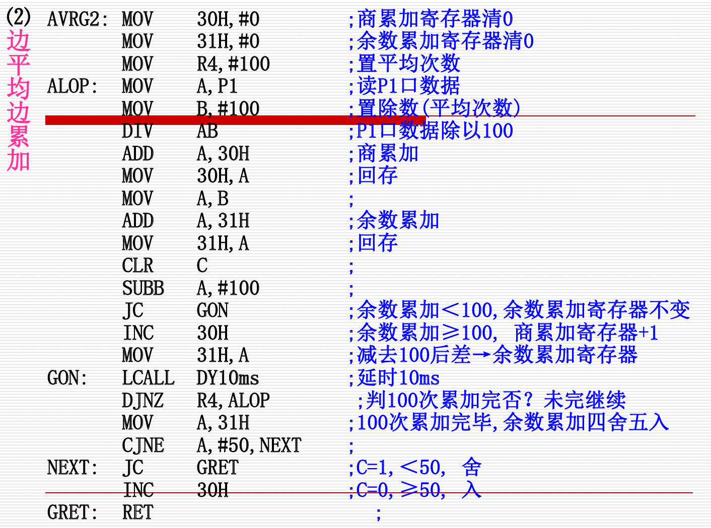
```
AVRG2:      MOV     30H,#0      ;商清零
            MOV     31H,#0      ;余数清零
            MOV     R4,#100     ;置平均次数
ALOP:       MOV     A,P1        ;读取端口数据作为被除数
            MOV     B,#100      ;除数
            DIV     AB          ;
            ADD     A,30H       ;商累加
            MOV     30H,A       ;回存
            MOV     A,B         ;
            ADD     A,#31H      ;余数累加
            MOV     31H,A       ;回存
            CLR     C           ;
            SUBB    A,#100      ;
            JC      GON         ;若借位了，余数不变，只是A变了，后续会覆盖
            INC     30H         ;若无借位，商+1
            MOV     31H,A       ;将余数置为减100后的结果
GON:        LCALL   DY10ms      ;延时
            DJNZ    R4,ALOP     ;进入循环
            MOV     A,31H       ;
            CJNE    A,#50H,NEXT ;四舍五入
NEXT:       JC      GRET        ;C=1，舍
            INC     30H         ;C=0，入
GRET:       RET                 ;

```
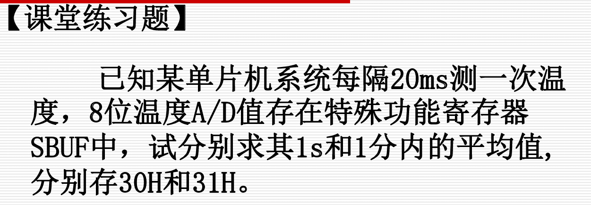

#### 3.4.5 查表程序
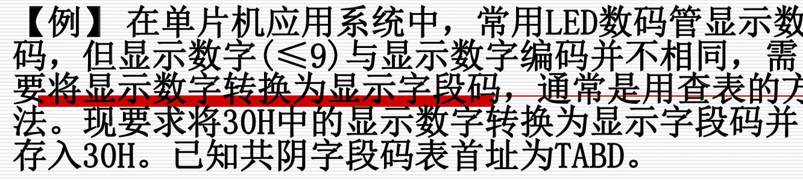
> 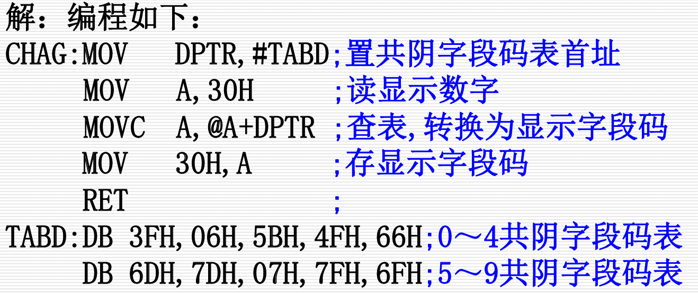


> 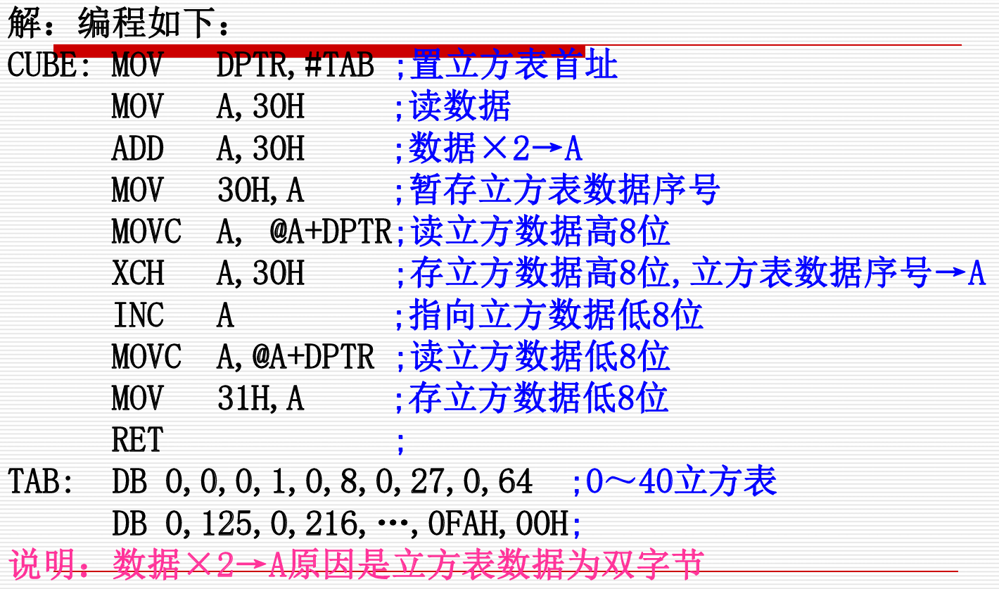

#### 3.4.6 散转程序

> 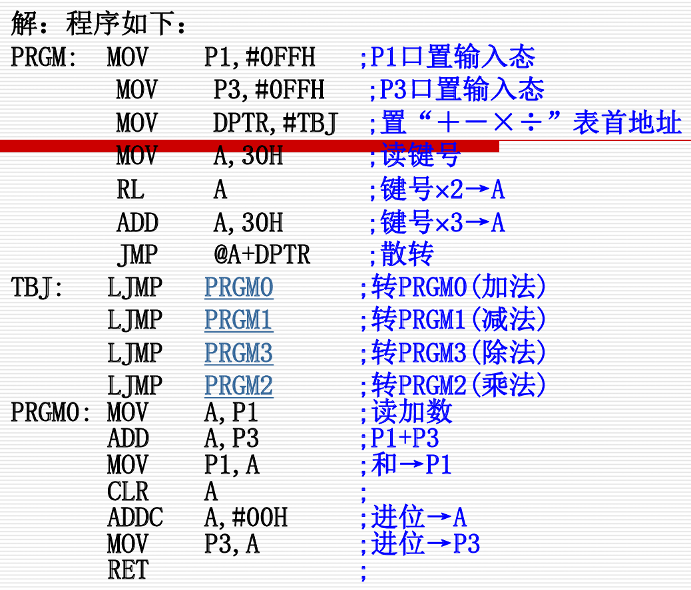
> 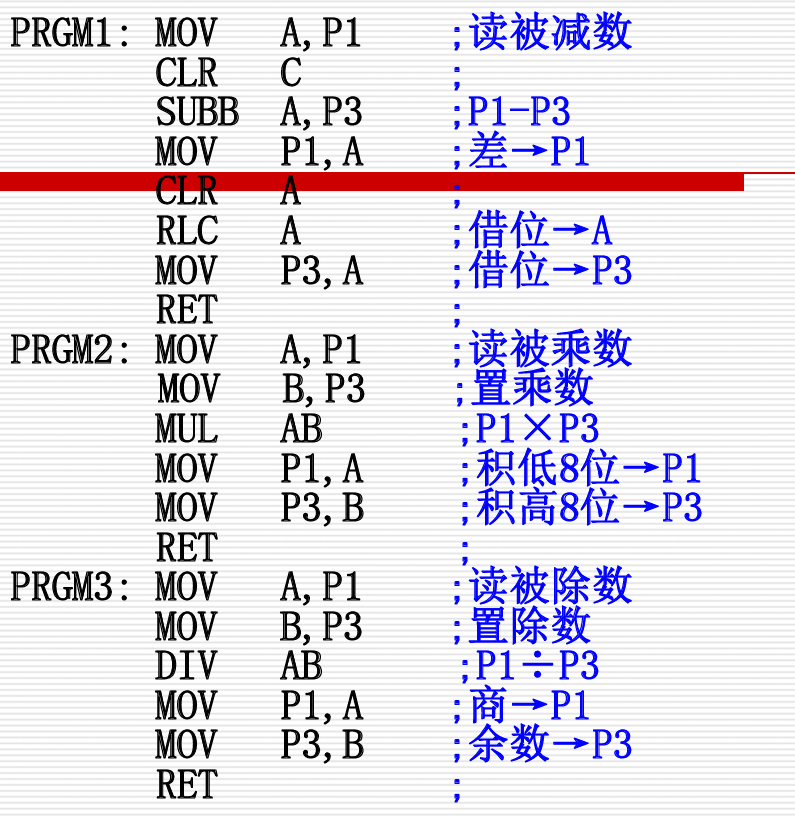


## 第四章 $\mathrm{C}$语言及$\mathrm{MCS-51}$单片机

### 4.1 $\mathrm{C-51}$程序结构

#### 4.1.1 基本数据类型
基本数据类型|长度|取值范围
:-:|:-:|:-:
unsigned char|1字节|0~255
signed char|1字节|-128~127
unsigned int|2字节|0~65535
singed int|2字节|-32768~32767
unsigned long|4字节|0~4294967295
signed long|4字节|-2147483648~2147483647
float|4字节|3.4E-38~3.4E+38
bit|1位|0或1
Sbit|1位|0或1
sfr|1字节|0~255
sfr16|2字节|0~65535

### 4.2 $\mathrm{C-51}$运算量

#### 4.2.1 常量

#### 4.2.2 变量
1. 定义格式：\[存储种类\]数据类型说明符\[存储器类型\]变量名\[=初始值\]···
2. 变量名：字母、数字、下划线组成，且首字符必须是字母或下划线
3. 存储种类：auto（自动分配释放内存）、static（静态）、register（寄存器变量，存放在$\mathrm{CPU}$中，处理速度快）、extern（外部）
4. 存储器类型

存储器类型|说明
:-:|:-:
data|直接寻址片内$\mathrm{RAM}$低128$\mathrm{B}$，访问速度快
bdata|片内$\mathrm{RAM}$可位寻址区$\mathrm{20H \textasciitilde 2FH}$，允许访问全部片内$\mathrm{RAM}$
idata|间接寻址访问的片内$\mathrm{RAM}$，允许访问全部的片内$\mathrm{RAM}$
pdata|用$\mathrm{R_i}$间接访问$\mathrm{RAM}$低256$\mathrm{B}$
xdata|用$\mathrm{DPTR}$间接访问片外$\mathrm{RAM}$，允许访问全部64$\mathrm{k}$片外$\mathrm{RAM}$
code|程序存储器$\mathrm{ROM64k}$空间

5. 特殊功能寄存器变量：sfr/sfr16 $\nobreakspace$ 特殊功能寄存器名（一般用大写字母）=地址：sfr-单字节，sfr16-双字节

6. 位变量：bit $\nobreakspace$：一般的可位处理的变量；Sbit $\nobreakspace$ 位变量名=位地址：可位寻址字节或特殊功能寄存器中的位

#### 4.2.3 $\mathrm{C51}$存储模式

SMALL模式|COMPACT模式|LARGE模式
:-:|:-:|:-:
小编译模式|紧凑编译模式|大编译模式
参数和变量默认在片内$\mathrm{RAM}$|在片外$\mathrm{RAM}$低256$\mathrm{B}$空间|在片外$\mathrm{RAM}$64$\mathrm{kB}$空间
存储器类型为$\mathrm{data}$|$\mathrm{pdata}$|$\mathrm{pdata}$

> 通过#pragma指令改变存储模式：#pragma small/compact/large。默认为small


#### 4.2.4  绝对地址访问
- 使用$\mathrm{C51}$运行库中预定义宏，访问形式如下：宏名\[地址\]
宏名包括：

宏名|说明
:-:|:-:
CBYTE|以字节形式对code区寻址
DBYTE|以字节形式对data区寻址
PBYTE|以字节形式对pdata区寻址
XBYTE|以字节形式对xdata区寻址
CWORD|以字（2字节）形式对code区寻址
DWORD|以字（2字节）形式对data区寻址
PWORD|以字（2字节）形式对pdata区寻址
XWORD|以字（2字节）形式对xdata区寻址

- 通过指针访问
- 使用$\mathrm{C51}$扩展关键字 $\mathrm{\_at\_}$
格式如下：\[存储器类型\]$\nobreakspace$变量名$\nobreakspace$ \_at\_ $\nobreakspace$ 地址

### 4.3 C51构造的数据类型
#### 4.3.1 数组
一维数组：数据类型 数组名[数组长度];
#### 4.3.2 指针

### 4.4 C51运算符与表达式

运算符类型|运算符
:-:|:-:
赋值运算符|=
算术运算符|+、-、*、/、%
关系运算符|==、!=、<、<=、>、>=
逻辑运算符|&&、||、!
位运算符|&、|、^、~、<<、>>
复合赋值运算符|=、+=、-=、*=、/=、%=、&=、|=、^=、<<=、>>=
逗号运算符|,（整个逗号表达式的值是最后一个表达式的值）
条件运算符|?：（条件表达式？真值表达式：假值表达式）
指针地址运算符|&，*


### 4.5 修饰符

reentrant：把函数定义为可重入函数，即允许被递归调用的函数。
1. 不允许使用bit类型参数
2. 通过模拟栈实现函数递归调用
3. 实参可以传递给间接调用的重入函数


## 集成作业

### 一、51 单片机有哪几种寻址方式？试分别列举采用这些寻址方式进行寻址的汇编指令。（3-9）
1. 立即寻址：MOV A,#10H;将立即数10H送到寄存器A
2. 直接寻址：MOV A,1AH;将1AH地址处的数据送到寄存器A
3. 寄存器寻址：MOV A,R0;将寄存器R0中的数据送到寄存器A
4. 寄存器间接寻址：MOV A,@R0;将寄存器R0中地址对应的数据送到寄存器A
5. 变址寻址：MOV A,@A+DPTR;将A中内容和DPTR内容相加得到一个新地址，该地址处的数据送到寄存器A
6. 相对寻址：SJMP 08H;相对当前PC值偏移08H的短跳转
7. 位寻址：MOV 10H,C;将进位C送到20H地址处

### 二、什么叫哈佛结构，什么叫冯诺依曼结构？单片机和PC机采用的分别是什么结构？（1-38）
1. 哈佛结构：一种存储器并行体系结构，主要特点是程序和数据分开存储，即程序存储器和数据存储器是两个独立的存储器，每个存储器独立编址，独立访问。
2. 冯诺依曼结构：使用二进制表示数据指令，指令和数据不加区分混合存储在一个存储器中，顺序执行程序的每一条指令，计算机由运算器、控制器、输入设备、输出设备、存储器组成。
- 单片机采用的是哈佛结构，PC机采用的是冯诺依曼结构。

### 三、特殊功能寄存器PSW中的各位分别表示什么，有什么功能？试分析执行指令 （2-33）MOV A,#7FH;ADD A,#47H后，程序状态字 PSW中 CY，AC，OV，P的状态是什么？
1. CY（PSW.7）：进/借位标志，加法产生的进位或者减法产生借位时置1
2. AC（PSW.6）：辅助进位标志，低4位有进位时为1
3. F0（PSW.5）：用户标志位，可以使用软件来置1清0
4. RS1，RS0（PSW.4，PSW.3）：工作寄存器选择位，00选寄存器组0（地址00H~07H），01选寄存器组1（地址08H~0FH），10选寄存器组2（地址10H~17H），11选寄存器组3（地址18H~1FH）
5. OV（PSW.2）：溢出标志位，指示运算结果是否溢出，溢出置1
6. PSW.1：保留位，一般未用
7. P（PSW.0）：奇偶标志位，累加器A中1的个数位奇数时置1
- 执行两条指令后，CY=0,AC=1,OV=1,P=0

### 四、特殊功能寄存器SP、ACC、B、DPTR各有什么功能？（2-31）
1. SP：堆栈指针寄存器，8位寄存器，存放栈顶指针，用于保护CPU和断点地址，入栈SP+1，出栈SP-1。
2. ACC：累加器，绝大多数的算术运算，逻辑运算，移位运算，比较运算通过ACC完成，操作数取自A，结果存于A/AB，指令系统采用A作为累加器的标识符
3. B：8位寄存器，配合A使用作乘除运算，用于存放第二操作数，乘积的高字节
4. DPTR：数据指针寄存器，16位寄存器，高字节DPH，低字节DPL，主要对外部RAM/ROM寻址，范围64KB

### 五、程序计数器PC的功能是什么？试述PC管理程序执行顺序的过程。（2-29）
PC用于存放下一条指令地址，每执行一条指令自动加1，用于控制程序执行顺序。
- PC管理程序执行顺序的过程：
1. PC指向指令地址
2. CPU从ROM中取出指令
3. PC自动加1，指向下一条指令地址
4. CPU执行指令
5. 重复步骤2-4，直到程序结束
当遇到转移或调用类指令时，这些指令会把新的地址送入PC，使程序按照指定的目标地址跳转执行。PC通过顺序递增和被修改跳转两种形式实现对程序流程的控制。

### 六、单片机有哪些中断源？试述中断响应的过程和中断优先级的实现过程。（5-11）
单片机有5个中断源，2个外部中断源，3个内部中断源
$\\ \mathrm{\overline{INT0}}$：外部中断源0，中断请求信号由P3.2输入
$\\ \mathrm{\overline{INT1}}$：外部中断源1，中断请求信号由P3.3输入
$\\ T0$：定时/计数器0溢出中断，对外部脉冲计数由P3.4输入
$\\ T1$：定时/计数器1溢出中断，对外部脉冲计数由P3.5输入
串行中断：包括串行接收中断R1和串行发送中断T1（P3.0/P3.1）

中断响应过程：CPU查询到某中断标志为1，在满足中断响应条件下，响应中断。
中断响应条件：
1. 该中断已经开中断
2. CPU此时没有响应同级或更高级的中断
3. 当前所处于执行指令的最后一个机器周期
4. 正在执行的指令不是RETI或是范围跟IE、IP的指令，否则必须再另外执行一条指令后才能响应

响应中断：
1. 保护断点地址
2. 撤除该中断源的中断请求标志
3. 关闭同级中断源
4. 将相应中断的入口地址送入PC

中断优先级实现过程：
- 由IP设置优先级，划分为高优先级和低优先级，80C51中断优先控制首先根据中断优先级，同时规定了同一中断优先级之间的中断优先权，其从高到低的顺序为：$\mathrm{\overline{INT0}、\overline{INT1}、T0、T1、串行中断}$。
- 中断优先级可以编程设置，中断优先权是固定的，不能随意更改。
- 高优先级中断可以中断正在响应的低优先级中断，反之不能；同优先级中断不能互相中断；同一中断优先级中，若多个中断源同时请求中断，CPU将先响应优先权高的中断，后响应优先权低的中断


### 七、求带符号数+83、-34的补码（设机器字长为8位）。（1-23）
带符号数|+84|-34
:-:|:-:|:-:
原码|0101 0011|1010 0010
反码|0101 0011|1101 1101
补码|0101 0011|1101 1110

### 八、单片机的定义是什么？试述单片机的发展历程以及其和PC机的主要区别。（1-36）
- 单片机：是将CPU、存储器（RAM和ROM）、定时器/计数器，以及I/O接口等部件集成在一个芯片上的一种微型计算机。
- 发展历程：第一阶段，初级单片机，采用双片组成；第二阶段，低性能单片机，小而全；第三阶段，高性能单片机，系列化，功能强；第四阶段，16位、32位单片机，增加了内部资源，实时处理能力更强
- 与PC机的主要区别：单片机采用哈佛结构，多为单核，处理逻辑简单，主打低功耗、小体积，用于设备控制、运行逻辑程序或轻量级RTOS；PC机采用冯诺依曼结构，多核多线程，适合复杂运算，支持高性能功能扩展

### 九、 C51 中有哪些存储器类型，分别对应单片机的哪些存储器区域？如何利用指针访问这些存储器区域中任意指定的存储器单元？编写一个C51程序，采用指针方式将pdata区20H地址赋值为57H，xdata区2000H地址赋值为FFH。（4-21）
存储器类型:
1. data：直接寻址的片内RAM低128B，访问速度快
2. bdata：片内RAM的可位寻址区，允许字节和位寻址混合访问
3. idata：间接寻址的片内RAM区，允许访问全部片内RAM
4. pdata：用Ri间接访问的片外RAM低256B
5. xdata：用DPTR间接访问的片外RAM，允许访问全部64k片外RAM
6. code：程序存储器ROM，64KB空间

利用指针访问这些存储器区域中任意指定的存储器单元：
unsigned char data *dp;
unsigned char bdata *dp;
unsigned char idata *dp;
unsigned char pdata *dp;
unsigned char xdata *dp;
unsigned char code *dp;
```
#include <reg51.h>
#define uchar unsigned char
void main()
{
    uchar pdata *p=20H;
    uchar xdata *x=2000H;
    *p=57H;
    *x=FFH;
    while(1);
}
```

### 十、已知内部RAM中（20H）=10H, 试写一个汇编程序，运用寄存器间接寻址的方法将（20H）中的内容复制到内部RAM（51H）至（57H）单元中。（3-12，4-77）

```
            ORG     0000H
COPY:       MOV     R0,#20H     ;
            MOV     A,@R0       ;
            MOV     R1,#51H     ;
            MOV     R2,#07H     ;循环次数

LOOP:       MOV     R1,A        ;
            INC     R1          ;
            DJNZ    R2,LOOP     ;
            RET                 ;
            END
```

### 十一、用汇编语言编写查表程序求0～20之间整数的平方。已知该整数存在内RAM30H中，查得平方数存内部RAM30H（高8位）和31H（低8位）。已知平方表(双字节)首地址为TAB。（3-78）

```
            ORG     0000H       ;
            MOV     DPTR,#TAB   ;指向表首地址
            MOV     A,30H       ;得到要求平方的数
            ADD     A,30H       ;*2
            MOV     30H,A       ;

            MOVC    A,@A+DPTR   ;读取平方数高字节
            XCH     A,30H       ;交换后，A为2n，30H为高字节
            INC     A           ;低字节偏移量
            MOVC    A,@A+DPTR   ;读取平方数低字节
            MOV     31H,A       ;存入低字节
            END
```

### 十二、MOV, MOVX, MOVC，ADDC,SET ,XRL, CLR, ANL, PUSH, DEC , JB,JNB, DJNZ 等汇编指令的详细用法，注意每条指令的所有可能用法。（3-15）

### 十三、 51 单片机有哪几种周期？设晶振fosc=6MHz，使用汇编语言采用循环方式编写一个100ms 的准确延时程序。（3-67）
1. 振荡周期T：晶振电路直接产生的震荡信号的周期
2. 时钟周期S：一个时钟周期为两个振荡周期
3. 机器周期MC：完成一个基本操作所需要的时间，一个机器周期由六个时钟周期组成
4. 指令周期IC：执行一条指令所需要的时间

fosc=6MHz，MC=4$\mu s$
大约需要DJNZ执行$\frac{100ms}{4\mu s}=25000=100*250次\\$
程序如下：
```
DY100ms:        MOV     R6,#100     ;外循环100次
DY1:            MOV     R7,#250     ;内循环250次
DY2:            DJNZ    R7,DY2      ;
                DJNZ    R6,DY1      ;
                RET
```
> 比较粗糙，实际延时为1+250\*100\*2+100*(2+1)+2=50303个机周

精细程序需要考虑MOV等：
```
DLY100MS:
        MOV   R6,#99        ; 1 周期

OUTER:  MOV   R7,#250       ; 1 周期
INNER:  DJNZ  R7,INNER      ; 250 次，每次 2 周期 -> 500 周期
        DJNZ  R6,OUTER      ; 2 周期，外层共 99 次
\\ 到这里1+250*99*2+99*(2+1)=50301-3-500=49798

        MOV   R7,#99        ; 1 周期
EXTRA:  DJNZ  R7,EXTRA      ; 99 次，每次 2 周期 -> 198 周期
\\ 到这里，补的周期为1+2*99=199，总周期为4997

        NOP                 ; 1 周期（补足到刚好 50000）
        RET                 ; 2 周期
```

### 十四、设80C51 单片机的P1口作为输出口，每根线上接1只发光二极管，通过限流电阻接地。试使用汇编语言编程实现：每个灯闪烁点亮10次，再转移到下一个灯闪烁点亮10次，闪烁周期为500ms，循环不止。（3-68）
```
            ORG     0000H
FLASH:      MOV     A,#01H      ;初始点亮P1.0
FCI:        MOV     R0,#10      ;
FLOP:       MOV     P1,A        ;
            LCALL   DY500ms
            CLR     P1
            LCALL   DY500ms
            DJNZ    R0,FLOP
            RL      A
            SJMP    FCI

DY500ms:
            MOV     R6,#100
D1:         MOV     R7,#250
D2:         DJNZ    R7,D2
            DJNZ    R6,D1
            RET
            END
```

### 十五、设80C51 单片机的P1口作为输出口，每根线上接1只发光二极管，通过限流电阻接地。P3.2 上接有一个开关K，开关K按下时P3.2为低电平，开关K未按下时P3.2为高电平。请用外中断0的中断方式控制这8只LED的亮暗，要求每按一次开关K，LED由亮变暗或由暗变亮，请用C51编程实现。（5-25）
```
#include<reg51.h>
sbit  K=P3^2;               // INT0 引脚（P3.2）
void main()
{
    EA=1;                   // 开放总中断   
    EX0=1;                  // 允许使用外中断
    IT0=1;                  // 下降沿触发中断
    P1=0xFF;                // 设初值
    while(1);
}

void int0() interrupt 0     //外中断0，中断编号0
{
    P1=~P1;                 // 每产生一次中断请求，P1取反
}
```

### 十六、使用汇编语言编程实现编程实现乘法运算90H*20H，乘法结果放在寄存器R3、R2、R1中，其中高位放在R3。（3-71）
```
            ORG     0000H
            MOV     A,#90H      ;
            MOV     B,#20H      ;
            MUL     AB          ;A为低位，B为高位
            MOV     R1,A        ;
            MOV     R2,B        ;
            MOV     R3,#00H     ;
            END
```

### 十七、单片机的结构组成是怎样的？所包含功能部件各自有什么功能?8051单片机外部40条引脚的功能分别是什么？（2-3）
单片机包含时钟、复位电路、中央处理器CPU、存储器、定时计数器、中断系统、I/O接口。
- 时钟：为单片机提供工作频率，决定指令执行速度。
- 复位电路：用于初始化单片机状态，使其进入预定的工作状态。
- 中央处理器CPU：包含算术逻辑单元ALU、寄存器组、程序计数器PC、指令寄存器IR等，负责指令的执行和数据处理。
- 存储器：包括程序存储器（ROM），用于存储程序代码和固定常数；数据存储器（RAM），用于存储临时数据和变量。
- 定时计数器：用于实现精准定时或对外部事件进行计数
- 中断系统：一种优先响应机制，允许单片机暂停当前正在执行的程序，转去处理其他事件，处理完毕后再返回
- I/O接口：包含并行I/O口和串行I/O口，用于与外部设备进行数据交换

引脚功能：
- I/O口：P0（数据、地址复用口）、P1（I/O口）、P2（双功能）、P3（双功能），一共32条引脚
- 控制口线：$\mathrm{\overline{PSEN}}$、ALE、$\mathrm{\overline{EA}}$、RESET，一共4条
- 电源：VCC、VSS，一共2条
- 时钟：XTAL1、XTAL2，一共2条

### 十八、用汇编语言和C语言分别编写程序，在单片机内部RAM的30H-50H单元中，查找所有值为00H的内存单元，并将相应单元的值设置为77H，同时统计值为00H的内存单元的个数，并将结果存放在外部RAM的0051H单元中。（4-77）

```
            ORG     0000H
            MOV     R1,#30H     ;设置查询起始地址
            MOV     R0,#33      ;设置循环次数
            MOV     R2,#00H     ;计数值
SCAN:       MOV     A,@R1       ;
            JNZ     CHG         ;
            MOV     A,#77H      ;
            MOV     @R1,A       ;
            INC     R2          ;计数器加1
CHG:        INC     R1          ;
            DJNZ    R0,SCAN     ;

            MOV     DPTR,#0051H ;
            MOV     A,R2        ;
            MOVX    @DPTR,A     ;
            RET
            END
```

```
#include<reg51.h>
void main()
{
    unsigned char idata *p;         //指向内部RAM
    unsigned char xdata *count;     //指向外部RAM
    unsigned char cnt=0;
    unsigned char i;

    p=(unsigned char idata *)0x30;
    count=(unsigned char xdata *)0x0051;

    for(i=0;i<=32;i++)
    {
        if(*p==0x00)
        {
            *p=0x77;
            cnt++;
        }
        p++;
    }
    *count=cnt;

    while(1);

}
```

### 十九、已知单片机晶振为10MHz，试求其时钟周期，机器周期，指令周期分别是多少？DJNZ指令及MOV指令的执行时间分别是多少？（2-61,3-67）
- 振荡周期：0.1$\mu s$
- 时钟周期：0.2$\mu s$
- 机器周期：1.2$\mu s$
- 指令周期：一般为1、2、4个机器周期，即1.2$\mu s$、2.4$\mu s$、3.6$\mu s$

### 二十、用C51中的循环语句实现计算并输出1~100的累加和。（4-71）
> SCON决定串行工作方式
```
#include<reg.h>
#include<stdio.h>
{
    \\串口初始化
    SCON=0x50;
    TMOD=0x20;
    TH1=0xFD;
    TR1=1;

    int i,sum=0;
    for(i=1;i<=100;i++)
    {
        sum+=i；
    }
    printf("和为%d\n",sum);
    while(1);
}
```

### 二十一、设51单片机的晶振fosc=6MHz，使用汇编语言编写程序，从P1.2输出一个方波，要求方波周期为80ms，占空比为10%。试分别运用片内定时器资源的中断方式和查询方式实现。（5-42）
机周2us，高电平8ms（4000机周），低电平72（36000机周）ms
```
//中断方式

            ORG     0000H
            AJMP    MAIN

            ORG     000BH
T0_ISR:
            CLR     TR0
            CPL     P1.2
            JB      P1.2,HIGH_T

LOW_T:      MOV     TH0,#73H

```