# 微电子工艺期末复习

# 速背

**半导体级硅**：做芯片的高纯度硅，先用碳加热硅石制备冶金级硅，再通过盐酸、氢气纯化（西门子工艺）

**晶体**：单晶长程有序，多晶短程有序，非晶无序排列，**半导体工艺中主要使用单晶、多晶（缺陷少，器件性能优异）**

**缺陷**：掺杂可能会破坏了晶体结构形成缺陷改变半导体性能

单晶硅主要沿100和111面生长，以100面为主

### 直拉法（CZ法）
1. 工艺流程： 准备 ——> 开炉 ——> 生长 ——> 停炉
2. 生长：引晶 ——> 缩颈 ——> 放肩 ——> 等颈生长 ——> 收尾

**原理**：将多晶硅原料加热熔融，籽晶一端插入熔体至融化，随后缓慢旋转并向上提拉，固液界面会逐渐经过冷凝形成单晶，整个过程是复制籽晶的过程。

**优点**：工艺成熟，设备简单，晶体直径可观，生长速度快。

**缺点**：坩埚、有氧环境易引入杂质

> 控制生长速度、直径的主要因素：提拉器的升速与转速、坩埚内熔体温度

### 悬浮区熔法（FZ法）
**原理**：在真空或惰性气体环境中，将多晶硅棒与籽晶一端接触，使用RF线圈加热接触区域至多晶硅熔融，缓慢向上移动RF线圈，向下旋转拉单晶，使熔融区上移，形成单晶。

**优点**：无坩埚污染，氧含量极低，纯度最高

**$\mathrm{SiO_2}$薄膜作用**：
1. 器件保护
2. 器件隔离
3. 表面钝化
4. 栅氧
5. 注入掩蔽
6. 金属层间介质

### 干氧氧化

**优点**：成膜干燥、致密性好、重复性好，与光刻胶粘附性好

**缺点**：生长速度慢

### 湿氧氧化

**优点**：生长速度快

**缺点**：成膜疏松、均匀性差，与光刻胶粘附性差

**热氧化机制-生长动力学**：氧化剂扩散穿过滞留层达到$\mathrm{SiO_2}$表面——继续扩散穿过$\mathrm{SiO_2}$层达到$\mathrm{SiO_2/Si}$界面——氧化剂在$\mathrm{Si}$表面与$\mathrm{Si}$发生反应生成$\mathrm{SiO_2}$——反应副产物离开界面

### 热氧化阶段
阶段|线性阶段|抛物线阶段
:-:|:-:|:-:
关系式|$X=\frac{B}{A}t$|$X=\sqrt{Bt}$
成因|反应速率控制|扩散控制
系数变化|与温度成正比|与温度成正比
制约因素|$\mathrm{Si/SiO_2}$界面上的化学反应|$\mathrm{O_2}穿过\mathrm{SiO_2}$层的扩散速率
有效范围|0~150$\AA$|>150$\AA$

### LOCOS工艺
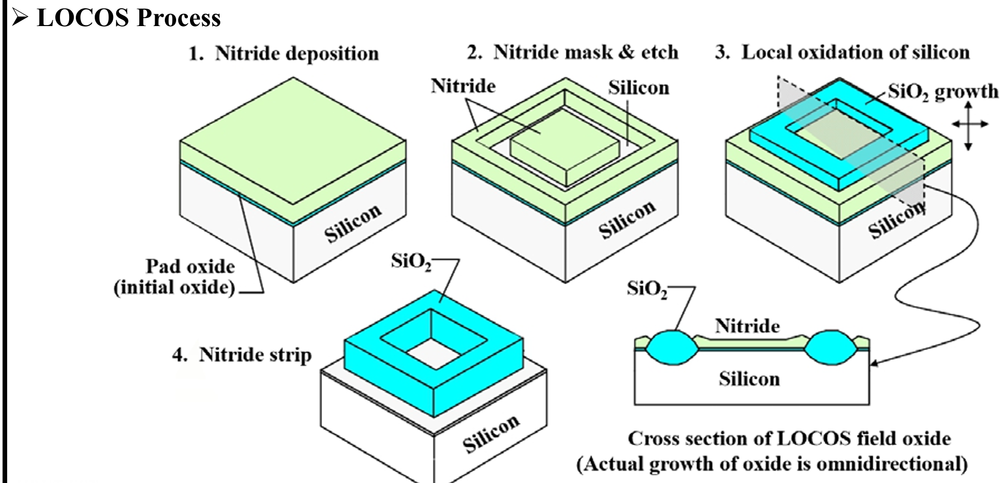
$\mathrm{LOCOS}$：选择性热氧化硅衬底来形成场氧化层，实现器件之间的电隔离。
**工艺步骤**：生长垫氧层——氮化层淀积——氮化层光刻与刻蚀——局部热氧化——去除氮化硅掩膜
1. $0.25\mathrm{\mu m}$以上工艺常用
2. 存在鸟嘴区，氧扩散到$Si_3N_4$膜下面生长$SiO_2$，有效栅宽变窄，增加电容
3. 缺陷增加

**鸟嘴效应**：场氧在纵向生长的同时向氮化硅掩膜下方发生横向延伸，使隔离氧化层边缘呈现出类似“鸟嘴”的形状，从而侵占有源区、缩小有效沟道宽度的现象。

### STI工艺
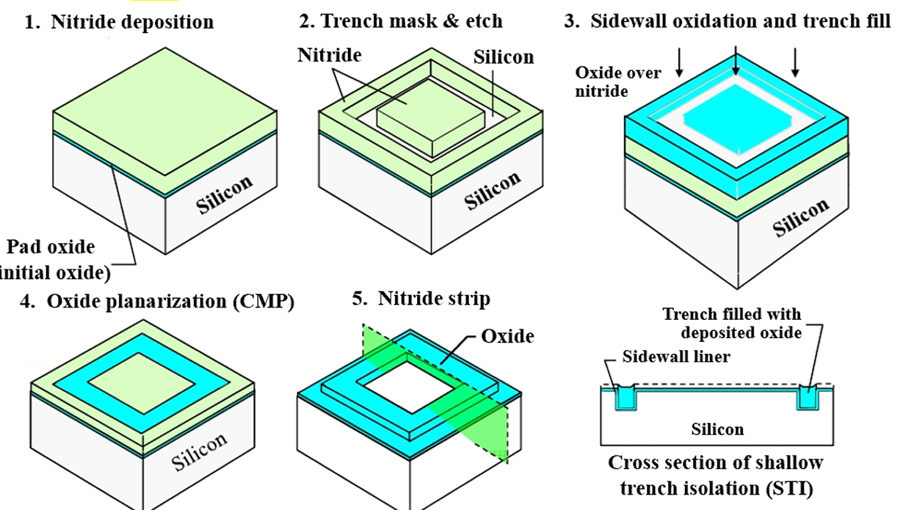
$\mathrm{STI}$：刻蚀浅沟槽实现器件隔离。

**工艺步骤**：生长垫氧层——氮化层淀积——沟槽光刻与刻蚀——沟槽侧壁氧化与氧化硅填充——CMP平坦化——去除氮化层、垫氧层
1. $0.25\mathrm{\mu m}$以下工艺常用
2. 更有效的隔离，尤其是对$DRAM$（对漏电流敏感）
3. 对晶体管隔离，表面积显著减小
4. 超强闩锁保护能力
5. 对沟道无侵蚀
6. 与$CMP$兼容

尺寸继续缩小后，LOCOS 的“鸟嘴效应”和平面性问题已不可接受，而 STI 在隔离精度、平坦化和可缩放性方面全面占优。

**介质薄膜**：隔离、绝缘、保护

**金属薄膜**：作为牺牲层

**low-k材料**：主要替代$\mathrm{SiO_2}$作为金属层间介质，可以降低寄生电容，从而提高信号传输速度并减少功耗

**high-k材料**：主要用于MOSFET的栅介质替代传统的$\mathrm{SiO_2}$栅，保证厚（减少门泄露电流）的同时电场效应足够

### 薄膜应力
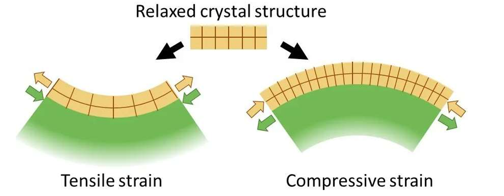
$$
\begin{cases}
\text{拉应力（正应力）} & \text{薄膜趋向于收缩} \\
\text{压应力（负应力）} & \text{薄膜趋向于张开} \\
\end{cases}
$$

- **残余应力**：由各种工艺因素引起的应力（工艺因素消失之后应力依旧存在）。

按照成因分类：
$$
残余应力
\begin{cases}
本征应力（内应力）：结构不匹配产生的力 \\

非本征应力（结构引起的应力）

    \begin{cases}
    热应力：热膨胀系数不匹配而产生的。 \\
    外应力：外力刺激而引起的应力。 \\
    \end{cases}
\end{cases}
$$

**消除应力的方法**：
1. 本征应力可以通过退火工艺消除
2. 淀积工艺制程和方法的优化、减少淀积速率
3. 选择热膨胀系数匹配的材料

**薄膜生长过程**：
1. **晶核形成**：成束的稳定小晶核直接形成于衬底表面。
2. **聚集成束(也称岛生长)**：随机方向的岛束依照在衬底表面的移动速率和成核速率来生长。
3. **连续薄膜**：岛束不断生长，直至岛束汇集合并形成固态的薄层并延伸铺满衬底表面。

### CVD
**CVD**：通过气体混合的化学反应在衬底表面淀积一层固态膜。

**淀积速率影响**：
1. **质量传输限制淀积速率**：不能提供足够的反应物到达衬底表面，受反应物传输速率限制，对温度不敏感
2. **反应速度限制淀积速率**：给了足够的反应物，反应温度、压力不足，提供驱动反应的能量不足

**常压化学气相淀积**：发生在**质量输运限制区域**，反应在常压下进行，冷壁反应，常用于淀积$\mathrm{SiO_2}$。
  - 主要优势：设备和操作简单，对温度控制要求不是很高。

**低压化学气相淀积**：发生在**反应速率限制区**，反应在低压下进行，热壁反应，保证温度均匀分布，薄膜淀积速率对温度变化很敏感。
  - 主要优势：高纯度和均匀性，台阶覆盖能力较好，投片量大

**等离子体化学气相淀积**：发生在**反应速率限制区**，温度比$\mathrm{APCVD、LPCVD}$低，冷壁反应，通过射频等离子体激活和维持化学反应。利用低温等离子体辉光放电发射出的高能电子撞击反应物气体分子，使之激活电离产生自由基，其在衬底表面发生化学反应形成膜。
  - 主要优势：低温、淀积速度快，台阶覆盖能力好，间隙填充能力好

**前道工序**：负责晶体管的制造

**后道工序**：负责金属互联

**金属互连层、介质绝缘层**：

**铜**：
- 优点：电阻率低，故集成度高、功耗低
- 缺点：铜会扩散，需要增加阻挡层，且刻蚀困难，但是在双大马士革工艺中，用CMP代替刻蚀
- 布线方法：大马士革工艺

**铝**：
- 优点：电阻低，可以不加接触层、黏附层和阻挡层等，工艺简单，产品价格低廉。
- 缺点：抗电迁移能力差。
- 布线方法：传统金属布线，反应离子刻蚀（RIE）

**阻挡层**：阻止上下层材料扩散、提高欧姆接触可靠性。

**通孔**：
- 作用：层间互联、缩短互连路径、提高布线灵活性
- 结构组成：阻挡层（通孔侧壁和底部淀积薄的氮化物层）、主填充材料（钨、铜）、覆盖层（铜互连中顶层有一层薄薄的材料防止氧化）

### 溅射
- 物理过程：惰性气体在高压下辉光放电**产生等离子体**，其中的**带正电离子被电场加速**具有较高的动能，**撞击位于阴极的靶电极**，使得靶表面的原子在碰撞过程中**溅射出来射向衬底**，从而实现在衬底上的薄膜淀积。
- 直流溅射：
- 射频溅射：
- 磁控溅射：
- 反应离子溅射：

### 光刻
- 原理：在光源的照射下，将掩模版上的微细图形转移到衬底上涂覆的光刻胶上；然后利用这些光刻胶做掩膜，对衬底材料进行选择性刻蚀
- 步骤：气相成底膜、涂胶、前烘、曝光、曝光后烘培、显影、后烘、显影后检查
- 指标：分辨率（特征尺寸）、套刻精度、产率
- 正胶-正性光刻：衬底图案与掩模版图案相同；曝光区域发生降解反应，可溶于显影液；曝光部分在显影过程中去除
  - 优点：显影后不易变形，分辨率高、对比度高
  - 缺点：粘附性差
- 负胶-负性光刻：衬底图案与掩模图案相反；曝光区域发生交联反应而硬化，留在硅片表面；未曝光部分在显影过程中被去除
  - 优点：粘附性好、曝光速度快、对刻蚀阻挡能力强
  - 缺点：显影时易吸收显影液膨胀变形、分辨率差
- 前烘作用：干燥光刻胶，增强光刻胶与衬底之间的粘附性与耐磨性能，使曝光时能够充分的发生光化学反应
- 后烘作用：使胶膜与硅片之间紧密黏附，防止胶膜脱落，增强胶膜抗蚀性
- 分辨率由瑞利法则确定
$$
R=k_1 \cdot \frac{\lambda}{NA}
$$
- 数值孔径定义式：
$$
NA=nsin\theta
$$
- 曝光方法：
$$
\begin{cases}
    遮蔽式曝光
        \begin{cases}
            接近式曝光 \\
            接触式曝光
        \end{cases} \\
    投影式曝光
        \begin{cases}
            步进重复式曝光 \\
            步进扫描式曝光 \\
            扫描投影式曝光
        \end{cases} \\
\end{cases}
$$

**干法刻蚀**：把硅片表面暴露于气态等离子体，等离子体与硅片发生**物理或化学反应(或这两种反应)**，从而去掉暴露的表面材料。具有**各向异性**
- 优点：各向异性、CD控制优良、光刻胶不易脱落、均匀性好
- 缺点：对下层材料选择比差

**湿法刻蚀**：采用液体化学试剂以**化学反应**方式去除硅片中无光刻胶覆盖的部分，要求光刻胶有较强的抗蚀能力。湿法刻蚀具有**各向同性**，从而造成侧向腐蚀，限制了器件尺寸向微细化发展，湿法刻蚀一般用于特征尺寸较大的刻蚀；
- 优点：高选择性、高重复性

**刻蚀偏差**：
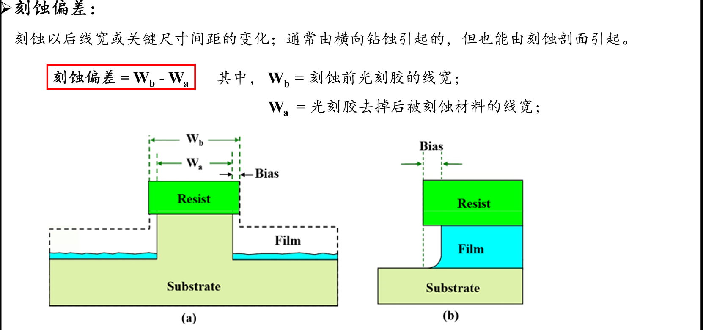

**负载效应**：刻蚀速率随着刻蚀面的大小、形状的变化而变化，即刻蚀速率取决于被刻蚀表面材料的量的现象。
1. 宏观负载效应：反应物恒定时，刻蚀速率随着被刻蚀表面积增大而减小。
2. 微观负载效应：在晶圆表面，器件密集区域的刻蚀速率低于稀疏区域。
3. 与深宽比相关的负载效应$\mathrm{(ARDE)}$：小尺寸孔或槽的刻蚀速率低于大尺寸（刻蚀气体难以进入小尺寸孔或槽）。

**热扩散**
- 优点：
1. 工艺简单、设备成本低
2. 对晶格损伤小
3. 适合深结掺杂

- 缺点：
1. 掺杂浓度受扩散系数、时间、温度影响，难以精确控制掺杂浓度与深度
2. 横向扩散严重
3. 热预算高（高温、长时间），易引起已形成的结构再次扩散
4. 不适合亚微米、深亚微米工艺
> 简单但精度不够，适合粗尺寸工艺

**离子注入**
- 优点：
1. 掺杂剂量和深度精确可控
2. 杂质均匀性好
3. 产生单一离子束
4. 低温工艺，允许使用不同的光刻掩膜
5. 横向扩散小，适合超浅结
6. 注入的离子能穿过薄膜
7. 无固溶度极限

- 缺点：
1. 会对晶格产生损伤
> 精确但昂贵，需要修复损伤

**扩散步骤**：预淀积、再扩散、激活

**恒定表面源**：：整个扩散过程中杂质浓度始终不变，硅片一直处于杂质氛围中，表面杂质浓度达到了该扩散温度的固溶度 ，杂质浓度分布服从余误差分布
- 特点：一定扩散温度下，表面杂质浓度由固溶度决定；扩散的时间越长，温度越高，扩散深度越大

**限定表面源扩散**：扩散开始时半导体表面杂质源一定，后续不再增加，杂质浓度分布服从高斯分布
- 特点：扩散时间越长，温度越高，扩散越深，表面浓度越低

**离子注入**：一种向硅衬底中引入可控制数量的杂质，以改变其电学性能的方法；它是一个**物理过程**

**退火**：加热硅片提高硅的结晶性
- 目的：修复晶格损伤；激活杂质

**沟道效应**：单晶硅排列长程有序，在某些特定的角度会有很多通道，当离子以特定角度注入时会穿过晶格间隙
- 解决方法：倾斜硅片、掩蔽氧化层、硅预非晶化、使用质量较大的原子

**平坦化**：
- 平滑：台阶角度圆滑、侧壁倾斜，但是高度没有显著减小
- 部分平坦化：平滑且高度显著减小
- 局部平坦化：完全填充小缝隙或局部区域，相对于平整区的总的台阶高度没有显著减小
- 全局平坦化：局部平坦化并且整个硅片表面总的台阶高度显著减小

**CMP工艺**：通过比去除低处图形更快的速率去除高处图形以获得均匀表面，化学+机械作用的平坦化过程
- 化学作用：表面材料与磨料发生化学反应生成较易去除的表面层
- 机械作用：新表面层在研磨剂和研磨压力与抛光垫的相对运动中去除
- 抛光速率影响因素：压力和旋转速度，硬抛光垫和较大的压力引起更严重的表面损伤
  - 小压力会更加平整，但是片间均匀性变差
  - 硬抛光垫和小压力获得最好的平整性

[TOC]

## 题型
判断题\*10+选择题\*7（最后一题以填空形式给出）+画图题\*2+简答题\*5
> 考试带作业本+（封面+翻译+综述）

## 考试重点
### 第一章 硅片
- 采用什么等级的硅（半导体级、冶金级、电子级），以及生产方式、来源
- 单晶、多晶、非晶，半导体工艺中主要使用单晶、多晶
- 掺杂利用晶体缺陷
- **单晶硅生长方式（CZ、FZ）及其影响因素，二者区别、优缺点**

### 第二章 制备二氧化硅薄膜
- **二氧化硅作为薄膜的作用，作器件隔离时的LOCOS、STI工艺的差别、步骤，鸟嘴效应**
- 湿氧法、干氧法，各自优缺点
- 器件热生长反应生长动力学机制，线性阶段、抛物线阶段，分两阶段的成因、影响因素

### 第三章 其他介质薄膜
- 介质薄膜、金属薄膜（绝缘薄膜）作用、区别，隔离、绝缘，**high-k介质、low-k介质用在哪**
- 薄膜应力分那些，产生原因，消除薄膜应力的方法
- 薄膜生长过程
- CVD几种方法的区别
- CVD淀积速率影响：质量传输限制、反应速度限制

## 第四章 金属化
- 前道工序、后道工序分别做什么
- 金属互连层、介质绝缘层
- 铜铝各自的优势
- 铝用传统金属布线，铜用双大马士革工艺
- 阻挡层是什么
- 通孔作用、位置、结构组成
- 溅射原理，不同机制

## 第五章 光刻（最重要）
- 光刻原理
- 光刻步骤
- 光刻指标，和刻蚀过程关注的指标不一样
- 正性光刻、负性光刻，正胶负胶，均一性等性质
- 烘培物理作用
- 分辨率由瑞利法则决定、数值孔径
- 接近式光刻、接触时光刻等分类

## 第六章 刻蚀
- 干法刻蚀（物、化、物+化）、湿法刻蚀（化）区别、性质、原理
- 刻蚀与哪些因素有关
- 刻蚀偏差
- 负载效应及其影响

## 第七章 扩散和离子注入（掺杂用）
- 热扩散和离子注入各自优缺点
- 扩散的步骤、影响，恒定表面源、恒定表面浓度、有限源扩散差别和具体影响因素
- 离子注入影响因素···
- 退火的目的、作用
- 沟道效应如何避免

## 第八章 CMP工艺
- 全局平坦化、局部平坦化等之间的区别
- CMP特点、几种作用、影响因素、研磨速率

## 作业题

### *第二章 硅和硅片的制备*

#### 一、叙述$\mathrm{SiO_2}$的主要用途
1. 作为**栅氧层**，隔离栅极与沟道，防止直流电流流过，可以形成$\mathrm{MOS}$，实现电场控制沟道导电性。
2. 作为**隔离层**，可以隔离不同器件，防止漏电流或串扰。
3. 作为**掩膜层**，在扩散或离子注入中，$\mathrm{SiO_2}$可以阻止杂质进入被覆盖区域。
4. 作为**钝化层**，保护器件表面，防止离子污染和机械损伤。
5. 作为**金属层间介质**，防止金属间直接接触发生短路。
6. 作为**牺牲层**，在$\mathrm{MEMS}$中，作为牺牲层，在后续刻蚀中被选择去除，形成空腔或是悬空结构。

### *第四章 氧化*

#### 二、干氧氧化和湿氧氧化区别
氧化方式|干氧氧化|湿氧氧化
:-:|:-:|:-:
反应方程式|$\mathrm{Si(s)+O_2(g)\rightarrow SiO_2(s)}$|$\mathrm{SiO_2(s)+H_2O(l)\rightarrow SiO_2(s)+H_2O(g)}\newline \mathrm{Si(s)+O_2(g)\rightarrow SiO_2(s)}$
气体源|$\mathrm{O_2}$|$\mathrm{O_2}+\mathrm{H_2O}$
氧化速度|慢|快
氧化层$\mathrm{SiO_2}$质量|好（干燥、致密、重复性好）|相对较差（疏松、均匀性差）
与光刻胶粘附性|好|差

#### 三、$\mathrm{Si}$的热氧化机理
$\mathrm{SiO_2}$生长模型为：“线性-抛物线模型”

阶段|线性阶段|抛物线阶段
:-:|:-:|:-:
关系式|$X=\frac{B}{A}t$|$X=\sqrt{Bt}$
成因|反应速率控制|扩散控制
系数变化|与温度成正比|与温度成正比
制约因素|$\mathrm{Si/SiO_2}$界面上的化学反应|$\mathrm{O_2}穿过\mathrm{SiO_2}$层的扩散速率
有效范围|0~150$\AA$|>150$\AA$

### *第五章 淀积*

#### 四、列举并描述薄膜生长的三个阶段。
1. **晶核形成**：成束的稳定小晶核直接形成于衬底表面。
2. **聚集成束(也称岛生长)**：随机方向的岛束依照在衬底表面的移动速率和成核速率来生长。
3. **连续薄膜**：岛束不断生长，直至岛束汇集合并形成固态的薄层并延伸铺满衬底表面。

#### 五、描述不同类型的$\mathrm{CVD}$反应和它们的主要优势。

- **常压化学气相淀积**：发生在质量输运限制区域，反应在常压下进行，冷壁反应，常用于淀积$\mathrm{SiO_2}$。
  - 主要优势：设备和操作简单，对温度控制要求不是很高。
- **低压化学气相淀积**：发生在表面反应控制区，反应在低压下进行，热壁反应，保证温度均匀分布，薄膜淀积速率对温度变化很敏感。
  - 主要优势：高纯度和均匀性，台阶覆盖能力较好，投片量大
- **等离子体化学气相淀积**：通过射频等离子体激活和维持化学反应，温度比$\mathrm{APCVD、LPCVD}$低，电子从电场中获得足够的能量与分子碰撞时，分子被解离后不断吸附在衬底表面，在表面发生迁移重排形成薄膜。
  - 主要优势：低温、淀积速度快，台阶覆盖能力好，间隙填充能力好

#### 六、什么是$\mathrm{LOCOS}$和$\mathrm{STI}$？为什么在亚微米级$\mathrm{IC}$中，$\mathrm{STI}$取代了$\mathrm{LOCOS}$？

$\mathrm{LOCOS,\ STI}$都属于选择性氧化区域的制备方法

$\mathrm{LOCOS(Local\ Oxidation\ of\ Silicon,\ 局部硅氧化)}$：选择性热氧化硅衬底来形成场氧化层，实现器件之间的电隔离。

1. $0.25\mathrm{\mu m}$以上工艺常用
2. 存在鸟嘴区，氧扩散到$Si_3N_4$膜下面生长$SiO_2$，有效栅宽变窄，增加电容
3. 缺陷增加

$\mathrm{STI(Shallow\ Trench\ Isolation,\ 浅沟槽隔离)}$：刻蚀浅沟槽实现器件隔离。
1. $0.25\mathrm{\mu m}$以下工艺常用
2. 更有效的隔离，尤其是对$DRAM$（对漏电流敏感）
3. 对晶体管隔离，表面积显著减小
4. 超强闩锁保护能力
5. 对沟道无侵蚀
6. 与$CMP$兼容

尺寸继续缩小后，LOCOS 的“鸟嘴效应”和平面性问题已不可接受，而 STI 在隔离精度、平坦化和可缩放性方面全面占优。

### *第六章 金属化*

#### 七、列出双大马士金属化过程的$\mathrm{10}$个步骤。
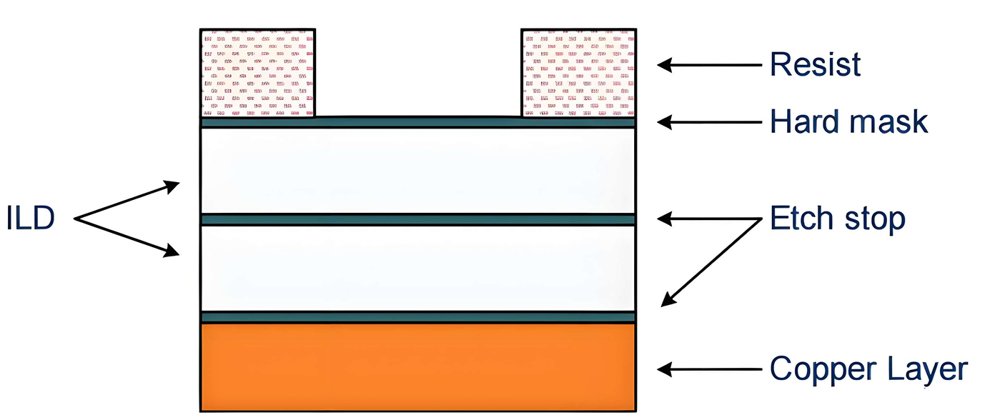
双大马士革工艺$\mathrm{(Dual\ Damascene\ Process)}$分两类：

- 先沟槽后通孔$\mathrm{(Trench\ First\ VIA\ Last,\ TFLV)}$
1. 涂抹刻蚀层抗蚀层$\mathrm{Resist}$并光刻形成沟槽图案
2. 各向异性干法刻蚀硬掩模$\mathrm{SiN}$和$\mathrm{ILD}$，直到到达第一蚀刻停止层$\mathrm{(EtchStop)}$。
3. 沉积并构造新的抗蚀剂层，光刻出通孔图案。
4. 各向异性干法蚀刻打开通孔；低能量刻蚀打开底部刻蚀停止层；去除抗蚀剂并沉积一层薄薄的钽作为阻挡层，以防止后来沉积的铜扩散$\mathrm{ILD}$中。
5. 淀积薄铜层作为种子，电镀填充铜。
6. $\mathrm{CMP}$抛光铜。

缺点：厚的抗蚀层被刻蚀后，沟槽已被刻蚀，刻蚀微小通孔是比较困难的，$\mathrm{TFVL}$仅适用于较大的结构。

- 先通孔后沟槽$\mathrm{(VIA\ First\ Trench\ Last,\ VFTL)}$
1. 涂抹抗蚀剂并光刻形成通孔图案，各向异性干法刻蚀至底部刻蚀停止层，该层不能被打开，防止铜溅射出来
2. 随后去除抗蚀层，新的抗蚀层被图案化，代表沟槽：先前打开的通孔也充满了抗蚀剂。
3. 各向异性干法刻蚀出沟槽；低能量刻蚀打开底部刻蚀停止层，沉积钽阻挡层和铜种子层并电镀。
4. CMP抛光铜。

#### 八、解释溅射的物理过程。

惰性气体在高压下辉光放电**产生等离子体**，其中的**带正电离子被电场加速**具有较高的动能，**撞击位于阴极的靶电极**，使得靶表面的原子在碰撞过程中**溅射出来射向衬底**，从而实现在衬底上的薄膜淀积。

#### 九、为什么热蒸发作为金属淀积系统被溅射镀膜工艺取代。
P203
1. 保形覆盖特性好
2. 附着性好
3. 薄膜密度大$\rightarrow$针孔少
4. 淀积速率较慢$\rightarrow$膜厚可控性、重复性好
5. 常用的是磁控溅射，是在高度真空中进行的，薄膜纯度较高

- 缺点：溅射工艺需要有与薄膜成分相适应的高纯度靶材，耗时长

### *第七章 光刻*

#### 十、列出光刻的$\mathrm{8}$个基本步骤，并对每一步做出简要描述。

1. **气相成底膜处理**：包括清洁、烘干、气相成底膜$\mathrm{(HMDS)}$。增强表面与光刻胶的粘附性；
2. **涂胶**：在待光刻的硅片表面均匀地涂上一层光刻胶。要求粘附良好，均匀；
3. **软烘$\mathrm{(90~100℃)}$**：使光刻胶干燥，以增强胶膜与硅片表面的粘附性和胶膜耐磨性，并使曝光时能进行充分的光化学反应；
4. **对准和曝光**：将掩膜版图形转移到光刻胶。
5. **曝光后烘培**：促进关键光刻胶的化学反应
6. **显影**：溶解光刻胶的可溶解区域
7. **坚膜$\mathrm{(120~140℃)}$**：使胶膜与硅片间紧密粘附，防止胶层脱落，并增强胶膜本身的抗蚀能力；
8. **显影后检查**：发现错误一定纠正。

#### 十一、解释负性光刻和正性光刻，并解释它们之间的区别。

**负性光刻：**曝光后的光刻胶因发生交联反应而硬化，留在硅片表面，未曝光的被显影液溶解而去除，留下光刻胶的图形与掩膜版图形相反。

**正性光刻：**曝光后的光刻胶被显影液溶解而去除，留下光刻胶的图形与掩膜版图形一致。

区别：
光刻类型|负性光刻|正性光刻
:-:|:-:|:-:
衬底图形与掩模版图形|相反|相同
曝光部分|发生交联反应后硬化而不可溶解|发生降解反应，可溶于显影液
无曝光部分|显影时去除|留下

#### 十二、陈述在光刻工艺中采用软烘$(\mathrm{Soft bake})$和后烘$\mathrm{(Hard bake)}$的目的。
- **软烘：**
1. 将光刻胶中的溶剂去除
2. 增强光刻胶与硅片粘附能力
3. 提高胶膜与掩膜版接触时的耐磨性能
4. 减小应力
5. 防止光刻胶粘在设备上

- **后烘：**使胶膜与硅片间紧密粘附，防止胶层脱落，并增强胶膜本身的抗蚀能力。

#### 十三、什么是对准？什么是套刻精度？
- **对准：**在进行新一层光刻时，使当前掩模图形与晶圆上已存在的下层图形在空间位置上正确对齐的过程。

- **套刻精度：**分层多次光刻工艺（套刻）中，新形成的光刻图形层和衬底前次光刻图形层的最大相对位移。

#### 十四、陈述分辨率公式。影响光刻分辨率的三个参数是什么？如何影响？

$$
R=k_1 \cdot \frac{\lambda}{NA}
$$

波长、数值孔径、工艺因子影响分辨率。
- 波长$\uparrow$，分辨率$\downarrow$：波长越长，衍射效应越明显，图形越模糊；
- 数值孔径$\uparrow$，分辨率$\uparrow$：数值孔径越大，可以收集
- 工艺因子$\uparrow$，分辨率$\downarrow$。

#### 十五、解释光刻胶显影，其目的是什么？

用化学显影液溶解由曝光造成的光刻胶的可溶解区域，其主要目的是把掩模版图形准确复制到光刻胶薄膜中。

### *第八章 刻蚀*

#### 十六、解释什么是负载效应，并阐释它与刻蚀速率的关系。

- 负载效应：刻蚀速率随着刻蚀面的大小、形状的变化而变化，即刻蚀速率取决于被刻蚀表面材料的量的现象。
1. 宏观负载效应：反应物恒定时，刻蚀速率随着被刻蚀表面积增大而减小。
2. 微观负载效应：在晶圆表面，器件密集区域的刻蚀速率低于稀疏区域。
3. 与深宽比相关的负载效应$\mathrm{(ARDE)}$：小尺寸孔或槽的刻蚀速率低于大尺寸（刻蚀气体难以进入小尺寸孔或槽）。

#### 十七、解释发生刻蚀反应的化学机理和物理机理。

- 化学刻蚀：利用游离基和中性原子团与被刻蚀材料之间的化学反应，生成易挥发或可溶的产物，从而被去除。

- 物理刻蚀：高能惰性气体离子高速撞击衬底表面，衬底原子被轰击溅射出来，为纯粹的物理过程。

### *第九章 扩散和离子注入*
#### 十八、解释在热扩散工艺中为什么杂质需要激活？

使杂质原子与衬底晶格中的硅原子形成共价键，成为替位式杂质，从而电离并提供自由载流子。

#### 十九、离子注入与热扩散比较，请阐述各自有何优缺点？

热扩散
- 优点：
1. 工艺简单、设备成本低
2. 对晶格损伤小
3. 适合深结掺杂

- 缺点：
1. 掺杂浓度受扩散系数、时间、温度影响，难以精确控制掺杂浓度与深度
2. 横向扩散严重
3. 热预算高（高温、长时间），易引起已形成的结构再次扩散
4. 不适合亚微米、深亚微米工艺
> 简单但精度不够，适合粗尺寸工艺

离子注入
- 优点：
1. 掺杂剂量和深度精确可控
2. 杂质均匀性好
3. 产生单一离子束
4. 低温工艺，允许使用不同的光刻掩膜
5. 横向扩散小，适合超浅结
6. 注入的离子能穿过薄膜
7. 无固溶度极限

- 缺点：
1. 会对晶格产生损伤
> 精确但昂贵，需要修复损伤

### *第十章 化学机械平坦化$\mathrm{CMP}$*

#### 二十、叙述用于解释$\mathrm{CMP}$平坦化表面的两种机理。
- 表面材料与磨料发生反应，生成容易去除的表面层
- 表面层通过磨料中的研磨剂和研磨压力与抛光垫的相对运动而机械磨去。

---

## *第一章 硅和硅片的制备*

### 1.1 半导体级硅

## *第四章 氧化*
### 4.3 热氧化生长
#### 4.3.1 $\mathrm{LOCOS(Local\ Oxidation\ of\ Silicon,\ 局部硅氧化)}$

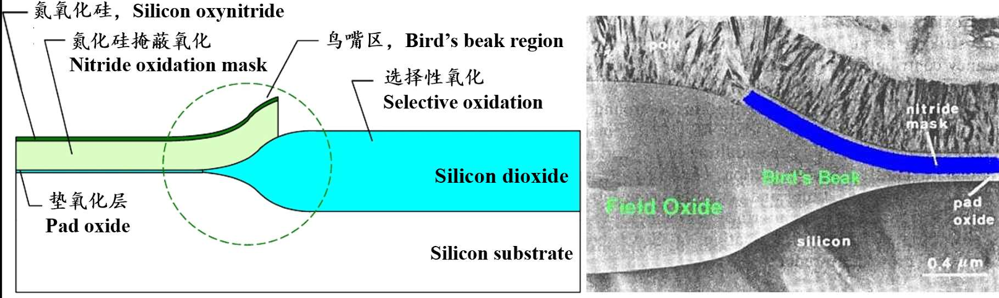
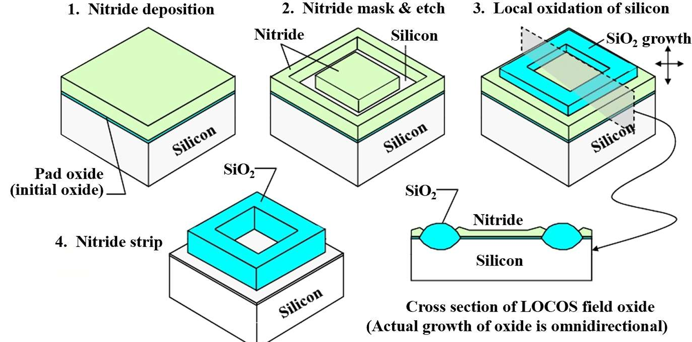

#### 4.3.2 $\mathrm{STI(Shallow\ Trench\ Isolation,\ 浅沟槽隔离)}$

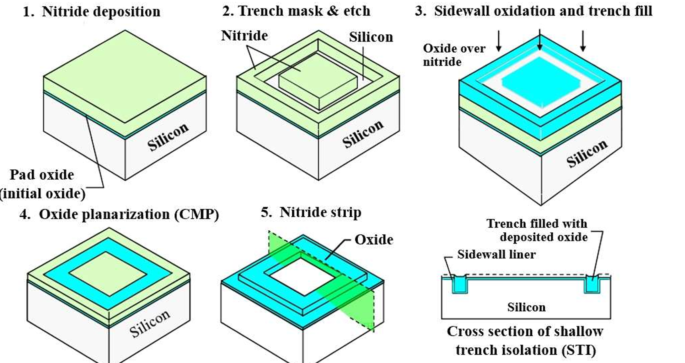
$\mathrm{STI}$主要工艺步骤：
1. 垫氧层生长+氮化硅淀积
2. 沟槽掩膜确定隔离区域+氮化硅层、垫氧层、硅衬底的沟槽刻蚀
3. 在衬底中刻蚀出的沟槽中，侧壁氧化+沟槽填充$\mathrm{SiO_2}$（过填充，高出表面）
4. $\mathrm{CMP}$氧化物平坦化，露出氮化硅层
5. 氮化硅层去除，留下沟槽中的氧化物

##  *第五章 淀积*

### **5.1 薄膜质量控制**
薄膜质量主要是指薄膜是否为保形覆盖，界面应力类型与大小，薄膜的致密性、厚度均匀性、附着性等几方面特性。

#### 5.1.1 台阶覆盖特性

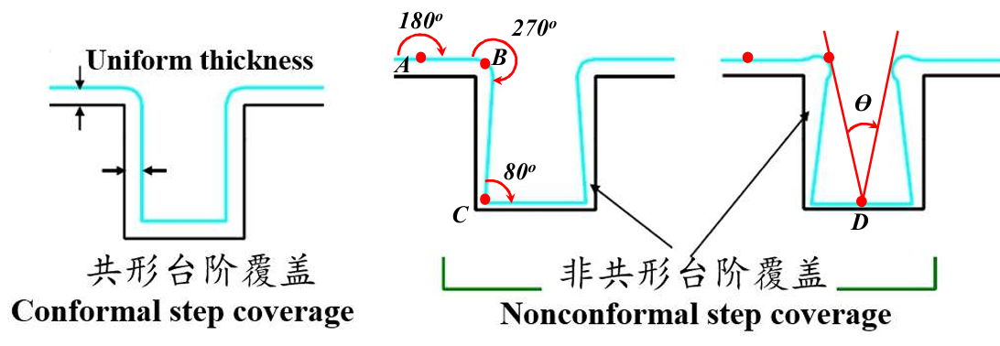
- **台阶覆盖能力：**覆盖这些高度差异的结构的能力，能力强则说明包裹能力好：能力差则说明包裹能力差
- **到达角：**反应剂能从各方向**到达**表面上**某一点**的全部方向角，到达角越大，能够到该点的反应剂分子就越多，该点淀积的薄膜就越厚。
- **遮蔽效应：**衬底表面上的图形对反应剂气体分子直线运动的阻挡作用。

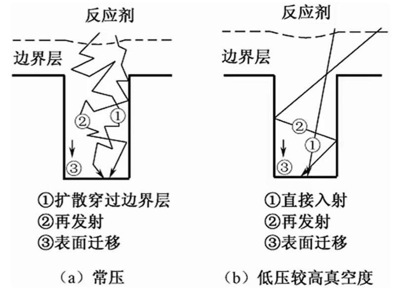
- **气体分子到达表面：**扩散、在发射、表面迁移。
- 影响台阶覆盖因素：薄膜种类、淀积方法、反应剂系统、工艺条件（$T,P,v$）。
- 对某一薄膜，考虑影响台阶覆盖性的主要因素进行工艺控制。

#### 5.1.2 薄膜应力

$$
\begin{cases}
\text{拉应力（正应力）} & \text{薄膜趋向于收缩} \\
\text{压应力（负应力）} & \text{薄膜趋向于张开} \\
\end{cases}
$$

- **残余应力：**由各种工艺因素引起的应力（工艺因素消失之后应力依旧存在）。

按照成因分类：
$$
残余应力
\begin{cases}
本征应力（内应力）：一般来源于工艺本身，薄膜生长过程中本身形成的应力，淀积完成、温度稳定后依然存在，与外界热或机械条件无关。 \\

非本征应力（非薄膜结构引起的应力）

    \begin{cases}
    热应力：基板和薄膜的热膨胀系数不匹配而产生的。 \\
    外应力：薄膜收到外力的刺激而引起的应力。 \\
    \end{cases}
\end{cases}
$$

- 应力的影响（应力实质上是改变了薄膜的微观结构，即引入缺陷）
1. 应力过大$\rightarrow$薄膜卷曲、开裂、分层、起泡、脱落、褶皱，衬底翘曲变大
2. 改变电子迁移率，若缺陷过多，薄膜易被击穿
3. 应力过大$\rightarrow$改变薄膜的折射率

- 应力的解决方案
1. 本征应力可以通过退火工艺消除
2. 沉淀工艺制程和方法的优化、减少淀积速率
3. 选择热膨胀系数匹配的材料

#### 5.1.3 深宽比

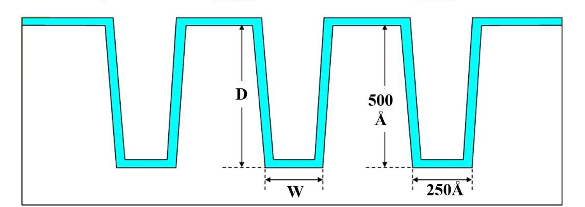
深宽比用于描述一个小间隙（槽或孔），定义为间隙深度和宽度的比值：
$$
深宽比=\frac{深度}{宽度}=\frac{500\AA}{250\AA}=2
$$
在先进器件中，常使用高深宽比，可提高电容值（面积增加）、存储密度等
> 深宽比$\uparrow$,集成度$\uparrow$,工艺难度$\uparrow$

#### 5.1.4 厚度均匀性
制备芯片过程中要求薄膜厚度具备均匀性

$$
厚度均匀性\xrightarrow{决定于}淀积速率的均匀性\xrightarrow{决定于}衬底工艺温度、反应剂浓度（气流成分均匀、流动状态稳定）
$$

#### 5.1.5 膜的纯度和密度
高纯度$\xrightarrow{意味着}$无其他元素、原子$\\$
高密度$\xrightarrow{意味着}$无孔隙、无空洞

#### 5.1.6 致密性
> 温度$\uparrow$,致密性$\uparrow$

温度高有助于薄膜分子或原子迁移、排列、气态副产物的解析、离开，但是温度过高会导致成膜困难

#### 5.1.7 附着性
温度越高，附着性越好

#### 5.2 $\mathrm{CVD}$

$\mathrm{CVD}类型$|常压化学气相淀积$\mathrm{APCVD}$|低压化学气相淀积$\mathrm{LPCVD}$|等离子体增强化学气相淀积$\mathrm{PECVD}$
:-:|:-:|:-:|:-:
工作压力|$\approx 1\mathrm{atm}$|$10^{-1}-10^{-2}$|中低压
能量来源|热能|热能|热能+等离子体
反应控制|气相反应为主|表面反应控制|等离子体激发反应
淀积温度|中高温|高温$（600-900℃）$|低温$（200-400℃）$
淀积速度|快|较慢|快
薄膜致密性|一般|最好|较好
均匀性|一般|最好|好
台阶覆盖性|较差|最好|较好
膜中氢含量|低|低|高
典型材料|$\mathrm{SiO_2}$|多晶$\mathrm{Si,Si_3N_4}$|$\mathrm{SiO_2,SiN_x,a-Si}$
主要优点|设备简单，成本低|膜质量好，一致性高|低温，工艺灵活
主要缺点|覆盖性差|温度高|膜致密性略差

## *第六章 金属化*

### 6.2 单大马士革工艺

一层一层淀积实现功能

通过一次刻蚀和填充工艺来形成（仅包含沟槽或仅包含通孔，具有更高的分辨率），工艺流程如下：
1. 淀积介质
2. $\mathrm{CMP}$
3. 刻印
4. 刻蚀
5. 钨淀积
6. 钨抛光

> 通常第一金属铜层$\mathrm{(M1)}$用单大马士革工艺，其他层用双大马士革工艺

> 在单大马士革工艺中，通孔层和沟槽层被沉积并且一个接一个地结构化，因此需要更多的工艺步骤(ILD沉积$\rightarrow$VIA结构化$\rightarrow$铜沉积$\rightarrow$平面化$\rightarrow$ILD沉积$\rightarrow$沟槽结构$\rightarrow$铜沉积$\rightarrow$平坦化)

### 6.3 双大马士革工艺
- 一次性形成通孔和沟槽
- 较单大马士革工艺减少$\mathrm{20\%}$工艺流程（金属线间无需再淀积填充介质和介质平坦化）
- 避免金属刻蚀

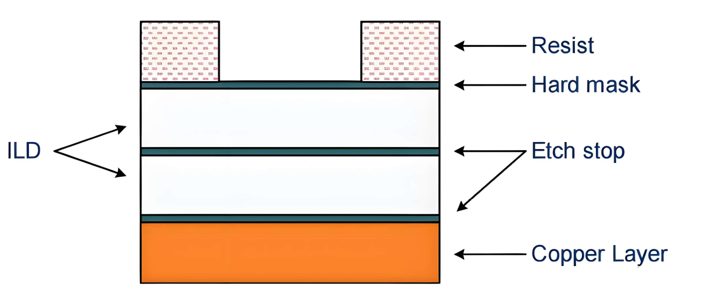
双大马士革工艺$\mathrm{(Dual\ Damascene\ Process)}$分两类：

- 先沟槽后通孔$\mathrm{(Trench\ First\ VIA\ Last,\ TFLV)}$
1. 晶圆上涂有待光刻的抗蚀层$\mathrm{Resist}$
2. 硬掩模$\mathrm{SiN}$和$\mathrm{ILD}$在各向异性的干法刻蚀工艺中刻蚀，直到到达第一蚀刻停止层$\mathrm{(EtchStop)}$。抗蚀层被去除，沟槽用于电传导的路径完成。
3. 接下来沉积并构造新的抗蚀剂层。
4. 最后在各向异性蚀刻工艺中打开通孔；在低能量蚀刻过程中，底部蚀刻停止层$\mathrm{(Etch Stop)}$被打开以避免溅射下方的铜可能会沉积在侧壁上并扩散到$\mathrm{ILD}$中；去除抗蚀剂并沉积一层薄薄的钽作为阻挡层，以防止后来沉积的铜扩散到$\mathrm{ILD}$中。
5. 薄铜层作为种子层，可以通过电镀填充通孔和沟槽。
6. 沉积的铜在$\mathrm{CMP}$工艺中被抛光。
缺点是：厚的抗蚀层被刻蚀后，沟槽已被刻蚀，刻蚀微小通孔是比较困难的，$\mathrm{TFVL}$仅适用于较大的结构。

- 先通孔后沟槽$\mathrm{(VIA\ First\ Trench\ Last,\ VFTL)}$
1. 形成通孔的抗蚀剂层结构化，并将通孔转移到$\mathrm{ILD}$中，通过各向异性蚀刻工艺直到到达底部蚀刻停止层；阻止铜从下面的金属化层中溅射出来，蚀刻停止层不得被打开。
2. 随后去除抗蚀层，新的抗蚀层被图案化，代表沟槽：先前打开的通孔也充满了抗蚀剂。
3. 在刻蚀沟槽期间，底部的刻蚀停止层被抗蚀剂覆盖，接下来是底部蚀刻停止层在低能量过程中打开，钽阻挡层和铜种子层随后沉积。
4. 铜沉积后，金属在CMP工艺中被抛光。

## *第九章  扩散和离子注入*
### 9.1 热扩散
- 热扩散：高温驱动杂质穿过硅晶格，掺杂总量及浓度分布受扩散时间和温度影响，是高温工艺，所以需要氧化物或氮化物作为掩膜；形成特征尺寸较大；
- 离子注入：高压离子轰击杂质进入硅片；杂质通过与硅片发生原子级的高能碰撞，才能被注入；杂质总量及浓度分布受注入剂量、能量和推结时间及温度决定；属于低温工艺，常用光刻胶作为掩膜，也可以使用其他一些掩膜；适于小特征尺寸的芯片。

## *第十章 化学机械平坦化*

- $\mathrm{CMP}\text{机理——氧化硅}$
1. 磨料喷嘴
2. $\mathrm{H_2O \& OH^-}$运动到硅片表面
3. 机械力将磨料压入硅片
4. 表面反应和机械磨损
5. 副产物去除

- $\mathrm{CMP}\text{机理——金属}$
1. 表面刻蚀和钝化
2. 机械研磨
3. 再钝化

- 反应腔室

热壁反应|冷壁反应
:-:|:-:
加热硅片、支撑物、反应室侧壁|仅加热硅片和支撑物
在硅片和侧壁上成膜|仅在硅片上成膜
需要清洗热壁上的小颗粒|反应壁上难以吸附小颗粒污染物
