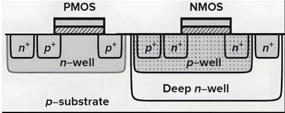
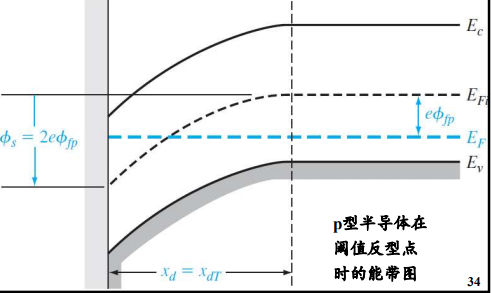
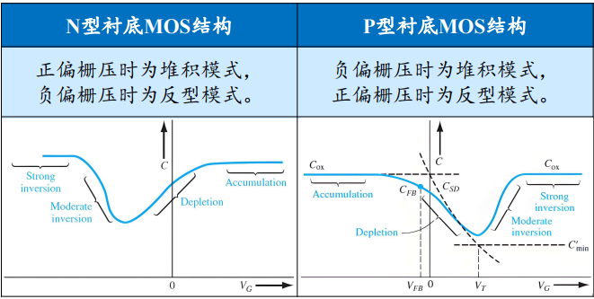
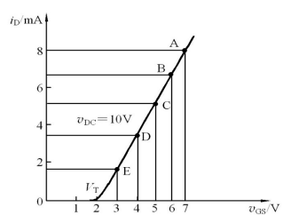
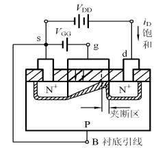
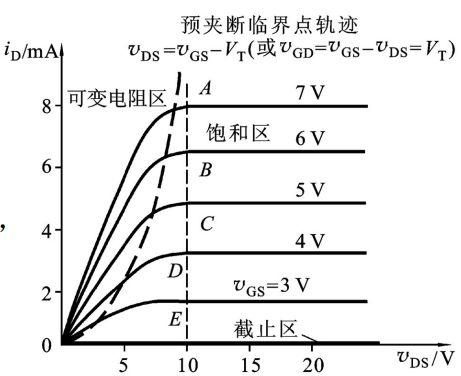

# 目录

[TOC]

# 要点速背

## 0.1 题型与复习总览
- 选择
- 判断
- 画图
- 简答
- 计算
- Chapter 5 基本数字集成电路设计是本轮复习重点；其中 CMOS 反相器静态/动态特性、噪声容限、传输门、功耗最需要反复看 PPT 图和公式。

## 0.2 CMOS 反相器关键结论

- CMOS 反相器由增强型 PMOS 和增强型 NMOS 组成，PMOS 作上拉开关，NMOS 作下拉开关，是无比电路。
- 输入为“1”时 NMOS 导通、PMOS 截止，输出“0”；输入为“0”时 NMOS 截止、PMOS 导通，输出“1”。
- CMOS 反相器逻辑摆幅大：$V_{OH}=V_{DD}$，$V_{OL}=0$；静态功耗理想情况下为零，实际来自反向漏电流和亚阈值漏电。

## 0.3 CMOS 静态与动态公式

- 逻辑工作点包括 $V_{OH}$、$V_{OL}$、$V_{IL}$、$V_{IH}$ 和 $V_{th}$；$V_{th}$ 是 VTC 曲线上 $V_{in}=V_{out}$ 时的值。
- 低电平噪声容限：$NM_{L}=|V_{IL,max}-V_{OL,max}|$；高电平噪声容限：$NM_{H}=|V_{OH,min}-V_{IH,min}|$。
- 平均延迟时间：$t_{p}=\frac{1}{2}(t_{PHL}+t_{PLH})$；若输入脉冲占空比为 1:1，最高工作频率受 $\max(t_r,t_f)$ 限制。

## 0.4 CMOS 传输门关键结论

- NMOS 传输低电平无损，传输高电平有阈值损失，输出高电平只能达到 $V_{DD}-V_{TN}$。
- PMOS 传输高电平无损，传输低电平有阈值损失，输出低电平约为 $|V_{TP}|$。
- CMOS 传输门把 NMOS 与 PMOS 并联，用互补控制信号驱动栅极，可无损传输高电平和低电平。

# 第 1 章 绪论
> 1. 掌握关键尺寸和Moore定律的定义及意义
> 2. 了解集成电路制造发展的主要趋势
> 3. 知道集成电路的分类

## 1.1 集成电路定义与分类

**来源**：Chapter 1.pdf

**定义**：

- 集成电路（IC）通过特定加工工艺，把有源器件和无源器件按电路互连集成在半导体单晶片上。
- 封装后执行特定电路或系统功能。

**器件组成**：

- 有源器件：晶体管、二极管等。
- 无源器件：电阻、电容等。

**半导体材料**：

| 代际   | 典型材料  |
| ------ | --------- |
| 第一代 | Si、Ge    |
| 第二代 | GaAs、InP |
| 第三代 | SiC、GaN  |

**集成电路分类**：

| 分类依据 | 类型                           |
| -------- | ------------------------------ |
| 功能结构 | 数字 IC、模拟 IC、数模混合 IC  |
| 制造工艺 | Bipolar IC、MOS IC、Bi-CMOS IC |
| 设计方法 | 全定制、半定制、可编程 IC      |
| 集成度   | SSI、MSI、LSI、VLSI、ULSI、GSI |

**衡量方式**：

- 数字集成电路常用等效门数衡量。
- 模拟集成电路常用晶体管数目衡量。

## 1.2 关键尺寸、Moore 定律与制造趋势

**来源**：Chapter 1.pdf

**关键尺寸（Critical Dimension, CD）**：

- 描述集成电路制造中的最小图形尺寸或特征尺寸。
- 是衡量工艺先进程度的重要指标。

**Moore 定律**：

- 描述集成电路中晶体管数量随时间增长的经验规律。
- 意义在于推动关键尺寸缩小、集成度提高、成本下降和性能提升。

**制造发展趋势**：

- 特征尺寸继续缩小。
- 集成度提高。
- 制造工艺复杂度上升。
- 工艺与设计之间的耦合更强。

## 1.3 硅片制备与制造主要阶段

**来源**：Chapter 1.pdf，1.3 芯片制造厂概况，硅片制造相关页面。

**硅芯片的器件和层**：

- Silicon substrate：硅衬底，是器件和互连层的基础。
- Conductive layer / Recessed conductive layer：导电层或凹进导电层，用于形成局部连接或器件结构。
- Insulation layers：绝缘层，用于隔离不同导电结构。
- Metal layer：金属层，用于互连。
- Top protective layer：顶部保护层，用于保护芯片表面。

**制造步骤**：

1. 硅片制备：晶体生长，滚圆、切片、抛光。
2. 硅片制造：清洗、成膜、光刻、刻蚀、掺杂。
3. 硅片测试/拣选：测试、拣选每个芯片。
4. 装配与封装：沿着划片槽切割成芯片、压焊和包封。
5. 终测：电学和环境测试。

**硅片制备流程**：

1. Crystal Growth：单晶生长。
2. Single Crystal：形成单晶硅锭。
3. Crystal Trimming and Diameter Grind：单晶去头和径向研磨。
4. Flat Grinding：定位边研磨。
5. Wafer Slicing：硅片切割。
6. Edge Rounding：倒角。
7. Lapping：粘片。
8. Wafer Etching：硅片刻蚀。
9. Polishing：抛光。
10. Wafer Inspection：硅片检查。

**前部工序主要工艺**：

| 工艺     | PPT 要点                                           |
| -------- | -------------------------------------------------- |
| 图形转换 | 将掩膜版上的图形转移到半导体单晶片上               |
| 掺杂     | 按设计需要将杂质掺杂在需要位置，形成晶体管、接触等 |
| 制膜     | 制作各种材料的薄膜                                 |

# 第 2 章 集成电路制造介绍
> 1. 掌握典型 CMOS 集成电路制造工艺流程
> 2. 了解CMOS制造工艺14个步骤的主要目的
> 3. 知道6种主要制作工艺

## 2.1 CMOS 制造流程与关键工艺

**来源**：Chapter 2.pdf

**制造对象**：

- 集成电路制造是对硅片有源层进行化学或物理操作。
- 有源层通常位于硅片顶层几微米内。

**核心循环**：

- 光刻
- 成膜
- 刻蚀
- 掺杂

**制造厂分区与基础工艺方法**：

| 分区 / 工艺     | 主要工作                                         | 在 CMOS 制造中的作用                                        |
| --------------- | ------------------------------------------------ | ----------------------------------------------------------- |
| 扩散            | 氧化、扩散、淀积、退火、合金等高温工艺和薄膜淀积 | 形成氧化层，推进/激活杂质，修复注入损伤                     |
| 光刻            | 电路图形转移到覆盖于硅片表面的光刻胶上           | 把掩膜版图形转移到光刻胶上，决定图形尺寸和对准精度          |
| 刻蚀            | 在无光刻胶保护处留下永久图形                     | 去除不需要的材料，形成 STI 沟槽、栅、接触孔、通孔和金属图形 |
| 离子注入 / 掺杂 | 调整阱、沟道、源漏等掺杂                         | 调节阱、沟道、源漏区和多晶硅的电学性质                      |
| 薄膜 / 成膜     | 介质层和金属层的生长                             | 通过氧化、淀积等形成栅氧化层、介质层、金属层、多晶硅层      |
| 抛光 / CMP      | 表面平坦化，使凸出部分减薄到凹陷部分厚度         | 保证 STI、ILD、钨塞等后续多层互连加工质量                   |
| 参数测试        | 检查器件和工艺参数                               | 工艺结束后判断器件和工艺参数是否满足要求                    |

**典型 CMOS 制作 14 步详解**：

1. **双阱工艺（Twin-well Implants）**
   - **目的**：定义 nMOS 和 pMOS 的有源区。
   - **阱注入作用**：决定阈值电压，并有助于避免 CMOS 闩锁效应。
   - **倒掺杂技术**：先高能量、大剂量注入，注入深度约 1μm。
   - **后续注入**：仍在相同区域进行，但能量、剂量和结深大幅减小。
   - **N 阱形成**：氧化层保护表面免污染、免注入损伤，并控制注入深度。
   - **P 阱形成**：光刻版与 N 阱光刻版反向，注入后退火推进、激活杂质、修复损伤。
   - **闩锁效应**：寄生 PNP / NPN 双极晶体管形成正反馈，可能在 $V_{DD}$ 与 GND 间形成低阻通路。

2. **浅槽隔离工艺（STI）**
   - **目的**：在晶体管有源区之间形成隔离，常用于小于 0.25μm 的工艺。
   - **LOCOS 局限**：鸟头、鸟嘴影响平整度，且不能精确控制横向尺寸。
   - **STI Trench Etch**：隔离氧化层保护有源区；$Si_{3}N_{4}$ 作坚固掩膜和 CMP 阻挡层。
   - **光刻与刻蚀**：光刻定义隔离区，干法刻蚀形成沟槽，PPT 称为“深沟刻蚀”。
   - **沟槽形貌**：倾斜侧壁和圆滑底部可提高填充氧化物质量和隔离结构电学性能。
   - **STI Oxide Fill**：沟槽衬垫氧化硅改善 Si / 填充 $SiO_{2}$ 的界面特性。
   - **填充与平坦化**：CVD 氧化物填充沟槽，CMP 抛光沟槽氧化物，最后氮化物剥离。

3. **多晶硅栅结构工艺**
   - **栅氧化层**：形成高质量栅氧化层，PPT 给出厚度约 20-50Å。
   - **多晶硅淀积**：淀积约 5000Å 多晶硅，并立即进行多晶硅掺杂。
   - **多晶硅栅光刻**：栅长为 CD 线宽，光刻精度要求很高。
   - **检测**：之后进行 CD 检测、DI 检测和套准精度检测。
   - **多晶硅栅刻蚀**：刻蚀精度要求高，采用各向异性等离子刻蚀机。

4. **轻掺杂 LDD 注入工艺**
   - **n- LDD 光刻**：定义 nMOS 注入区域，与栅两侧自对准。
   - **n- LDD 注入**：低能量、浅结。
   - **p- LDD 光刻**：定义 pMOS 注入区域，与栅两侧自对准。
   - **p- LDD 注入**：低能量、浅结。
   - **作用**：减小沟道缩短后源漏穿通导致的不需要漏电流。
   - **PPT 补充**：大质量 As、$BF_{2}$ 掺杂剂有利于维持浅结，减少漏电流。

5. **侧墙工艺**
   - **二氧化硅淀积**：淀积约 1000Å $SiO_{2}$，用于形成侧墙。
   - **二氧化硅反刻**：各向异性离子溅射刻蚀，无需掩膜版。
   - **侧墙作用**：保护栅极，防止更大剂量注入过于接近栅极而导致源漏穿通。

6. **源漏（S/D）注入工艺**
   - **n+ 源/漏光刻**：定义 n+ 源/漏注入区域。
   - **n+ 源/漏注入**：源/漏注入结深比 LDD 注入更深。
   - **p+ 源/漏光刻**：定义 p+ 源/漏注入区域。
   - **p+ 源/漏注入**：注入后在快速退火 RTP 装置中退火数十秒。

7. **接触孔的形成**
   - **淀积 Ti**：采用 PVD 溅射法淀积钛。
   - **退火**：快速退火生成低电阻率 $TiSi_{2}$。
   - **刻蚀**：去掉未反应的钛。
   - **作用**：Ti 能够与 Si 和之后淀积的导电材料形成良好接触。

8. **局部互联工艺（LI）**
   - **LI 介质形成**：淀积氮化硅，保护有源区并与掺杂氧化层隔开。
   - **掺杂氧化层**：淀积后回流，得到较平坦表面。
   - **CMP 平坦化**：氧化层厚约 8000Å。
   - **局部互联刻蚀**：通过光刻和刻蚀定义局部互联金属路径。
   - **LI 金属形成**：淀积 Ti 作钨和 $SiO_{2}$ 的粘合剂。
   - **TiN 与钨**：TiN 作扩散阻挡层，钨用于填隙并便于抛磨。

9. **通孔 1 和金属塞 1 的形成**
   - **Via-1 形成**：淀积 ILD-1 层间介质氧化物。
   - **氧化物抛磨**：CMP 后氧化层厚度约 8000Å。
   - **ILD-1 光刻、刻蚀**：形成通孔，是关键步骤。
   - **Plug-1 形成**：淀积 Ti、TiN、钨，再抛磨钨。
   - **材料作用**：Ti 作粘合剂，TiN 作钨扩散阻挡层，钨用于空洞填隙。

10. **金属 1 互联的形成**
    - **淀积 Ti**：使钨塞和下一层金属、层间介质良好键合。
    - **淀积 AlCu 合金**：PPT 给出 99% Al 和 1% Cu，加入 Cu 用于抗电迁移。
    - **淀积 TiN**：作为下一次光刻的抗反射层。
    - **金属刻蚀**：形成第一层金属互连。

11. **通孔 2 和金属塞 2 的形成**
    - **间隙填充**：采用 HDPCVD 交替淀积和刻蚀，实现致密填充。
    - **ILD-2 氧化物淀积**：形成第二层层间介质。
    - **平坦化 ILD-2**：磨抛表面。
    - **ILD-2 刻蚀**：形成 Via-2。
    - **Plug-2 形成**：淀积 Ti、TiN、钨，并磨抛钨。

12. **金属 2 互联的形成**
    - **金属 2 淀积与刻蚀**：方法同金属 1 的制作。
    - **层间介质间隙填充**：进行致密填充。
    - **ILD-3 淀积和平坦化**：淀积 ILD-3 并磨抛表面。
    - **后续刻蚀、淀积、平坦化**：继续形成上层连接结构。

13. **金属 3、压点及合金**
    - **作用**：完成更高层金属互连、Bonding pad metal 和钝化层相关结构。
    - **PPT 图示**：完整 0.18μm CMOS 横截面包含 ILD-1 到 ILD-6、金属层、压点金属和 Passivation layer。

14. **参数测试**
    - **第一次测试**：在首次金属刻蚀完成后进行，测试特定器件的特定电学参数。
    - **第二次测试**：在芯片制造最后一步工艺后进行。
    - **测试后处理**：硅片通过测试拣选后进行背部减薄，使划片更容易，也更利于散热。

# 第 3 章 MOSFET
> 1. MOSFET 分类
> 2. MOSFET结构及工作原理
> 3. MOS Capacitor
> 4. C-V Characteristics
> 5. MOSFET Capacitance（C-V、I-V）
> 6. 阈值电压（Threshold Voltage）
> 7. 寄生电容
> 8. 闩锁效应

## 3.1 双极型晶体管与场效应晶体管的区别

**来源**：Chapter 3 MOSFET.pdf，3.1 Introduction、3.2 MOSFET 结构及工作原理。

**基本定义**：

- **双极型晶体管（Bipolar Transistor）**：参加工作的不仅有少数载流子，也有多数载流子，因此称为双极型晶体管。
- **场效应晶体管（Field Effect Transistor, FET）**：通过改变垂直于导电沟道的电场强度来控制沟道导电能力，是电压控制型、由多数载流子参与导电的器件，又称单极型晶体管。

**FET 特性**：

- 输入阻抗高。
- 热稳定性好。
- 噪声较小。
- 没有少子存储效应，开关速度快。
- 大电流情况下跨导稳定性好。
- 功耗低。
- 制造工艺简单。

## 3.2 MOSFET 分类、结构与工作原理

**来源**：Chapter 3 MOSFET.pdf

**分类**：

| 类型         | 零栅压状态     | 阈值电压     |
| ------------ | -------------- | ------------ |
| n 沟道增强型 | 不存在反型沟道 | $V_{TN}$ > 0 |
| n 沟道耗尽型 | 已存在反型沟道 | $V_{TN}$ < 0 |
| p 沟道增强型 | 不存在反型沟道 | $V_{TP}$ < 0 |
| p 沟道耗尽型 | 已存在反型沟道 | $V_{TP}$ > 0 |

- 耗尽型：0 栅压时已存在导电沟道。
- 增强型：0 栅压时不存在导电沟道。

**四端结构**：

| 端子 | 含义          |
| ---- | ------------- |
| S    | 源极          |
| G    | 栅极          |
| D    | 漏极          |
| B    | 体端 / 衬底端 |

**基本结构**：

- 源区、沟道区、漏区。
- 栅 / 氧化层 / 衬底三层结构。

## 3.3 MOSFET 衬底连接与 Deep N-Well

**来源**：Chapter 3 MOSFET.pdf

**参数分类**：

| 参数类型 | 典型参数                                    |
| -------- | ------------------------------------------- |
| 工艺参数 | 氧化层厚度 $t_{ox}$、衬底掺杂浓度 $N_{sub}$ |
| 设计参数 | 沟道长度 $L_{drawn}$、沟道宽度 W            |

**MOSFET 特点**：
- Gate-Source 间无直流电流通路，功耗低，输入电阻高；这是 MOSFET 与 Bipolar 的主要区别。
- NMOS 衬底接电路中最低电位，通常 PMOS 衬底接电路中最高电位；这样可保证所有源/漏极 PN 结反偏，防止产生衬底漏电流。
- Drain 与 Source 在物理构造上无区别，完全对称；电路设计中通常把提供载流子的一端称为源极，把收集载流子的一端称为漏极。

**衬底连接原则**：

| 器件 | 衬底连接       | 目的                                |
| ---- | -------------- | ----------------------------------- |
| NMOS | 电路中最低电位 | 保证源/漏 PN 结反偏，防止衬底漏电流 |
| PMOS | 电路中最高电位 | 保证源/漏 PN 结反偏，防止衬底漏电流 |

**PMOS 的 N 阱接触**：

- PMOS 做在 N 阱中，N 阱相当于 PMOS 的体区 / 衬底区。
- N 阱通常接电路最高电位 $V_{DD}$，使 $P^{+}$ 源/漏区与 N 阱之间的 PN 结保持反偏或零偏。
- N 阱中常设置 $N^{+}$ 重掺杂接触区，再通过 Contact 和金属接到 $V_{DD}$。
- $N^{+}$ 接触区的作用是降低接触电阻，使 N 阱电位稳定地钳在 $V_{DD}$。
- **硅化物作用**：减小源区、漏区、栅极、衬底的电阻；硅化物与 $N^{+}$ 形成欧姆接触，以消除肖特基二极管效应（相比于金属和轻掺杂半导体直接接触）
- 稳定的 N 阱电位可减少衬底漏电流，并降低闩锁效应风险。

**源漏判定**：

- NMOS 中连接低电压的端子为源极，载流子为电子。
- PMOS 中连接高电压的端子为源极，载流子为空穴。

**N 阱与 Deep N-Well**：

- N 阱工艺中，NMOS 和 PMOS 制作在同一 P 型衬底上，PMOS 需要局部 N-Well。
- N-Well 在大多数数字电路中与最正电源相连接。
- Deep N-Well 可实现 NMOS 独立体端 B，并降低串扰（相邻区域离得太近了导致信号互相影响）。
- Deep N-Well 缺点是版图面积增大、成本提高。

**Contact 可靠性**：

- 尽可能使用多个 Contact（在同一个源区/漏区/接触区中），以减小接触电阻并使电流均匀。
- 多 Contact 对防止 Latch-up（闩锁效应） 也有好处。
- 为提高可靠性，多晶硅栅的 Contact 不放置在栅区域上面。

## 3.4 MOS 电容、C-V 与 I-V 特性

**来源**：Chapter 3 MOSFET.pdf

**表面场效应**：

- 垂直于半导体表面的电场会改变表面层载流子浓度。
- 载流子浓度变化会导致表面层导电能力改变。

**MOS 电容加栅压后的表面状态结论**：

- P 型半导体加大的正栅压时，表面可出现 N 型反型层。
- N 型半导体加大的负栅压时，表面可出现 P 型反型层。

**表面能带弯曲方向**：

| 栅压方向   | 半导体表面能带变化 | PPT 表述 |
| ---------- | ------------------ | -------- |
| 栅极加负压 | 能带向上弯曲       | 抬头     |
| 栅极加正压 | 能带向下弯曲       | 低头     |

**反型与沟道**：

| 概念     | 判据 / 含义                      |
| -------- | -------------------------------- |
| 反型层   | 表面少子浓度大于表面多子浓度     |
| 强反型   | 表面少子浓度大于等于体内多子浓度 |
| 导电沟道 | 强反型时漏源之间形成的导电通道   |

**阈值反型点**：

- 表面电子（少子）浓度等于体内空穴（多子）浓度。
- 此时所加栅电压 $V_{G}$ 称为阈值电压 $V_{T}$。

**阈值反型点条件**：

- $V_{G}$=$V_{T}$。
- 表面势 $\varphi_{s}$=2$\varphi_{fn}$。
- 表面空间电荷区宽度达到**最大值**。
- 反型层电荷密度为 0。

**理想 C-V 曲线具体变化（P 型衬底）**：

- **堆积状态**：$V_G<0$，空穴被吸引到 $SiO_2$-半导体界面形成堆积层，电容约等于栅氧化层电容：$C'_{acc}=C_{ox}=\varepsilon_{ox}/t_{ox}$。
- **平带状态**：$V_G=V_{FB}$，半导体表面能带无弯曲，位于堆积与耗尽之间。
- **耗尽状态**：加小的正栅压，空穴被推离界面形成空间电荷区；$C_{ox}$ 与耗尽层电容串联，$V_G$ 增大时 $x_d$ 增大，总电容下降。
- **阈值反型点**：耗尽区宽度达到最大值 $x_{dT}$，反型层电荷密度为 0，电容达到最小值 $C'_{min}$。
- **中等反型**：由“主要改变**空间电荷区**”过渡到“主要改变**反型层电荷**”。
- **强反型低频**：反型层少子有时间产生、复合并跟随交流小信号变化，电容从最小值回升并接近 $C_{ox}$。
- **强反型高频**：反型层少子来不及响应交流小信号，只有金属栅和空间电荷区电荷变化，电容维持在约 $C'_{min}$。

**非理想 C-V 曲线影响**：

- **固定栅氧化层电荷**：$Q'_{ss}$ 不是栅压的函数，所以主要表现为 C-V 曲线沿栅压轴整体平移。若 $Q'_{ss}$ 越大，平带电压 $V_{FB}$ 越小，曲线向负栅压方向左移，反之右移。
- **界面态电荷**：界面态位于氧化层-半导体界面，电荷状态会随表面费米能级变化，因此它不是简单整体平移，而是使不同栅压区间的平移量不同，曲线可能被拉伸或畸变。
   - **堆积附近**：界面陷阱带正电，需要更负的栅压来抵消界面正电荷，C-V 曲线向左偏移，平带电压更负。
   - **本征附近**：界面态近似不带电，对 C-V 曲线影响较小。
   - **反型附近**：界面陷阱带负电，需要更正的栅压来形成同样反型状态，C-V 曲线向右偏移，阈值电压更正。

**I-V 推导理想条件**：

- 为推导基本 MOSFET 特性，采用理想条件：
  - 漏区和源区的电压降可忽略。
  - 沟道区不存在复合-产生电流。
  - 沿沟道的扩散电流远小于电场产生的漂移电流。
  - 沟道内载流子迁移率为常数。
  - 沟道与衬底间反向饱和电流为零。
  - 缓变沟道近似成立，即跨过氧化层、垂直沟道方向的电场分量 $E_X$ 与沟道中沿载流子运动方向的电场分量 $E_Y$ 无关，沿沟道方向电场变化很慢。

**I-V 特性中 $V_{GS}$ 的控制作用**：

- $V_{GS}$ 控制沟道是否形成，以及沟道导电能力。
- 当 $V_{GS}\le0$ 时，无导电沟道，漏源间加电压也无电流产生。
- 当 $0<V_{GS}<V_T$ 时，栅压已产生电场，但仍未形成导电沟道，漏源间加电压后仍没有明显电流。
- 当 $V_{GS}\ge V_T$ 时，在电场作用下形成导电沟道，漏源间加电压后产生漏极电流。
- 对增强型 MOS 管，$V_{GS}=0$ 时 $i_D=0$；只有 $V_{GS}>V_T$ 后才出现漏极电流。
- $V_{GS}$ 继续增大时，沟道反型电荷增多，沟道导电能力增强，$i_D$ 不断增大。
- 转移特性曲线描述 $V_{GS}$ 对漏极电流的控制关系：$i_D=f(V_{GS})|_{V_{DS}=const.}$。
  

**I-V 特性中 $V_{DS}$ 的控制作用**：

- 在 $V_{GS}$ 一定且 $V_{GS}>V_T$ 时，增大 $V_{DS}$ 会使 $i_D$ 增大。
- $V_{DS}$ 增大后，沟道电位梯度增大，靠近漏极处电位升高。
- 靠近漏极处的栅-沟道有效电压减小，沟道变薄，整个沟道呈楔形分布。
- 当 $V_{DS}$ 增加到使 $V_{GD}=V_T$ 时，紧靠漏极处出现夹断点（Pinch-off Point）。
- 夹断点条件：$V_{GD}=V_{GS}-V_{DS}=V_T$。
- 夹断后，继续增大 $V_{DS}$ 会使夹断区延长、沟道电阻增大，$i_D$ 基本不变。

**输出特性曲线**：
- 输出特性及大信号特性可写为：$i_D=f(v_{DS})|_{v_{GS}=const.}$。
- $V_{GS}$ 越大，沟道导电能力越强，对应的输出特性曲线整体电流越大。
  

**I-V 工作区判定**：

- **截止区**：当 $V_{GS}<V_T$ 时，导电沟道尚未形成，$i_D=0$。
- **线性区 / 可变电阻区**：当 $V_{GS}>V_T$ 且 $V_{DS}$ 较小时，漏源电流随 $V_{DS}$ 增大而增大，MOS 管表现为受 $V_{GS}$ 控制的电阻。
- **夹断临界点**：当 $V_{GD}=V_T$，即 $V_{GS}-V_{DS}=V_T$ 时，漏端附近开始夹断。
- **饱和区**：夹断后，$V_{DS}$ 继续增大主要使夹断区延长，理想情况下 $i_D$ 基本不随 $V_{DS}$ 增大。

**沟道长度调制效应**：

- 实际饱和区曲线不是完全水平的；在饱和区，随着 $V_{DS}$ 增加，导电沟道实际长度逐渐减小，$I_{DS}$ 相应增大。
- 沟道长度 $L$ 越大，沟道长度调制效应越小，饱和区 $I_D-V_{DS}$ 曲线斜率越小。
- 不考虑沟道长度调制时，$\lambda=0$，饱和区曲线近似平坦。
- PPT 指出，当 $L>2L_{min}$ 时，$\lambda$ 趋于平缓变化；模拟 CMOS 电路通常不使用工艺允许的最小栅长，常取 $L=(4\sim8)L_{min}$，以减小 $\lambda$、提高放大器增益。

## 3.5 Threshold Voltage 与阈值电压影响因素

**来源**：Chapter 3 MOSFET.pdf

**阈值电压定义**：

- $V_{T}$ 是 MOS 管沟道区半导体表面达强反型、形成导电沟道时所需的栅源电压。
- MOS 电容工作状态包括堆积、耗尽和反型。

**能带弯曲动因**：

- 金属与半导体功函数差。
- 氧化层中净空间电荷。
- 外加栅压。

**平带电压 $V_{FB}$**：

- 实际 MOS 结构中存在金半接触电势差 $\varphi_{ms}$≠0。
- $SiO_{2}$ 绝缘层电荷 $Q_{OX}$≠0。
- 为使表面势为 0，需要在栅极加偏压 $V_{FB}$。

**阈值电压影响因素**：

| 因素                | 对阈值电压的影响                                                                  |
| ------------------- | --------------------------------------------------------------------------------- |
| 栅电容 $C_{ox}$     | 可通过减小氧化层厚度、选用较大介电系数材料作栅介质膜来调节                        |
| 衬底掺杂浓度        | 影响很大；可通过沟道区离子注入调整剂量和深度                                      |
| 氧化层电荷 $Q_{ox}$ | 影响 MOSFET 工作模式（D 型或 E 型）和阈值电压高低                                 |
| 窄沟道效应          | 边缘场使耗尽层向两侧场区扩展，阈值电压增大                                        |
| 短沟道效应          | 源漏耗尽层分担耗尽区，栅控制减弱，阈值电压下降                                    |
| 体效应              | 衬底偏压影响阈值电压；NMOS 负衬底偏压会使耗尽层变宽、耗尽层电荷增加，阈值电压升高 |

**氧化层电荷类型**：

- 可动电荷。
- 陷阱电荷。
- 固定电荷。

## 3.6 MOSFET 寄生电容

**来源**：Chapter 3 MOSFET.pdf，寄生电容。

**寄生电容来源**：

| 类型        | 记号 / 来源                  | 影响                                               |
| ----------- | ---------------------------- | -------------------------------------------------- |
| 栅相关电容  | $C_{gs}$、$C_{gd}$、$C_{gb}$ | 受工作区和沟道电荷分布影响，影响开关速度和负载电容 |
| 源/漏结电容 | $C_{db}$、$C_{sb}$           | 由源/漏扩散区与衬底或阱之间 PN 结形成              |

**结电容相关因素**：

- 扩散区面积。
- 扩散区周长。
- 反向偏压。

## 3.7 亚阈值电导与闩锁防护

**来源**：Chapter 3 MOSFET.pdf，Latch-up；亚阈值电导资料中未明确提供。

**亚阈值电导**：

- 资料中未明确提供亚阈值电导的定义、公式，以及漏电流与栅极电压关系曲线的画法。

**CMOS 闩锁效应**：

- 来源于寄生 PNP 和 NPN 双极晶体管构成的正反馈回路。
- 触发后在 $V_{DD}$ 与 GND 之间形成低阻通路。
- 本质上是 CMOS 结构中的寄生晶体管被异常电流触发后持续导通。
- 低阻通路会使电源到地之间产生大电流，导致电路功能异常，严重时可能烧毁器件。

**触发条件**：

- I/O 端口静电放电。
- 输入信号过冲。
- 向衬底或阱中注入大电流。

**防护方法**：

- 采用 SOI、STI、Deep N-Well。
- 降低 N 阱电阻和衬底电阻。
- 增加衬底/阱接触。
- 设置保护环。

# 第 4 章 集成电路无源器件设计
> 1. 电阻（Resistor）
> 2. 电容（Capacitor）
> 3. 电感（Inductor）
> 4. 互连线（Lead Wire）
> 5. Interconnect
> 6. Pad

## 4.1 有源器件、无源器件与集成无源元件特点

**来源**：Chapter 4 集成电路无源器件设计.pdf

**有源 / 无源辨析**：

- 有源器件（Active Device）：各类晶体管。
- 无源器件（Passive Device）：电阻、电容、电感、互连线等。
- 本章按电路观点采用上述分类。

**本章知识要点**：

- 介绍集成电路中常用的电阻器和电容器。
- 讨论其结构、性能、寄生效应和设计。

**集成无源元件特点**：

| 项目 | PPT 要点 |
| ---- | -------- |
| 常见对象 | 集成电路中的无源元件通常指电阻器和电容器 |
| 工艺关系 | 制造工艺与晶体管或 CMOS 兼容 |
| 最大优点 | 元器件之间匹配好，并具有一致的温度特性 |
| 电路设计用法 | 尽量让电路性能依赖元件比值，而不是单个元件绝对值 |
| 主要缺点 | 精度低、绝对误差大、温度系数较大、可制作范围有限、面积大、成本高 |

## 4.2 集成电阻类型与结构

**来源**：Chapter 4 集成电路无源器件设计.pdf，4.2 Resistor。

**电阻定义**：

- 电阻是具有一定导电能力且稳定的无源器件。
- 集成电路芯片上的电阻通常为薄膜电阻，只占用衬底很小面积。
- 电阻与芯片电路的连接通过与导电金属形成接触实现。

**电阻分类**：

| 类型 | 结构 / 来源 | PPT 要点 |
| ---- | ----------- | -------- |
| 多晶硅电阻 | Poly-Si 制作在场氧区，通过 Contact 与 Metal-1 连接 | 最常用，结构简单；阻值由掺杂浓度和电阻形状决定 |
| N+ 有源层电阻 | N+ 扩散与有源区形成，做在 P-Substrate 上 | 方块电阻约 79.1Ω，接触孔电阻约 54.8Ω |
| P+ 有源层电阻 | P+ 扩散与有源区形成，做在 N 阱中 | 方块电阻约 153.4Ω，接触孔电阻约 118.5Ω |
| 阱电阻 | P 阱 / N 阱轻掺杂区 | 高电阻率，方块电阻可达 10kΩ/□，精度不高、阻值不稳定 |
| 金属电阻 | 金属膜形成 | 方块电阻很小，可做直线、蛇形或折叠状 |
| MOS 有源电阻 | MOS 管在线性区利用阻性 I-V 特性 | 面积小，但非线性，阻值与端电压有关 |

**无源电阻与有源电阻**：

| 类型 | 形成方式 | 特点 |
| ---- | -------- | ---- |
| 无源电阻 | 掺杂半导体材料或其它材料构成 | 包括多晶硅、有源区、阱、金属电阻；集成电路设计中大多使用无源电阻 |
| 有源电阻 | 晶体管适当连接和偏置 | MOS 在线性区可近似作电阻；面积小，但工作状态受电流、电压影响，不稳定 |

**有源层电阻注意点**：

- 源漏扩散时形成，有 N+ 扩散和 P+ 扩散电阻。
- 电阻区和阱之间形成 PN 结。
- 使用时需使 PN 结反向偏置或零偏置。
- 电阻率不能灵活变化，受工艺限制。

**阱电阻注意点**：

- P 阱 / N 阱属于轻掺杂区，电阻率高。
- 缺点是电阻精度不高，阻值会随光照变化。
- 电阻图形尺寸 L/W 至少是阱深的 2 倍。
- N 阱电阻通过 N+ 扩散、有源区、接触孔和金属形成两个电极。

## 4.3 电阻设计依据与匹配规则

**来源**：Chapter 4 集成电路无源器件设计.pdf，电阻设计依据与匹配规则。

**电阻变化因素**：

| 因素 | PPT 要点 |
| ---- | -------- |
| 工艺变化 | 影响块电阻和尺寸；与膜厚、制程、光刻对准、刻蚀速率有关 |
| 温度变化 | TCR 大小：阱电阻 > 多晶硅电阻 > 金属电阻 |
| I-V 非线性 | 主要源于自加热、强场速度饱和、耗尽区侵蚀 |
| 寄生电阻 | 接触区、头区等非理想电阻会影响总阻值 |
| 匹配相关因素 | 方向、压力、温度梯度、热电子效应、刻蚀速率不一致性 |

**误差控制**：

- 多晶硅总电阻可看作 $R=r_b+2r_h+2r_c$。
- 设计原则：体区电阻 $r_b$ 应在总电阻中起支配作用，即 $r_b\gg r_h$ 且 $r_b\gg r_c$。
- 经验法则：体区长度至少为光刻和刻蚀工艺误差的 100 倍。
- 经验法则：体区宽度至少为光刻和刻蚀工艺误差的 50 倍。
- 电流密度经验法则：每微米宽度电阻电流约 0.5mA。

**电阻匹配规则**：

- 没有很大功率耗散时，尽可能使用多晶硅电阻；无源电阻中多晶硅工艺和温度稳定性最高，阱电阻其次，有源区电阻最差。
- 高精度电阻应采用较宽电阻条，同时调整长度保持方块数不变。
- 大电阻应拆成较短的单位电阻，平行放置并串联。
- 匹配电阻应使用同一种材料，避免不同材料 TCR 不同造成温度失配。
- 匹配电阻应采用相同宽度，避免固定工艺误差造成系统失配。
- 匹配电阻应尽量使用相同图形，减少角和端部效应差异。
- 匹配电阻应沿同一方向摆放，并尽可能靠近。
- 阵列化电阻采用叉指结构或共质心结构提高匹配度。
- 阵列两侧设置 Dummy resistor，使光刻和刻蚀环境一致。
- 匹配电阻应放在低应力区，远离功率器件，并尽量降低功耗。

## 4.4 集成电容类型与结构

**来源**：Chapter 4 集成电路无源器件设计.pdf，4.3 Capacitor。

**电容基本结论**：

- 两层导体夹一层绝缘体形成平板电容。
- 集成电容单位面积电容量较小，电容值 $C=A\times C_A$ 与面积成正比。
- 为得到一定电容量，需要增加面积；因此集成电路设计中应尽量避免使用过大电容。

**芯片电容结构**：

| 类型 | 结构 / 特点 | PPT 要点 |
| ---- | ----------- | -------- |
| 多晶硅-多晶硅电容（PIP） | 第一层多晶硅和第二层多晶硅作上下电极，氧化层作介质 | 寄生参数小，无横向扩散影响，电容值可精确控制 |
| 金属-金属电容（MIM） | 上下极板均为金属，多层金属可做叠层电容 | 无 PN 结，消除结电容，对电压依赖小，精度高、匹配性好 |
| 金属-多晶硅电容 | 金属作上极板，多晶硅作下极板 | 类似多晶硅-多晶硅电容，只是上极板换成金属 |
| 多晶硅-扩散区 / N 阱电容 | 单层多晶硅工艺中使用 | 存在 PN 结寄生电容；N 阱下极板串联电阻大 |
| 反偏 PN 结电容 | 工艺完全与晶体管兼容 | 电容值较小；可提高单位面积电容但击穿电压低 |
| MOS 电容 | 多晶硅栅极与沟道或扩散区形成 | 电容值可能与端电压有关，可用于自举电路 |
| 金属-扩散区电容 | 金属与扩散区之间隔介质形成 | PPT 仅列为可实现结构 |

**PIP 电容注意点**：

- 上、下电极均为重掺杂多晶硅，以降低电阻率。
- 制作在场氧化层上。
- 电容结构下方不能有氧化层台阶。
- 台阶会造成介质层局部减薄和电场集中，破坏电容完整性。

**MIM 电容注意点**：

- 多层金属互连中，可把奇数层金属连为一极、偶数层连为另一极。
- 从剖面图看，叠层金属电容是梳状交叉结构。
- 缺点是电介质层较厚，金属极板面积大。
- PPT 提到 MIM 通常使用顶层金属与其下一层金属，且电容区下方不要走线。

**MOS 电容特点**：

- 双极 IC 中 MOS 电容单位面积电容值较小，击穿电压较高。
- MOS 电容温度系数小，单个电容误差较大，但匹配误差较小。
- MOS IC 中感应沟道 MOS 电容以栅氧化层为介质，多晶硅为上电极，衬底表面感应沟道区为下电极。
- 感应沟道 MOS 电容大小与两端电压有关，常用于自举电路。

## 4.5 电容匹配规则与寄生效应

**来源**：Chapter 4 集成电路无源器件设计.pdf，Capacitor 匹配规则与寄生效应。

**电容匹配规则**：

- 大部分集成电容误差约为 20% 到 30%，但匹配得当可得到高性能、高精度电容。
- 匹配电容图形尽量相同。
- 精确匹配电容尺寸应采用正方形，因为正方形周长面积比最小，匹配性最好。
- 匹配电容大小要适当。
- 匹配电容应邻近摆放；多个电容应排成尽可能小的矩形阵列。
- 大电容可拆分成阵列结构以实现对称性。
- 阵列结构应采用共质心，并在周围设置 Dummy 电容。
- 精确匹配电容应进行静电屏蔽；若没有屏蔽，不应在电容上方布线。
- 匹配电容应放置在低应力区，并远离功率器件。

**寄生电容**：

- 只要一块导电材料跨过另一块导电材料，且二者之间存在电介质，就会形成寄生电容。
- 寄生电容是不希望存在但实际存在的电容，版图设计中应尽量减小。

**边缘效应**：

- 实际电场不只存在于两平板之间，平板边缘也存在电场。
- 边缘效应产生边缘电容。
- 边缘电容等于单位边缘电容常数乘以极板周长。
- 边缘效应相当于增大平板面积，增加程度与电介质厚度成正比。
- 若平板尺寸远大于电介质厚度，边缘效应可忽略。

## 4.6 集成电感结构、寄生效应与设计准则

**来源**：Chapter 4 集成电路无源器件设计.pdf，4.4 Inductor。

**电感分类**：

- 线圈结构电感很难集成。
- 采用平面加工工艺的集成电路芯片可使用平面结构电感。
- 平面电感可分为圆形、八边形和方形。
- 方形电感图形规整、方便布局，使用最多，又称螺旋电感。
- 为增加电感，可利用多层金属在螺旋电感基础上构造叠层电感。
- 叠层电感中，金属 $M_1$ 和 $M_2$ 绕行方向必须一致，且绕线穿插不重叠，以避免两层金属间产生寄生电容。

**关键尺寸**：

| 参数 | 含义 |
| ---- | ---- |
| D | 边长 / 直径 |
| W | 线条宽度 |
| S | 线条间隔 |
| N | 匝数 |

**寄生效应**：

- 集成电感会受到很多寄生效应影响，其中涡流损耗最重要。
- 交变电流产生磁场，磁场变化会在附近导体中产生循环电流。
- 涡流会消耗磁场能量，相当于插入串联电阻造成损耗。
- 为避免涡流损耗，应把电感制作在高电阻率轻掺杂衬底上。
- 高频下耦合电容可能使电感呈容性。

**电感设计准则**：

- 制作在高电阻率衬底上，以减小涡流损耗。
- 尽量用高层金属制作电感，减小对衬底的寄生电容。
- 未连接金属线应远离电感；其它元件如 PN 结也应尽量远离。
- 不同圈导线之间距离尽可能小，以增强磁耦合并增大电感值。
- 不要在电感上方或下方放置金属板；若存在金属板，应尽量远离。
- 电感导线应短而直，以减小寄生电阻和寄生电容。
- 尽量使用芯片厂商提供的电感库。
- 常采用顶层金属作为线圈，因为方阻最小；中心由下一层金属或多晶硅引出。

## 4.7 互连线、层间连接与 Pad

**来源**：Chapter 4 集成电路无源器件设计.pdf，4.5 Lead Wire、4.6 Interconnect、4.7 Pad。

**互连线定义与类型**：

- 集成电路中的内连线包括金属膜、扩散条、多晶硅等。
- 随着 CD 缩小，连线寄生电阻和寄生电容对电路系统影响越来越明显。
- 从某种意义上说，连线也成为一种“元件”。
- 在 Mixed ICs 和 Monolithic ICs 中，衬底上的互连线多数由金属薄层形成。

**互连线设计要点**：

- 大多数连线应尽量短，以减少信号和电源损耗并减小芯片面积。
- 传输微弱电流时，如 MOS Gate，可采用制造工艺允许的最小宽度布线。
- 传输大电流时，应估计电流容量并保留足够裕量。
- 多层金属可有效提高集成度。
- 微波和毫米波范围内应注意趋肤效应和寄生参数。
- 某些情况下可有目的地利用互连线寄生效应。

**不同连线材料**：

| 连线类型 | PPT 要点 |
| -------- | -------- |
| 金属膜互连 | 电阻最小，主要用于大电流传输；常用铝 |
| 扩散区连线 | 双极 IC 中主要指发射区扩散层；MOS IC 中可用源漏扩散区作内连线 |
| 多晶硅连线 | 工艺简单，适合小电流传输；薄层电阻较大 |
| 硅化物连线 | 要求较高时可采用 Ti、W、Mo 的硅化物，但工艺步骤增加 |

**金属互连注意点**：

- 长而窄的金属线电阻会增大。
- 大电流会导致铝的电迁移，严重时断路。
- 电源线和地线电流通常最大，应尽量加宽，或用 Al-Si-Cu 合金代替纯铝。
- 高温下 Al 和 Si 会形成 Al-Si 共熔体，可能使有源区变薄或浅结熔穿。
- 可在铝中掺硅形成铝硅合金以减少铝熔硅，但硅含量过大又会增加接触电阻。

**交叉连线**：

- 单层布线的双极集成电路中，交叉连线不可避免。
- 可利用基区扩散电阻、隐埋层电阻上的氧化层走线。
- 可利用双基极或双集电极晶体管，或加大晶体管电极间距离进行交叉走线。
- 可利用磷桥或隔离槽进行交叉走线，但隔离槽固定接地或负电源，使用受限。
- 复杂集成电路通常需要多层布线。

**互连线寄生效应**：

| 寄生效应 | 影响 |
| -------- | ---- |
| 串联寄生电阻 | 在电源和地之间造成直流和瞬态压降 |
| 并联寄生电容 | 在长距离并行导线或不同层交叉导线间造成串扰 |
| 分布 RC | 在长信号线上造成延迟 |

**层间连接**：

- 不同导电层之间由绝缘介质隔离。
- 导电层之间的相互连接需要通过打孔实现。
- 有源层、多晶硅和第二层多晶硅通过 Contact 与 Metal-1 连接。
- Metal-1 与 Metal-2 通过 Via1 连接；Metal-2 与 Metal-3 通过 Via2 连接。

**Pad**：

- 电路输入和输出通过 Pad 与外部电路连接。
- Pad 同时用于芯片测试。
- 焊盘尺寸通常远大于电路中其它元器件。
- 焊盘尺寸是固定的。

# 第 5 章 基本数字集成电路设计
> 1. MOS 反相器（Inverter）
>    1. 电阻负载型反相器 (E/R)
>    2. MOSFET 负载反相器
>    3. CMOS 反相器
>    4. CMOS 反相器的静态特性
> 2. 噪声容限 (Noise Margins)
> 3. CMOS 反相器的动态特性
>    1. CMOS 反相器的负载电容
>    2. 信号传输延迟（门延迟、扇出延迟）
>    3. CMOS 反相器的最高工作频率
> 4. CMOS 反相器的功耗
>    1. CMOS 反相器的静态功耗
>    2. CMOS 反相器的动态功耗
>    3. CMOS 反相器的总功耗
>    4. CMOS 反相器的功耗管理
> 5. 传输门 (Transmission Gate)
>    1. NMOS 传输门
>    2. PMOS 传输门
>    3. CMOS传输门

## 5.1 MOS 反相器

**来源**：Chapter 5 基本数字集成电路设计.pdf，5.1 MOS Inverter。

**基本概念**：

- MOS 反相器是单输入变量布尔运算中最基本的逻辑门，输出与输入反相，执行逻辑“非”的功能。
- 按负载元件类型可分为电阻负载、耗尽型负载、增强型负载和互补型负载；按负载元件和驱动元件之间的关系可分为有比反相器和无比反相器。
- MOS 反相器信号从栅极输入，输入电流非常小，输入阻抗接近无穷大；直接级联时可认为没有直流负载，一般只带纯电容负载。

**评价指标**：

- 评价 MOS 反相器性能的主要指标包括直流电压传输特性、输出高电平、输出低电平、反相器阈值电压、直流噪声容限、直流功耗、占芯片面积、工艺难度和兼容性。

**电阻负载型反相器 E/R**：

- 电阻负载反相器中，为使传输特性好，驱动管断开时负载电阻相对开关电阻应足够小，驱动管闭合时负载电阻相对开关电阻应足够大；由于电阻负载面积很大，通常用 MOS 管作负载。

**MOSFET 负载反相器**：

- E/E 饱和型 NMOS 负载反相器的特点是 $V_{OH}$ 比 $V_{DD}$ 低一个阈值电压，$V_{OL}$ 与比例因子有关，为有比电路，上升过程 $T_r$ 较大。
- 栅源短接耗尽型 E/D 反相器的特点是 $V_{OH}$ 可达到 $V_{DD}$，$V_{OL}$ 与 $K_R$ 有关但 $V_{TD}$ 是关键因素，近似于无比电路，面积小、速度快。

## 5.2 CMOS 反相器

**来源**：Chapter 5 基本数字集成电路设计.pdf，5.2.1 CMOS Inverter、5.2.2 CMOS 反相器静态特性。

**结构与开关状态**：

- CMOS 反相器由一个增强型 PMOS 和一个增强型 NMOS 组成；数字电路中作为开关使用，是无比电路。
- 结构特点：$V_{out}$ 为共漏极，$V_{in}$ 为 PMOS 和 NMOS 的共栅极，$V_{DD}$ 接 PMOS 的源极和体端，GND 接 NMOS 的源极和体端。
- 若输入为“1”（$V_{in}=V_{DD}$），则 $V_{GSN}=V_{DD}$、$V_{GSP}=0$，NMOS 导通、PMOS 截止，输出“0”（$V_{out}=0$）。
- 若输入为“0”（$V_{in}=0$），则 $V_{GSN}=0$、$V_{GSP}=-V_{DD}$，NMOS 截止、PMOS 导通，输出“1”（$V_{out}=V_{DD}$）。
- CMOS 反相器优点包括利用 P、N 管交替通断获取输出高低电压，传输特性理想、过渡区陡，逻辑摆幅大，速度快，阈值接近 $V_{DD}/2$，噪声容限大，功耗小。

**VTC 定义**：

- CMOS 反相器静态特性通过直流电压传输特性 VTC 分析。
- VTC 表示 $V_{out}$ 随 $V_{in}$ 从 0V 增大到 $V_{DD}$ 的变化曲线。

**工作区边界**：

- $V_{in}=V_{TN}$。
- $V_{in}=V_{DD}+V_{TP}$。
- $V_{in}-V_{TN}=V_{out}$。
- $V_{in}-V_{TP}=V_{out}$。

| 工作区 | 输入范围                                     | NMOS 状态 | PMOS 状态 | 输出特征                                      |
| ------ | -------------------------------------------- | --------- | --------- | --------------------------------------------- |
| A 区   | $0\le V_{in}\le V_{TN}$                      | 截止      | 线性      | 高电平，$V_{OH}=V_{DD}$                       |
| B 区   | $V_{TN}<V_{in}<V_{out}+V_{TP}$               | 饱和      | 线性      | 输出开始下降                                  |
| C 区   | $V_{out}+V_{TP}\le V_{in}\le V_{out}+V_{TN}$ | 饱和      | 饱和      | 输出显著变化，转换电压为 $V_{it}$ 或 $V_{th}$ |
| D 区   | $V_{out}+V_{TN}<V_{in}<V_{DD}+V_{TP}$        | 线性      | 饱和      | 输出继续下降                                  |
| E 区   | $V_{DD}+V_{TP}\le V_{in}\le V_{DD}$          | 线性      | 截止      | 低电平，$V_{OL}=0$                            |

**VTC 结论**：

- 理想 VTC 中第 3 区为垂线段；实际 VTC 会因器件参数不对称发生偏移。
- 比例因子 $k_R=K_N/K_P$ 由 PMOS 和 NMOS 宽长比决定。
- 若 $V_{TN}=-V_{TP}$ 且 $K_N=K_P$，则 $V_{it}=V_{DD}/2$。
- VTC 高、低电平区 $I_{on}=0$；转变区 $I_{on}\ne0$；当 $V_{in}=V_{it}$ 时 $I_{on}=I_{peak}$。

## 5.3 噪声容限

**来源**：Chapter 5 基本数字集成电路设计.pdf，5.3 噪声容限。

- 数字电路信号在 $V_{DD}$ 和 GND 之间转换，干扰信号会使输入电平偏离理想电平，产生噪声并影响输出电平。
- 直流噪声容限反映电路能承受的实际输入电平与理想逻辑电平的偏离范围，反映逻辑电路抗干扰能力；噪声容限越大，抗干扰能力越强。
- 逻辑 0 的允许输入范围为 $0\le V_{in}\le V_{IL}$；逻辑 1 的允许输入范围为 $V_{IH}\le V_{in}\le V_{DD}$。
- 低信号电平噪声容限：$NM_L=|V_{IL,max}-V_{OL,max}|$。
- 高信号电平噪声容限：$NM_H=|V_{OH,min}-V_{IH,min}|$。
- CMOS 直流噪声容限可用单位增益点定义，也可用转折电压 $V_{th}$ 定义；对称设计时 $V_{th}=V_{DD}/2$，$NM_L=NM_H=V_{DD}/2$。

## 5.4 CMOS 反相器动态特性

**来源**：Chapter 5 基本数字集成电路设计.pdf，5.4 CMOS 反相器动态特性。

- 动态特性又称瞬态特性或开关特性；输出节点存在容性负载，输出变化时需要对负载电容充放电。
- 阶跃输入近似假设包括：输入信号为理想方波，忽略 MOS 晶体管本身驰豫时间，把输出节点相关本征电容和寄生电容等效为常值集总负载电容 $C_L$。

**负载电容**：

- 负载电容主要由三部分构成：本级输出电容、下一级电路输入电容、连线寄生电容。
- PPT 给出的负载电容关系为 $C_L=C_{DBN}+C_{DBP}+C_l+C_{in}$；若连线较短，$C_l$ 可忽略。
- 当扇出系数大于 1 时，所有被驱动电路的输入电容都要计入负载电容。

**信号传输延迟、扇出与最高频率**：

- 数字电路延迟由门延迟、连线延迟、扇出延迟和大电容负载延迟组成。
- 上升时间 $t_r$ 指输出信号从 $V_{DD}$ 的 10% 上升到 90% 所需时间；下降时间 $t_f$ 指输出信号从 $V_{DD}$ 的 90% 下降到 10% 所需时间。

**传输延迟定义**：

- $t_{PHL}$：输入电压上升到 $50\%V_{DD}$ 的时刻，到输出电压下降到 $50\%V_{DD}$ 的时刻之间的延迟。
- $t_{PLH}$：输入电压下降到 $50\%V_{DD}$ 的时刻，到输出电压上升到 $50\%V_{DD}$ 的时刻之间的延迟。
- 平均延迟时间：$t_p=\frac{1}{2}(t_{PHL}+t_{PLH})$。
- 对延迟时间 $t_D$ 用于非阶跃输入情况，可通过奇数级反相器构成的环形振荡器测量；环形振荡器频率或周期可用于求出对延迟时间。
- 当 NMOS 和 PMOS 尺寸相等时，$K_N=2K_P$；若要求上升时间和下降时间近似相等，则需使 $W_P=2W_N$。
- 对较长导线，分布电阻和分布电容是影响传输速度延迟的最大两个因素，连线延迟常用最简单 RC 网络模型估算。
- 扇出 FO 是输出端所接入输入门的个数，扇入 FI 是输入端子的个数；若反相器扇出为 N，要保持相同延迟，驱动能力需为驱动一个反相器时的 N 倍。
- 为保证输出达到合格逻辑电平，输入脉冲宽度必须大于上升时间和下降时间中较大的一个。
- 若输入脉冲占空比为 1:1，PPT 给出最高工作频率：$f_m=\frac{1}{2\max(t_r,t_f)}$。

## 5.5 CMOS 反相器功耗

**来源**：Chapter 5 基本数字集成电路设计.pdf，5.5 CMOS 反相器的功耗。

- CMOS 电路功耗主要包括静态功耗 $P_s$ 和动态功耗 $P_d$。
- 静态功耗指电路不翻转、维持一定状态时消耗的功耗；理想 CMOS 稳态时 P、N 管始终只有一个导通，没有 $V_{DD}$ 到 GND 的直流通路，静态功耗应为零。
- 实际静态功耗来自漏源扩散区与 P 阱或 N 阱形成的 PN 结反向漏电流，以及 MOS 管亚阈值漏电 $I_{leak}$。
- 动态功耗来自状态变化时电容充放电和 CMOS 开关瞬态电流。
- 输入为非理想波形时，输入上升沿和下降沿瞬间负载管和驱动管会同时导通，引起交变功耗 $P_A$。
- 输出端负载电容充电和放电引起的功耗称为瞬态功耗 $P_T$；瞬态功耗是造成动态功耗的主要因素。
- 总功耗近似为 $P\approx P_s+P_T$；工作频率升高时，交变功耗 $P_A$ 增大，高速 CMOS 反相器中 $P_A$ 与 $P_T$ 可为同一数量级，不能忽略。
- 功耗设计中的基本问题包括导体电迁移、散热和供电；低功耗设计方法包括降低节点电容、减小开关活动次数、降低工作电压、降低工作频率。

## 5.6 传输门

**来源**：Chapter 5 基本数字集成电路设计.pdf，5.6 传输门。

- MOS 管源漏区完全对称且可互换，双向导通特性使其可作为受控开关，也称传输门或传输管。
- NMOS 传输门当 $V_G=0$ 时截止，输入输出隔开，$I_{DS}=0$；当 $V_G=V_{DD}$ 时导通，将输入信号传到输出端。
- NMOS 传输高电平时存在阈值电压损失，输出高电平只能达到 $V_{DD}-V_{TN}$；NMOS 传输低电平可无损失传到输出端。
- PMOS 传输门低电平有效；PMOS 传输高电平特性类似 NMOS 传输低电平，可无损传输高电平。
- PMOS 传输低电平时存在阈值损失，输出约为 $|V_{TP}|$，信号传输失真。
- CMOS 传输门把 NMOS 和 PMOS 并联使用，用一对互补信号分别接到 NMOS 和 PMOS 栅极，以克服单管传输门的阈值损失。
- CMOS 传输高电平时，NMOS 始终工作在饱和区，PMOS 经历饱和和线性两个工作区；即使 NMOS 后期截止，PMOS 仍导通直到 $V_o=V_i=V_{DD}$。
- CMOS 传输低电平时，PMOS 始终工作在饱和区，NMOS 经历饱和和线性两个工作区；后期 PMOS 截止，靠 NMOS 使输出降到 0。
- CMOS 传输门截止时电阻应尽可能大，导通后电阻应尽量小且接近线性；导通电阻由 NMOS 和 PMOS 导通电阻并联组成。

# 作业题
**来源**：集成电路分析与设计---作业.docx

## 题 1 第 2 章：简述什么是双阱工艺？

**答案**：

- **定义**：双阱工艺（Twin-well Implants）用以定义 nMOS 和 pMOS 的有源区。
- **作用**：阱注入决定阈值电压，同时避免 CMOS 电路中的闩锁效应。
- **工艺特点**：采用倒掺杂技术形成双阱，高能量、大剂量注入深度约 1μm；后续注入仍在相同区域进行，但注入能量、剂量和结深大幅减小。

**来源**：Chapter 2.pdf，双阱工艺。

## 题 2 第 2 章：为什么在栅长相同的情况下 NMOS 管速度要高于 PMOS 管？

**答案**：

- **PPT 结论**：当 NMOS 和 PMOS 的尺寸相等时，$K_{N}$=2$K_{P}$。
- **原因**：相同尺寸条件下，NMOS 导电因子较大，驱动电流较大，对负载电容充放电所需时间更短。
- **设计补偿**：若要求 CMOS 反相器上升时间与下降时间近似相等，需要使 $W_{P}$=2$W_{N}$。

**来源**：Chapter 5 基本数字集成电路设计.pdf，CMOS 反相器信号传输延迟。

## 题 3 第 2 章：简述什么是深 N 阱工艺？

**答案**：

- **定义**：Deep N-Well 是实现具有独立衬底端 NMOS 晶体管的一种结构。
- **优点**：可为每个 NMOS 实现独立体端 B，并通过减小串扰改善性能。
- **缺点**：版图面积增大，需要增加掩膜，成本较高。
- **闩锁防护**：可将 P-Well 与相邻 N-Well 隔离，用于减小 Latch-up。

**来源**：Chapter 3 MOSFET.pdf，Deep N-Well 结构与闩锁效应。

## 题 4 第 3 章：什么是 MOSFET 的阈值电压？它受哪些因素影响？

**答案**：

- **定义**：阈值电压 $V_{T}$ 是 MOS 管沟道区半导体表面达到强反型、形成导电沟道时所需的栅源电压。
- **阈值反型点**：$V_{G}$=$V_{T}$，表面势 $\varphi_{s}$=2$\varphi_{fn}$。
- **电荷状态**：表面空间电荷区宽度达到最大值，反型层电荷密度为 0。

影响阈值电压的因素包括：

- 栅电容 $C_{ox}$。
- 接触电势差。
- 衬底杂质浓度。
- 氧化层电荷密度。
- 窄沟道效应和短沟道效应。
- 体效应。
- PPT 还指出阈值电压与温度有关。

**来源**：Chapter 3 MOSFET.pdf，MOS Capacitor 与 Threshold Voltage。

## 题 5 第 3 章：什么是 MOS 器件的体效应？

**答案**：

- **定义**：衬底相对于源端的偏置电压称为衬底偏压 $V_{BS}$；衬底偏压对阈值电压的影响称为体效应或背栅效应。
- **NMOS 情况**：负衬底偏压使源区、沟道、漏区与衬底之间的 PN 结反偏。
- **结果**：衬底耗尽层变宽、耗尽层电荷增加，形成反型层需要更大栅压，阈值电压升高。
- **影响因素**：体效应系数越大，衬底偏压对阈值电压的影响越大。

**来源**：Chapter 3 MOSFET.pdf，体效应。

## 题 6 第 3 章：什么是沟道长度调制？画出 I-V 特性曲线图来表明沟道长度调制效应。

**答案**：

- **定义**：在饱和区，随着 $V_{DS}$ 增加，导电沟道的实际长度逐渐减小，$I_{DS}$ 相应增大，这一效应称为沟道长度调制效应。
- **沟道长度影响**：管子的沟道长度 L 越大，沟道长度调制效应越小。
- **曲线特征**：实际饱和区 $I_{D}$-$V_{DS}$ 曲线不是平坦的，而是随 $V_{DS}$ 增加略微上升。
- **理想情况**：不考虑沟道长度调制效应时，λ=0，饱和区曲线平坦。

**画图要点**：

- 画出多条不同 $V_{GS}$ 下的 $I_{D}$-$V_{DS}$ 曲线。
- 各曲线进入饱和区后仍保持正斜率。
- 沟道长度调制越明显，饱和区斜率越大。
- PPT 指出，当 L>2$L_{min}$ 时，λ 趋于平缓变化；模拟 CMOS 电路通常取 L=(4~8)$L_{min}$。

**来源**：Chapter 3 MOSFET.pdf，沟道长度调制效应。

## 题 7 第 3 章：什么是亚阈值电导？画出漏电流与栅极电压的关系图，以表示当管子处于饱和区时的亚阈值电流。

**答案**：

- 现有课程 PPT 中未明确提供亚阈值电导的定义、公式，以及漏电流与栅极电压关系曲线的画法。

## 题 8 第 3 章：什么是 CMOS 闩锁效应？

**答案**：

- 对于 CMOS 器件，其中容易形成由寄生双极晶体管构成的正反馈回路；触发后会在电源和地之间形成低阻抗路径，引发大电流，甚至烧毁器件，这称为闩锁效应（Latch-up effect）。

触发条件包括：

- 外部信号引脚发生静电放电 ESD 或信号过冲，向衬底或阱中注入大电流。
- 电源电压或输入/输出引脚出现瞬态过压。
- 高温环境使寄生 BJT 导通阈值降低。
- 高能粒子电离衬底，引发瞬态电流。

解决方法包括采用 SOI 技术、STI 隔离、Deep N-Well，以及通过倒掺杂降低 $R_{N-well}$ 和 $R_{Sub}$。

**来源**：Chapter 3 MOSFET.pdf，闩锁效应。

## 题 9 第 4 章：芯片电容有哪几种实现结构？

**答案**：

- 两层导体夹一层绝缘体可形成平板电容。PPT 列出的芯片电容结构包括：

- 多晶硅-多晶硅电容。
- Metal-Metal 金属-金属电容。
- Metal-多晶硅电容。
- 多晶硅-扩散区电容。
- PN 结电容。
- MOS 电容。
- 金属-扩散区电容。

**来源**：Chapter 4 集成电路无源器件设计.pdf，Capacitor。

## 题 10 第 4 章：芯片电阻有哪几种实现结构？采用半导体材料实现电阻要注意哪些问题？

**答案**：

- 与 CMOS 工艺兼容的集成电路电阻可分为无源电阻和有源电阻。

- 无源电阻主要包括多晶硅电阻、有源区电阻、阱电阻和金属电阻。
- 有源电阻是将晶体管适当连接和偏置，利用晶体管在不同工作区域表现出的电阻特性；例如 MOS 管在线性区时 I-V 特性接近线性，可视为有源电阻。

采用半导体材料实现电阻时应注意：

- 多晶硅电阻阻值由掺杂浓度和电阻形状决定；扩散掺杂精度不高，离子注入掺杂可提高精度。
- 有源区电阻与阱之间形成 PN 结，必须使 PN 结反向偏置或零偏置；其电阻率受工艺限制，不能灵活变化。
- 阱电阻属于轻掺杂高电阻率区域，但精度不高，阻值会随光照变化；电阻图形尺寸 L/W 至少是阱深的 2 倍。
- MOS 有源电阻占用面积较小，但属于非线性电阻，阻值与端电压有关。
- 电阻变化因素包括工艺变化、温度、非线性和寄生电阻；匹配电阻应尽量使用相同材料。

**来源**：Chapter 4 集成电路无源器件设计.pdf，Resistor。

## 题 11 第 4 章：芯片电感有哪几种实现结构？

**答案**：

- **类型**：PPT 列出的芯片电感结构包括圆环形结构、线圈结构和平面结构。
- **常用结构**：线圈结构电感很难集成，采用平面加工工艺的集成电路芯片通常使用平面电感。
- **平面电感**：可分为圆形、八边形和方形；方形结构规整、方便布局，使用最多，又称螺旋电感。
- **叠层电感**：为增加电感，可利用多层金属构造叠层电感。

叠层电感中 $M_{1}$ 和 $M_{2}$ 的绕行方向必须一致，且绕线穿插不重叠，以避免两层金属之间产生寄生电容。

**来源**：Chapter 4 集成电路无源器件设计.pdf，Inductor。

## 题 12 第 5 章：画出二输入 CMOS 与非门和或非门的电路图，并分析不同输入情况下各个晶体管的状态。

**答案**：

- 现有课程 PPT 中未明确提供二输入 CMOS 与非门、或非门的具体电路图及各输入组合下的晶体管状态表。

## 题 13 第 5 章：计算 CMOS 反相器峰值电流 $I_{peak}$

**题目**：

- **已知**：$V_{DD}=2\mathrm{V}$，$V_{tn}=0.5\mathrm{V}$，$V_{tp}=-0.5\mathrm{V}$。
- **器件参数**：$K_{n}=75\,\mu\mathrm{A}/\mathrm{V}^2$，$K_{p}=50\,\mu\mathrm{A}/\mathrm{V}$。
- **尺寸比**：$(W/L)_{n}=2$，$(W/L)_{p}=3$。
- **求**：$I_{peak}$。

**答案**：

- 按 PPT 的 CMOS 反相器直流转移特性计算。

先计算有效导电因子：

- $K_{N}=K_{n}(W/L)_{n}=75\times2=150\,\mu\mathrm{A}/\mathrm{V}^2$
- $K_{P}=K_{p}(W/L)_{p}=50\times3=150\,\mu\mathrm{A}/\mathrm{V}^2$
- 因此 $K_{r}=K_{N}/K_{P}=1$

转换电压：

$V_{it}=[V_{TN}+\sqrt{K_{r}}(V_{DD}+V_{TP})]/(1+\sqrt{K_{r}})=[0.5+(2-0.5)]/2=1\mathrm{V}$

PPT 给出的峰值电流公式为：

$I_{peak}=K_{N}(V_{it}-V_{TN})^2=K_{P}(V_{it}-V_{TP}-V_{DD})^2$

代入得：

$I_{peak}=150\times(1-0.5)^2=37.5\,\mu\mathrm{A}$

因此，$I_{peak}$=37.5 μA。

说明：题目中 $K_{p}$ 的单位写为 μA/V，按 PPT 峰值电流公式计算时将其按与 $K_{n}$ 相同的导电因子单位处理。

**来源**：Chapter 5 基本数字集成电路设计.pdf，CMOS 反相器直流转移特性。

## 题 14 第 5 章：计算低电平和高电平噪声容限

**题目**：

- **已知**：$V_{DD}$=1.5V，$V_{OH}$=1.35V，$V_{OL}$=0.2V。
- **输入阈值**：$V_{IH}$=1.2V，$V_{IL}$=0.3V。
- **求**：$NM_{L}$ 和 $NM_{H}$。

**答案**：

- 根据 PPT 中噪声容限的定义：

- $NM_{L}$=|$V_{IL,max}$-$V_{OL,max}$|=|0.3-0.2|=0.1V
- $NM_{H}$=|$V_{OH,min}$-$V_{IH,min}$|=|1.35-1.2|=0.15V

因此，低电平噪声容限 $NM_{L}$=0.1V，高电平噪声容限 $NM_{H}$=0.15V。

**来源**：Chapter 5 基本数字集成电路设计.pdf，噪声容限。
